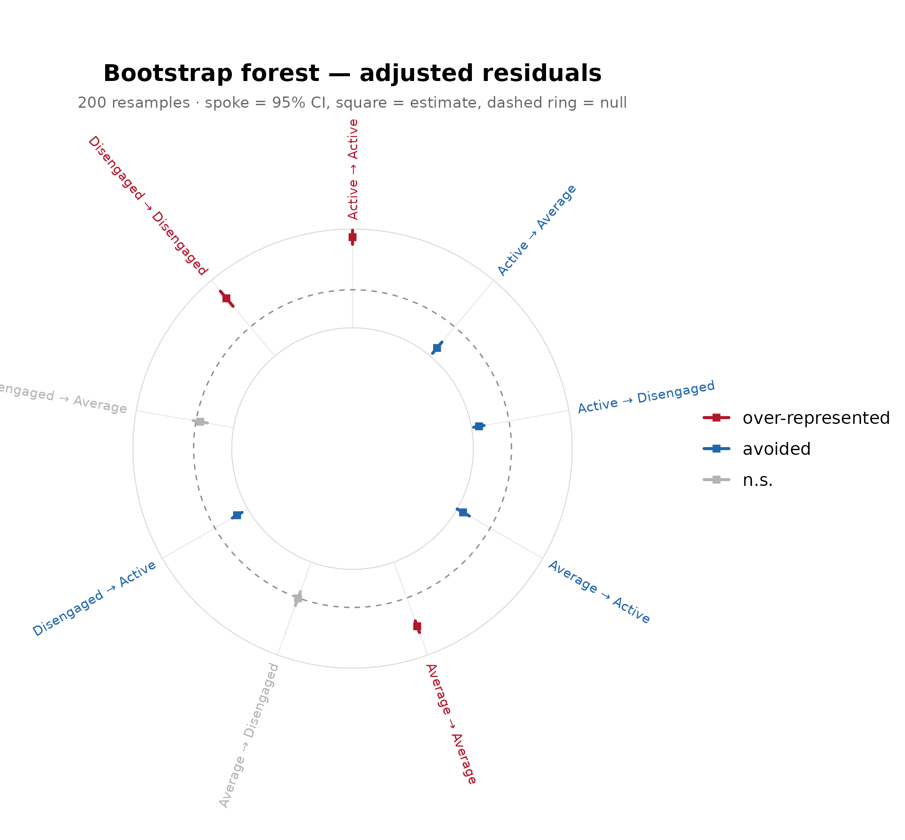
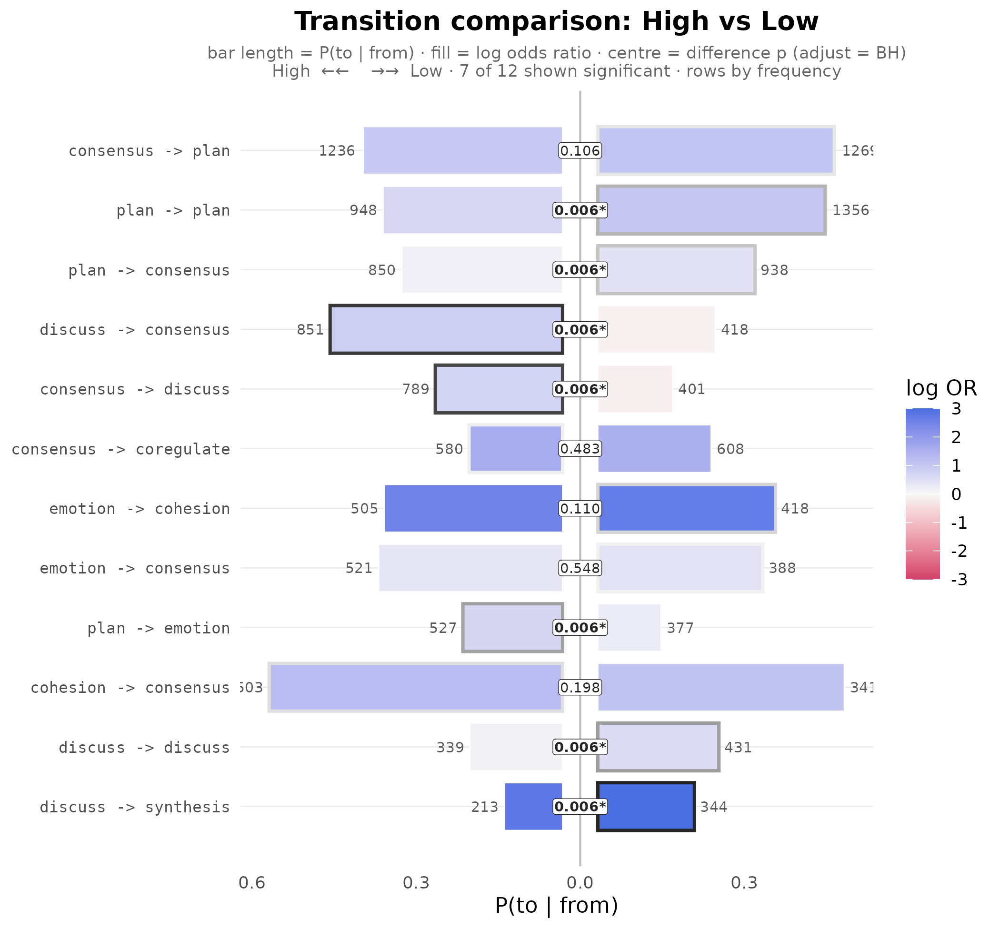

# Confirmatory testing: matching claims to evidence

A fitted model is an estimate, not a finding. The Dynalytics framework
(Saqr, Lopez-Pernas, and Misiejuk, 2026) formalises this as a
*scientific contract*: every analytical claim must be matched by
evidence appropriate to its structure, scope, and complexity.
`lagdynamics` provides the confirmatory testing battery that discharges
that contract for lag-sequential models, where each edge is a tested
departure from independence.

The battery pairs a kind of claim with a kind of evidence:

| Claim | Evidence | Function |
|----|----|----|
| a *specific transition* is real / how precise it is | edge-level uncertainty | [`certainty_lsa()`](https://saqr.me/lagdynamics/reference/certainty_lsa.md), [`bootstrap_lsa()`](https://saqr.me/lagdynamics/reference/bootstrap_lsa.md) |
| a *significant transition* is not fragile | robustness to information loss | [`stability_lsa()`](https://saqr.me/lagdynamics/reference/stability_lsa.md) |
| the *whole network* is reproducible | structural reliability | [`reliability_lsa()`](https://saqr.me/lagdynamics/reference/reliability_lsa.md) |
| the structure is *more than chance* | an assumption-free null | [`permute_lsa()`](https://saqr.me/lagdynamics/reference/permute_lsa.md) |
| two *groups* differ | inference under exchangeability | [`compare_lsa()`](https://saqr.me/lagdynamics/reference/compare_lsa.md), [`bayes_compare_lsa()`](https://saqr.me/lagdynamics/reference/bayes_compare_lsa.md) |

We use the bundled `engagement` data (138 students, weekly engagement
states) for the single-network tests, and a long event log with a real
group for the comparison.

``` r

fit <- lsa(engagement)
transitions(fit, significant = TRUE)
#>         from         to lag count expected  prob prob_col adj_res         p
#> 1     Active     Active   1   459      247 0.698   0.7051    21.7 4.60e-104
#> 2    Average     Active   1   153      282 0.204   0.2350   -12.9  4.16e-38
#> 3 Disengaged     Active   1    39      122 0.120   0.0599   -10.5  5.11e-26
#> 4     Active    Average   1   176      290 0.267   0.2307   -11.3  1.06e-29
#> 5    Average    Average   1   458      330 0.610   0.6003    12.5  1.35e-35
#> 6     Active Disengaged   1    23      121 0.035   0.0719   -12.6  3.64e-36
#> 7 Disengaged Disengaged   1   157       60 0.483   0.4906    15.4  1.90e-53
#>   yules_q  kappa kappa_z  kappa_p  lift  sign significant
#> 1   0.828  0.444   19.19 4.68e-82 1.858  over        TRUE
#> 2  -0.601 -0.499  -14.70 6.81e-49 0.543 under        TRUE
#> 3  -0.698 -0.707  -11.46 2.03e-30 0.320 under        TRUE
#> 4  -0.534 -0.424  -12.48 9.39e-36 0.608 under        TRUE
#> 5   0.553  0.227    9.83 7.97e-23 1.386  over        TRUE
#> 6  -0.826 -0.827  -13.41 5.14e-41 0.189 under        TRUE
#> 7   0.754  0.314   13.56 7.34e-42 2.618  over        TRUE
```

The adjusted residual already tests each transition against the
independence model, but that test rests on large-sample assumptions that
sequential data can violate. The battery supplies evidence that does not
rely on them.

## A specific transition: edge-level uncertainty

A claim about one edge requires an estimate of how much that edge could
vary.
[`bootstrap_lsa()`](https://saqr.me/lagdynamics/reference/bootstrap_lsa.md)
resamples whole sequences and re-fits;
[`certainty_lsa()`](https://saqr.me/lagdynamics/reference/certainty_lsa.md)
derives the same uncertainty analytically from a Dirichlet-Multinomial
posterior. The two agree when the population is homogeneous; the
bootstrap is preferred for a mixture, because resampling sequences
preserves within-sequence dependence that the analytic model treats as
independent.

``` r

as.data.frame(bootstrap_lsa(fit, R = 200)) |> head(4)   # resampling CIs
#>         from      to observed count_mean count_se count_ci_low count_ci_high
#> 1     Active  Active      459      466.9    53.63          369           566
#> 2    Average  Active      153      152.7    15.24          127           183
#> 3 Disengaged  Active       39       38.6     6.37           26            51
#> 4     Active Average      176      176.2    16.06          148           210
#>   adj_res_observed adj_res_mean adj_res_se adj_res_ci_low adj_res_ci_high
#> 1             21.7         21.7       1.58           18.1           24.28
#> 2            -12.9        -13.1       1.49          -15.8           -9.98
#> 3            -10.5        -10.5       1.27          -12.8           -8.09
#> 4            -11.3        -11.4       1.54          -14.3           -8.16
#>   adj_res_p_boot adj_res_stable prob_observed prob_mean prob_ci_low
#> 1              0           TRUE         0.698     0.700      0.6388
#> 2              0           TRUE         0.204     0.205      0.1674
#> 3              0           TRUE         0.120     0.122      0.0856
#> 4              0           TRUE         0.267     0.266      0.2184
#>   prob_ci_high yules_q_observed yules_q_mean yules_q_ci_low yules_q_ci_high
#> 1        0.751            0.828        0.827          0.754           0.879
#> 2        0.249           -0.601       -0.605         -0.695          -0.487
#> 3        0.159           -0.698       -0.696         -0.800          -0.581
#> 4        0.323           -0.534       -0.537         -0.633          -0.406
as.data.frame(certainty_lsa(fit)) |> head(4)            # analytic CIs
#>         from      to observed prob_observed prob_mean prob_se prob_ci_low
#> 1     Active  Active      459         0.698     0.697  0.0179      0.6611
#> 2    Average  Active      153         0.204     0.204  0.0147      0.1760
#> 3 Disengaged  Active       39         0.120     0.121  0.0180      0.0879
#> 4     Active Average      176         0.267     0.268  0.0172      0.2345
#>   prob_ci_high  p_value stable adj_res_observed adj_res_stable
#> 1        0.731 5.56e-20   TRUE             21.7           TRUE
#> 2        0.233 6.06e-04   TRUE            -12.9           TRUE
#> 3        0.158 9.45e-02  FALSE            -10.5          FALSE
#> 4        0.302 1.21e-04   TRUE            -11.3           TRUE
```

The bootstrap forest shows every edge’s interval at once; tightly pinned
edges support stronger claims.

``` r

plot(bootstrap_lsa(fit, R = 200))
```



## A significant transition: robustness to information loss

[`stability_lsa()`](https://saqr.me/lagdynamics/reference/stability_lsa.md)
repeatedly drops a fraction of the cases and re-fits, recording how
often each significant edge stays significant. A high stability supports
reading the edge as a property of the process; a low one marks it as
sample-dependent.

``` r

as.data.frame(stability_lsa(fit, R = 200)) |> head(4)
#>         from      to observed_sig stability stable
#> 1     Active  Active         TRUE         1   TRUE
#> 2    Average  Active         TRUE         1   TRUE
#> 3 Disengaged  Active         TRUE         1   TRUE
#> 4     Active Average         TRUE         1   TRUE
```

## The whole network: structural reliability

[`reliability_lsa()`](https://saqr.me/lagdynamics/reference/reliability_lsa.md)
raises the claim from a single edge to the entire network. It repeatedly
splits the sequences into two halves, fits a model on each, and
correlates the edge-weight vectors. A high average correlation indicates
the network is reproducible within the sample.

``` r

reliability_lsa(fit, R = 50)
#> <lsa_reliability>
#>   engine:        classical
#>   replicates:    50
#>   weights:       prob
#>   method:        pearson
#>   n sequences:   136
#>   split-half r:  0.969  (sd = 0.027)
#>   95% CI:        [0.891, 0.994]
```

## More than chance: an assumption-free null

[`permute_lsa()`](https://saqr.me/lagdynamics/reference/permute_lsa.md)
shuffles the event order to build the null of no sequential structure,
giving a p-value that does not depend on the adjusted residual’s
large-sample approximation.

``` r

as.data.frame(permute_lsa(fit, R = 200)) |> head(4)
#>         from      to observed_count observed_adj_res  p_perm significant
#> 1     Active  Active            459             21.7 0.00498        TRUE
#> 2    Average  Active            153            -12.9 0.00498        TRUE
#> 3 Disengaged  Active             39            -10.5 0.08458       FALSE
#> 4     Active Average            176            -11.3 0.01493        TRUE
```

## Two groups: inference under exchangeability

Comparing groups is the claim that most invites over-interpretation: two
networks estimated separately almost always look different. The question
is whether the difference exceeds what arises by chance when the group
labels carry no information.

The bundled `group_regulation_long` is a long event log with a recorded
achievement group; the same `actor` / `action` / `time` grammar fits it
in one call.

``` r

gfit <- lsa(group_regulation_long, actor = "Actor", action = "Action",
            time = "Time", group = "Achiever")
```

[`compare_lsa()`](https://saqr.me/lagdynamics/reference/compare_lsa.md)
answers it by permutation under exchangeability: it shuffles the labels
to build a reference distribution for the per-edge difference and a
single omnibus statistic.

``` r

cmp <- compare_lsa(gfit, R = 500, adjust = "BH")
cmp
#> <lsa_comparison>
#>   groups:   High vs Low
#>   measure:  log_or difference (High - Low)
#>   R:        500 label permutations
#>   edges:    38 significant of 78 tested (adjust = BH)
#>   omnibus:  statistic = 79.48, p = 0.001996
as.data.frame(cmp) |> subset(significant) |> head(4)
#>          from       to log_or_a log_or_b  diff p_perm   p_adj significant
#> 2    cohesion    adapt   -0.794    -3.92  3.13  0.002 0.00599        TRUE
#> 4  coregulate    adapt    0.778    -1.08  1.85  0.002 0.00599        TRUE
#> 5     discuss    adapt    1.010     2.25 -1.24  0.002 0.00599        TRUE
#> 11   cohesion cohesion   -0.587    -2.34  1.75  0.002 0.00599        TRUE
```

``` r

plot(cmp)
```



[`bayes_compare_lsa()`](https://saqr.me/lagdynamics/reference/bayes_compare_lsa.md)
is the Bayesian counterpart: instead of a significance decision it
reports, for each edge, the posterior mean difference and a credible
interval, so the evidence is a plausible range rather than a verdict.

``` r

bayes_compare_lsa(gfit, seed = 1)
#> <lsa_bayes>  (Bayesian Dirichlet-Multinomial comparison)
#>   groups:    High vs Low
#>   prior:     Dirichlet(0.50)  |  draws: 10000  |  CI: 95%
#>   edges:     38 credibly different of 81 compared
```

## In short

The contract is one rule applied at every scope: match the claim to the
evidence. A descriptive reading of an edge needs only the fit; a
stronger claim needs the test that targets exactly its structure.

``` r

certainty_lsa(fit); bootstrap_lsa(fit)   # a specific edge
stability_lsa(fit)                       # a significant edge under case-dropping
reliability_lsa(fit)                     # the whole network
permute_lsa(fit)                         # more than chance
compare_lsa(gfit); bayes_compare_lsa(gfit)  # a group difference
```
