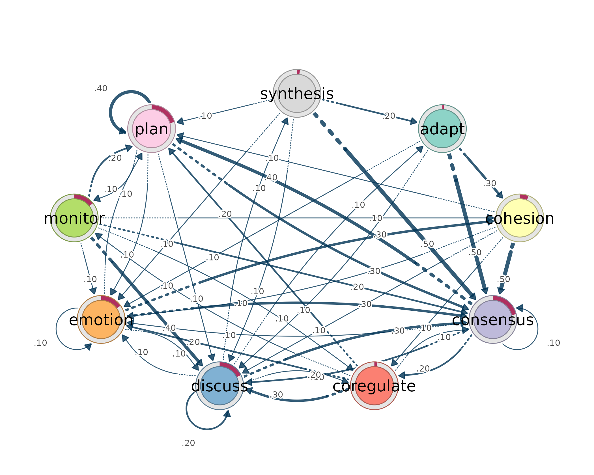

# Interoperability: wide data, long logs, tna, and Nestimate

`lagdynamics` is designed to sit inside the same event-sequence workflow
as Transition Network Analysis (TNA), `Nestimate`, `cograph`, and other
sequence tools. The important interoperability promise is simple:

- the same [`lsa()`](https://saqr.me/lagdynamics/reference/lsa.md) front
  door accepts wide sequence data, raw long event logs, `tna` sequence
  objects, and `Nestimate` prepared objects;
- long logs use the same column grammar as TNA-style workflows: `actor`,
  `action`, `time`, `order`, and `session`;
- fitted models expose transition probabilities, initial probabilities,
  tidy transition tables, and a `cograph_network` object for rendering.

## Same grammar as TNA

In a TNA workflow, a raw event log is usually sequenced by naming the
actor, the event/action code, and either a time or order column.
[`lsa()`](https://saqr.me/lagdynamics/reference/lsa.md) uses the same
grammar directly.

``` r

prepare_data(log, actor = "Actor", action = "Action", time = "Time")
lsa(log,         actor = "Actor", action = "Action", time = "Time")
```

The column names are passed as strings. `action` is the only mandatory
long-format column. If neither `actor` nor `session` is supplied, the
log is treated as one long sequence. If `session` is supplied, each
session is a sequence. If both `actor` and `session` are supplied, each
actor-session pair is a sequence.

## Wide sequence data

Wide data is the simplest input: rows are sequences and columns are
ordered time points. This is the form used by `engagement`.

``` r

head(engagement)
#>         1          2          3          4          5          6       7
#> 1  Active Disengaged Disengaged Disengaged     Active     Active  Active
#> 2 Average    Average    Average    Average    Average    Average Average
#> 3 Average     Active     Active     Active     Active     Active  Active
#> 4  Active     Active     Active     Active     Active    Average Average
#> 5  Active     Active     Active    Average     Active    Average  Active
#> 6 Average    Average Disengaged    Average Disengaged Disengaged Average
#>         8       9         10      11         12      13      14      15
#> 1  Active Average     Active Average     Active    <NA>    <NA>    <NA>
#> 2 Average Average     Active Average    Average Average Average Average
#> 3  Active  Active    Average  Active     Active  Active  Active  Active
#> 4  Active  Active     Active Average     Active Average  Active Average
#> 5  Active  Active Disengaged  Active     Active  Active Average Average
#> 6 Average Average Disengaged Average Disengaged Average Average Average

fit_wide <- lsa(engagement)
fit_wide
#> Lag Sequential Analysis  -  classical  (lag 1, directed)
#>   3 states | 1734 transitions | 1870 events | 136 sequences
#>   states: Active, Average, Disengaged
#>   independence: G² = 618.3, df = 4, p <2e-16
#> 
#>   Significant transitions (p < 0.05): 7 of 9
#>   strongest over-represented (of 3):
#>     Active -> Active          z =  +21.7  ***
#>     Disengaged -> Disengaged  z =  +15.4  ***
#>     Average -> Average        z =  +12.5  ***
#> 
#>   Initial states:
#>     Active     0.382  ████████████████████████
#>     Average    0.368  ███████████████████████
#>     Disengaged 0.250  ████████████████
```

The result is read through the same verbs used everywhere else.

``` r

transitions(fit_wide, significant = TRUE)
#>         from         to lag count expected  prob prob_col adj_res         p
#> 1     Active     Active   1   459      247 0.698   0.7051    21.7 4.60e-104
#> 2    Average     Active   1   153      282 0.204   0.2350   -12.9  4.16e-38
#> 3 Disengaged     Active   1    39      122 0.120   0.0599   -10.5  5.11e-26
#> 4     Active    Average   1   176      290 0.267   0.2307   -11.3  1.06e-29
#> 5    Average    Average   1   458      330 0.610   0.6003    12.5  1.35e-35
#> 6     Active Disengaged   1    23      121 0.035   0.0719   -12.6  3.64e-36
#> 7 Disengaged Disengaged   1   157       60 0.483   0.4906    15.4  1.90e-53
#>   yules_q  kappa kappa_z  kappa_p  lift  sign significant
#> 1   0.828  0.444   19.19 4.68e-82 1.858  over        TRUE
#> 2  -0.601 -0.499  -14.70 6.81e-49 0.543 under        TRUE
#> 3  -0.698 -0.707  -11.46 2.03e-30 0.320 under        TRUE
#> 4  -0.534 -0.424  -12.48 9.39e-36 0.608 under        TRUE
#> 5   0.553  0.227    9.83 7.97e-23 1.386  over        TRUE
#> 6  -0.826 -0.827  -13.41 5.14e-41 0.189 under        TRUE
#> 7   0.754  0.314   13.56 7.34e-42 2.618  over        TRUE
nodes(fit_wide)
#>        state outgoing incoming
#> 1     Active      658      651
#> 2    Average      751      763
#> 3 Disengaged      325      320
initial(fit_wide)
#>        state init_prob
#> 1     Active     0.382
#> 2    Average     0.368
#> 3 Disengaged     0.250
```

## Long event logs

Long logs have one row per event. The bundled `group_regulation_long`
data shows the TNA-style grammar directly: actor, action, time, and a
grouping column.

``` r

head(group_regulation_long)
#>   Actor Achiever Group Course                Time    Action
#> 1     1     High     1      A 2025-01-01 08:27:07  cohesion
#> 2     1     High     1      A 2025-01-01 08:35:20 consensus
#> 3     1     High     1      A 2025-01-01 08:42:18   discuss
#> 4     1     High     1      A 2025-01-01 08:50:00 synthesis
#> 5     1     High     1      A 2025-01-01 08:52:25     adapt
#> 6     1     High     1      A 2025-01-01 08:57:31 consensus
```

Fit a single model from the raw log by naming the columns.

``` r

fit_long <- lsa(group_regulation_long, actor = "Actor",
                action = "Action", time = "Time")
fit_long
#> Lag Sequential Analysis  -  classical  (lag 1, directed)
#>   9 states | 25533 transitions | 27533 events | 2000 sequences
#>   states: adapt, cohesion, consensus, coregulate, discuss, emotion, monitor, plan, synthesis
#>   independence: G² = 13203.8, df = 64, p <2e-16
#> 
#>   Significant transitions (p < 0.05): 72 of 81
#>   strongest over-represented (of 23):
#>     emotion -> cohesion      z =  +58.2  ***
#>     discuss -> synthesis     z =  +48.0  ***
#>     synthesis -> adapt       z =  +38.8  ***
#>     consensus -> coregulate  z =  +35.3  ***
#>     consensus -> plan        z =  +32.6  ***
#>     ... and 18 more
#> 
#>   Initial states:
#>     consensus  0.214  ████████████████████████
#>     plan       0.204  ███████████████████████
#>     discuss    0.175  ████████████████████
#>     emotion    0.151  █████████████████
#>     monitor    0.144  ████████████████
#>     cohesion   0.060  ███████
#>     synthesis  0.019  ██
#>     coregulate 0.019  ██
#>     adapt      0.011  █
```

If the log already has session identifiers, use `session`. In the
`Nestimate`-derived `ai_long` data, `project` and `session_id` define
the sequence boundary and `order_in_session` defines event order.

``` r

head(ai_long)
#>   message_id   project   session_id  timestamp session_date        code cluster
#> 1       3441 Project_7 0086cabebd15 1772661600   2026-03-05    Delegate  Action
#> 2       3441 Project_7 0086cabebd15 1772661600   2026-03-05        Plan  Repair
#> 3       3443 Project_7 0086cabebd15 1772661600   2026-03-05     Execute  Action
#> 4       3443 Project_7 0086cabebd15 1772661600   2026-03-05        Plan  Repair
#> 5       3445 Project_7 0086cabebd15 1772661600   2026-03-05     Execute  Action
#> 6       3447 Project_7 0086cabebd15 1772661600   2026-03-05 Investigate  Action
#>   code_order order_in_session
#> 1          1                5
#> 2          2                6
#> 3          1                8
#> 4          2                9
#> 5          1               12
#> 6          1               14

fit_session <- lsa(ai_long, actor = "project", session = "session_id",
                   action = "code", order = "order_in_session")
fit_session
#> Lag Sequential Analysis  -  classical  (lag 1, directed)
#>   8 states | 8123 transitions | 8551 events | 428 sequences
#>   states: Ask, Delegate, Execute, Explain, Investigate, Plan, Repair, Report
#>   independence: G² = 2168.1, df = 49, p <2e-16
#> 
#>   Significant transitions (p < 0.05): 40 of 64
#>   strongest over-represented (of 19):
#>     Investigate -> Plan  z =  +33.4  ***
#>     Delegate -> Plan     z =  +18.1  ***
#>     Ask -> Explain       z =  +16.4  ***
#>     Execute -> Execute   z =  +16.1  ***
#>     Explain -> Report    z =  +14.0  ***
#>     ... and 14 more
#> 
#>   Initial states:
#>     Investigate 0.715  ████████████████████████
#>     Delegate    0.185  ██████
#>     Execute     0.058  ██
#>     Plan        0.035  █
#>     Ask         0.005  
#>     Explain     0.002  
#>     Repair      0.000  
#>     Report      0.000
```

Grouping uses the same call. The grouping column must be fixed within
each recovered sequence.

``` r

gfit <- lsa(group_regulation_long, actor = "Actor", action = "Action",
            time = "Time", group = "Achiever")
gfit
#> <lsa_group>
#>   engine:    classical
#>   states:    9 (adapt, cohesion, consensus, coregulate, discuss, emotion, monitor, plan, synthesis)
#>   groups:    2
#>     - High:        1000 sequences
#>     - Low:         1000 sequences
transitions(gfit, significant = TRUE) |> head(6)
#>   group       from    to lag count expected    prob prob_col adj_res         p
#> 1  High  consensus adapt   1    14    38.13 0.00413   0.0979   -4.59  4.45e-06
#> 2  High coregulate adapt   1    20    10.05 0.02237   0.1399    3.27  1.06e-03
#> 3  High    discuss adapt   1    48    22.52 0.02396   0.3357    5.88  4.00e-09
#> 4  High    emotion adapt   1     5    17.42 0.00323   0.0350   -3.19  1.40e-03
#> 5  High       plan adapt   1     4    32.51 0.00138   0.0280   -5.72  1.06e-08
#> 6  High  synthesis adapt   1    40     3.13 0.14388   0.2797   21.21 7.61e-100
#>   yules_q   kappa kappa_z  kappa_p   lift  sign significant
#> 1  -0.544 -0.6606   -4.98 6.36e-07  0.367 under        TRUE
#> 2   0.371  0.0636    2.90 3.68e-03  1.990  over        TRUE
#> 3   0.466  0.1803    5.21 1.86e-07  2.132  over        TRUE
#> 4  -0.589 -0.7375   -3.46 5.48e-04  0.287 under        TRUE
#> 5  -0.824 -0.8859   -5.99 2.04e-09  0.123 under        TRUE
#> 6   0.905  0.2406   19.62 1.08e-85 12.800  over        TRUE
```

## tna objects

[`lsa()`](https://saqr.me/lagdynamics/reference/lsa.md) accepts a real
`tna` model when that model carries its source sequences. The example
below starts from the same included wide sequence data, fits a TNA model
with `tna`, and then hands that fitted object to
[`lsa()`](https://saqr.me/lagdynamics/reference/lsa.md).

``` r

tna_fit <- tna::tna(engagement)
tna_fit
#> State Labels : 
#> 
#>    Active, Average, Disengaged 
#> 
#> Transition Probability Matrix :
#> 
#>            Active Average Disengaged
#> Active      0.698   0.267      0.035
#> Average     0.204   0.610      0.186
#> Disengaged  0.120   0.397      0.483
#> 
#> Initial Probabilities : 
#> 
#>     Active    Average Disengaged 
#>      0.382      0.368      0.250

fit_from_tna <- lsa(tna_fit)
fit_from_tna
#> Lag Sequential Analysis  -  classical  (lag 1, directed)
#>   3 states | 1734 transitions | 1870 events | 136 sequences
#>   states: Active, Average, Disengaged
#>   independence: G² = 618.3, df = 4, p <2e-16
#> 
#>   Significant transitions (p < 0.05): 7 of 9
#>   strongest over-represented (of 3):
#>     Active -> Active          z =  +21.7  ***
#>     Disengaged -> Disengaged  z =  +15.4  ***
#>     Average -> Average        z =  +12.5  ***
#> 
#>   Initial states:
#>     Active     0.382  ████████████████████████
#>     Average    0.368  ███████████████████████
#>     Disengaged 0.250  ████████████████
```

Fitting the `tna` object and fitting the original wide data give the
same LSA transition table.

``` r

isTRUE(all.equal(transitions(fit_from_tna), transitions(fit_wide),
                 check.attributes = FALSE))
#> [1] TRUE
```

## Nestimate objects

[`Nestimate::build_network()`](https://saqr.me/Nestimate/reference/build_network.html)
uses the same long-log grammar. The object it returns carries the
prepared sequence data, so
[`lsa()`](https://saqr.me/lagdynamics/reference/lsa.md) can read it
directly.

``` r

nestimate_fit <- Nestimate::build_network(
  ai_long,
  method = "tna",
  actor = "project",
  session = "session_id",
  action = "code",
  order = "order_in_session"
)

nestimate_fit
#> Transition Network (relative probabilities) [directed]
#>   Weights: [0.004, 0.621]  |  mean: 0.125
#> 
#>   Weight matrix:
#>                 Ask Delegate Execute Explain Investigate  Plan Repair Report
#>   Ask         0.033    0.033   0.286   0.484       0.099 0.033  0.022  0.011
#>   Delegate    0.007    0.025   0.182   0.050       0.093 0.621  0.014  0.007
#>   Execute     0.010    0.022   0.510   0.055       0.247 0.116  0.030  0.010
#>   Explain     0.020    0.016   0.256   0.131       0.313 0.069  0.083  0.111
#>   Investigate 0.009    0.016   0.252   0.035       0.221 0.437  0.018  0.012
#>   Plan        0.010    0.048   0.470   0.060       0.303 0.032  0.040  0.037
#>   Repair      0.052    0.040   0.474   0.171       0.235 0.016  0.008  0.004
#>   Report      0.006    0.062   0.377   0.111       0.284 0.031  0.086  0.043 
#> 
#>   Initial probabilities:
#>   Investigate   0.715  ████████████████████████████████████████
#>   Delegate      0.185  ██████████
#>   Execute       0.058  ███
#>   Plan          0.035  ██
#>   Ask           0.005  
#>   Explain       0.002  
#>   Repair        0.000  
#>   Report        0.000

fit_nestimate <- lsa(nestimate_fit)
fit_nestimate
#> Lag Sequential Analysis  -  classical  (lag 1, directed)
#>   8 states | 8123 transitions | 8551 events | 428 sequences
#>   states: Ask, Delegate, Execute, Explain, Investigate, Plan, Repair, Report
#>   independence: G² = 2168.1, df = 49, p <2e-16
#> 
#>   Significant transitions (p < 0.05): 40 of 64
#>   strongest over-represented (of 19):
#>     Investigate -> Plan  z =  +33.4  ***
#>     Delegate -> Plan     z =  +18.1  ***
#>     Ask -> Explain       z =  +16.4  ***
#>     Execute -> Execute   z =  +16.1  ***
#>     Explain -> Report    z =  +14.0  ***
#>     ... and 14 more
#> 
#>   Initial states:
#>     Investigate 0.715  ████████████████████████
#>     Delegate    0.185  ██████
#>     Execute     0.058  ██
#>     Plan        0.035  █
#>     Ask         0.005  
#>     Explain     0.002  
#>     Repair      0.000  
#>     Report      0.000
```

The same raw log can also be fitted directly with the long-format
grammar. The `Nestimate` object and the direct
[`lsa()`](https://saqr.me/lagdynamics/reference/lsa.md) call recover the
same transition table.

``` r

fit_ai_direct <- lsa(ai_long, actor = "project", session = "session_id",
                     action = "code", order = "order_in_session")

isTRUE(all.equal(transitions(fit_nestimate), transitions(fit_ai_direct),
                 check.attributes = FALSE))
#> [1] TRUE
```

## Back to tna

Use
[`lsa_to_tna()`](https://saqr.me/lagdynamics/reference/lsa_to_tna.md)
when the model is estimated with `lagdynamics` and then handed to `tna`
for TNA-specific tooling.

``` r

tn <- lsa_to_tna(fit_wide, weights = "prob")
tn
#> State Labels : 
#> 
#>    Active, Average, Disengaged 
#> 
#> Transition Probability Matrix :
#> 
#>            Active Average Disengaged
#> Active      0.698   0.267      0.035
#> Average     0.204   0.610      0.186
#> Disengaged  0.120   0.397      0.483
#> 
#> Initial Probabilities : 
#> 
#>     Active    Average Disengaged 
#>      0.382      0.368      0.250

tna::centralities(tn)
#> # A tibble: 3 × 10
#>   state    OutStrength InStrength ClosenessIn ClosenessOut Closeness Betweenness
#> * <fct>          <dbl>      <dbl>       <dbl>        <dbl>     <dbl>       <dbl>
#> 1 Active         0.302      0.324      0.0811       0.0779     0.100           0
#> 2 Average        0.390      0.664      0.160        0.0973     0.160           2
#> 3 Disenga…       0.517      0.221      0.0691       0.101      0.114           0
#> # ℹ 3 more variables: BetweennessRSP <dbl>, Diffusion <dbl>, Clustering <dbl>
```

The same quantities are also exposed without conversion: the
row-stochastic transition matrix and the initial-state distribution.

``` r

transition_probabilities(fit_long)
#>               adapt cohesion consensus coregulate discuss emotion monitor
#> adapt      0.000000   0.2731     0.477     0.0216  0.0589  0.1198  0.0334
#> cohesion   0.002950   0.0271     0.498     0.1192  0.0596  0.1156  0.0330
#> consensus  0.004740   0.0149     0.082     0.1877  0.1880  0.0727  0.0466
#> coregulate 0.016244   0.0360     0.135     0.0234  0.2736  0.1721  0.0863
#> discuss    0.071374   0.0476     0.321     0.0843  0.1949  0.1058  0.0223
#> emotion    0.002467   0.3253     0.320     0.0342  0.1019  0.0768  0.0363
#> monitor    0.011165   0.0558     0.159     0.0579  0.3754  0.0907  0.0181
#> plan       0.000975   0.0252     0.290     0.0172  0.0679  0.1468  0.0755
#> synthesis  0.234663   0.0337     0.466     0.0445  0.0629  0.0706  0.0123
#>              plan synthesis
#> adapt      0.0157   0.00000
#> cohesion   0.1410   0.00354
#> consensus  0.3958   0.00758
#> coregulate 0.2391   0.01878
#> discuss    0.0116   0.14098
#> emotion    0.0998   0.00282
#> monitor    0.2156   0.01605
#> plan       0.3742   0.00179
#> synthesis  0.0752   0.00000
initial(fit_long)
#>        state init_prob
#> 1      adapt    0.0115
#> 2   cohesion    0.0605
#> 3  consensus    0.2140
#> 4 coregulate    0.0190
#> 5    discuss    0.1755
#> 6    emotion    0.1515
#> 7    monitor    0.1440
#> 8       plan    0.2045
#> 9  synthesis    0.0195
```

It also inherits `cograph_network`, so cograph-compatible renderers can
read the nodes and edges directly. The probability-weighted network uses
the TNA interpretation: edge weights are conditional transition
probabilities.

``` r

plot(fit_long, type = "network", weights = "tna")
```



Use the residual network when the claim is lag-sequential: which
transitions occur more or less often than expected under independence.
Use the probability/TNA network when the claim is descriptive: where the
process tends to go next.

------------------------------------------------------------------------

Part of the [Dynalytics framework](https://saqr.me/).
