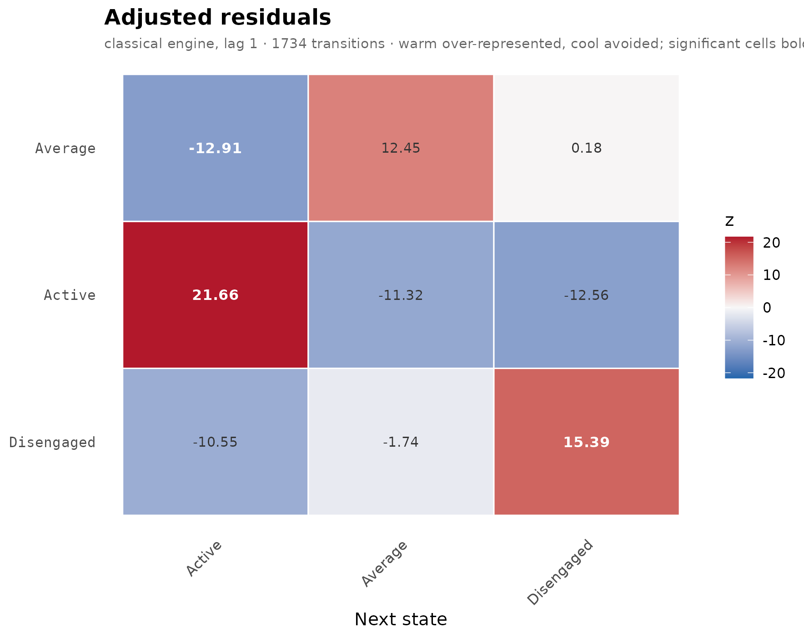
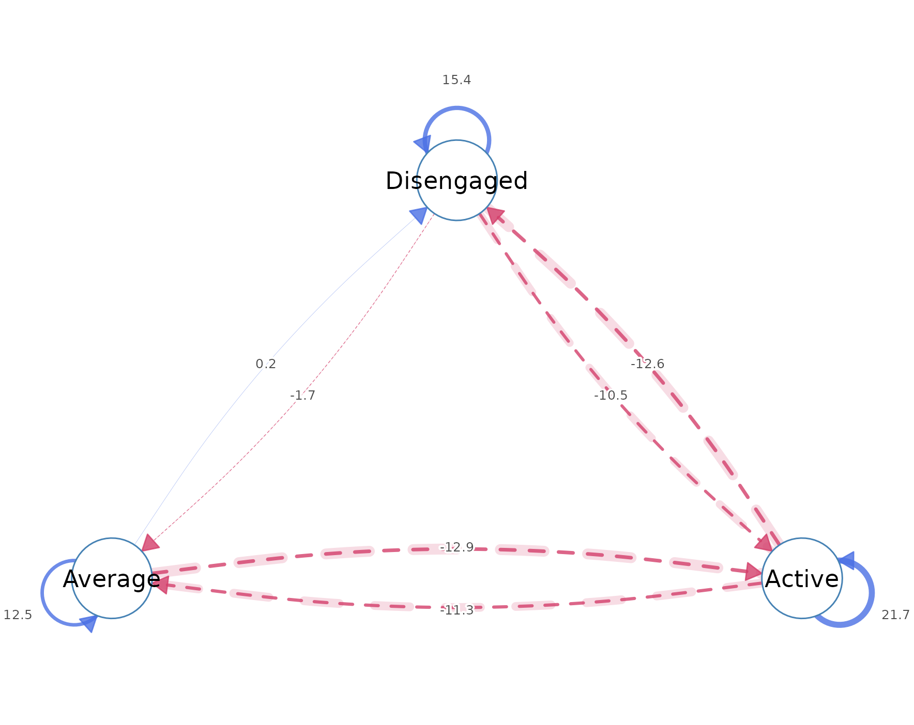
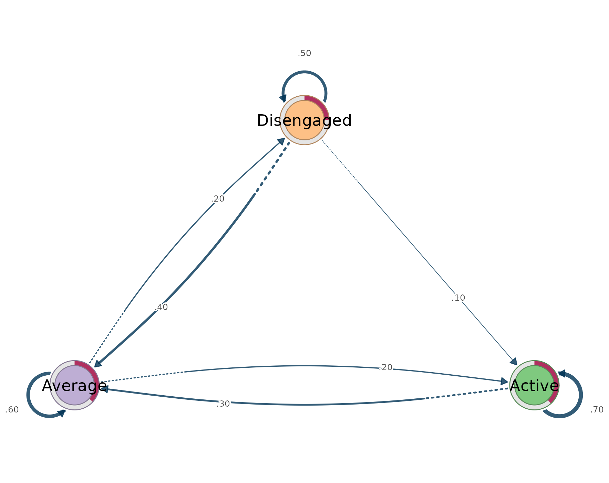
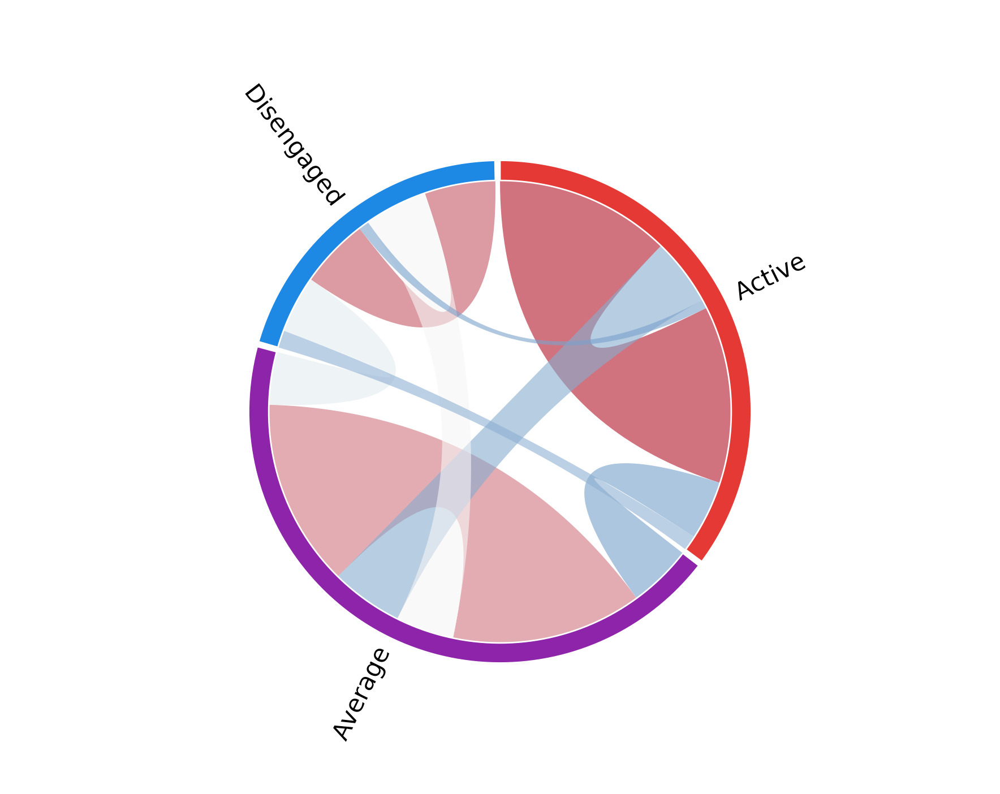
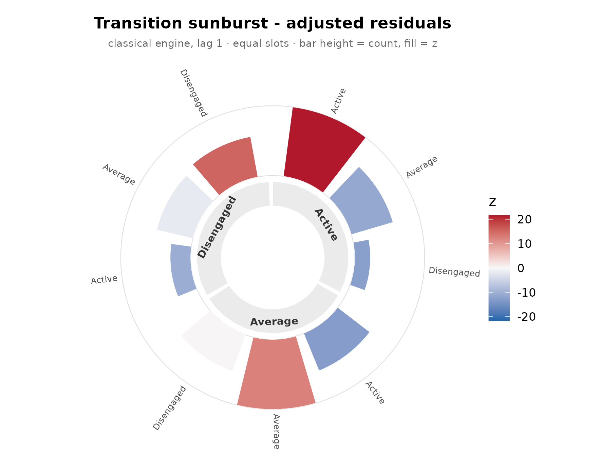
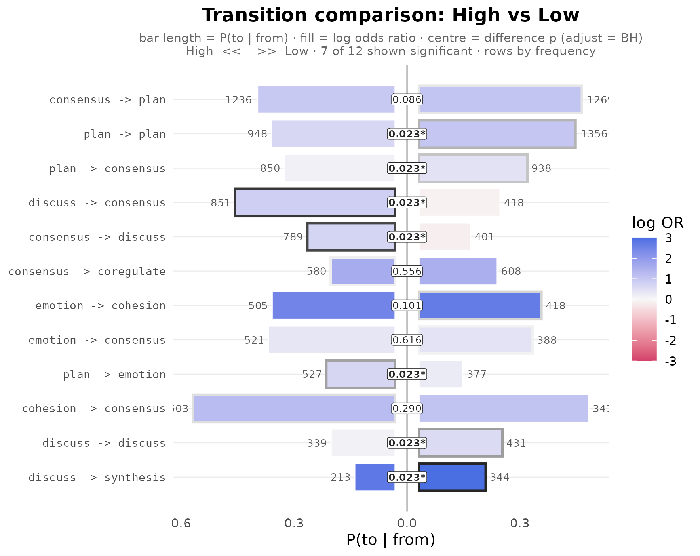
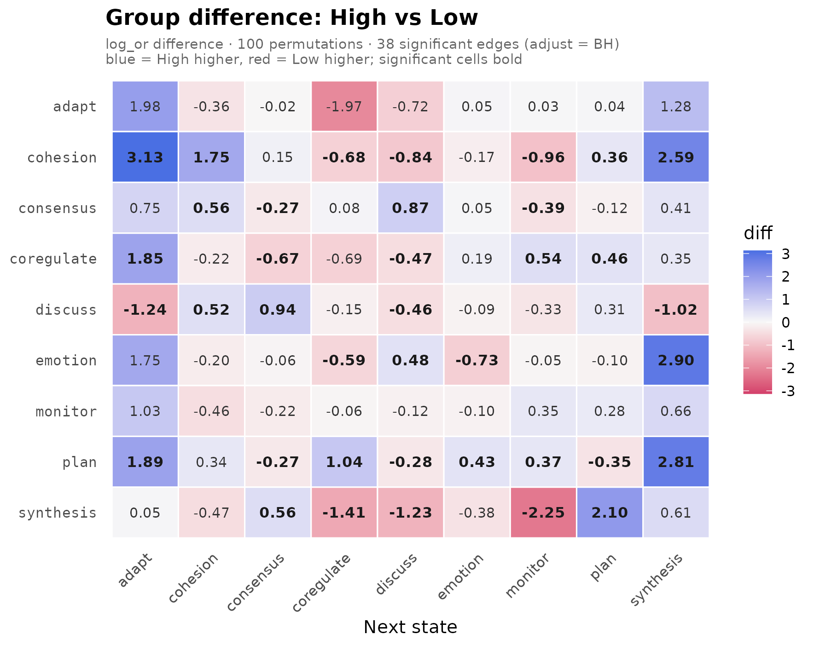
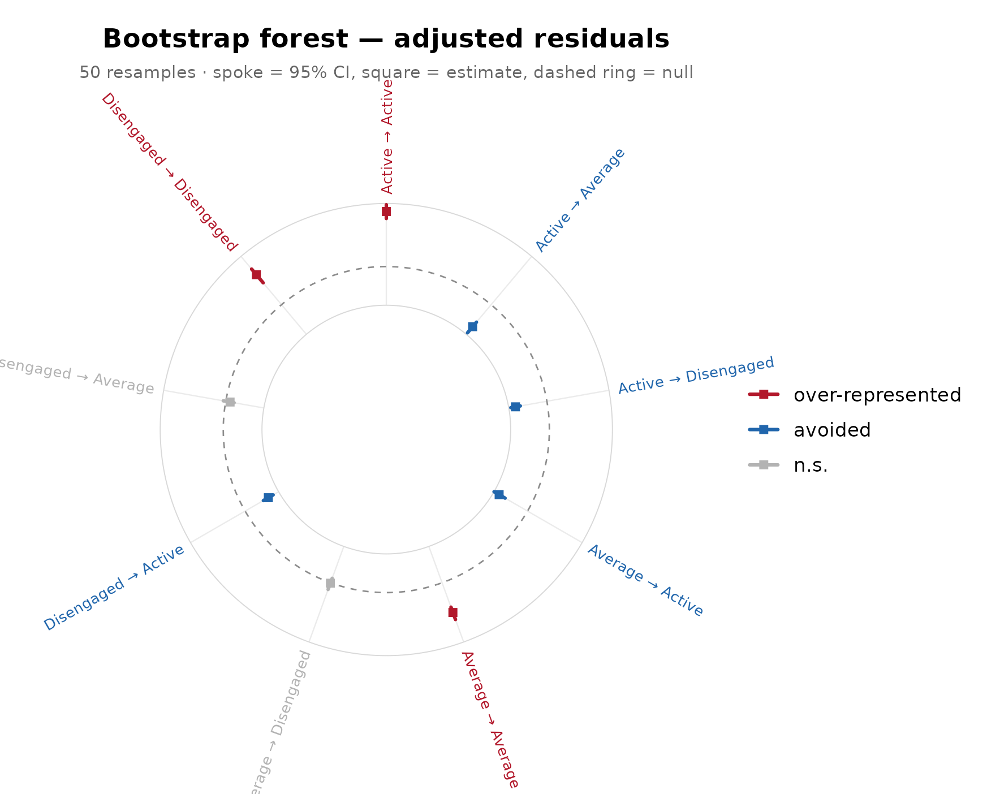

# Introduction

## Summary

`lagdynamics` implements lag-sequential analysis (LSA) and its network
representation, the lag transition network, for categorical event and
sequence data. LSA is the classical inferential method for temporal
contingency in observed behaviour: it tests, for every ordered pair of
states, whether one state follows another more or less often than
independence predicts. The package restates this method as a modern
statistical workflow built on six commitments:

- **Tidy.** Every result is produced by a verb –
  [`transitions()`](https://pak.dynasite.org/lagdynamics/reference/transitions.md),
  [`nodes()`](https://pak.dynasite.org/lagdynamics/reference/nodes.md),
  [`tests()`](https://pak.dynasite.org/lagdynamics/reference/tests.md),
  [`initial()`](https://pak.dynasite.org/lagdynamics/reference/initial.md),
  [`summary()`](https://rdrr.io/r/base/summary.html),
  [`transition_probabilities()`](https://pak.dynasite.org/lagdynamics/reference/transition_probabilities.md)
  – that returns a one-row-per-observation data frame.
  [`transitions()`](https://pak.dynasite.org/lagdynamics/reference/transitions.md)
  reads the fitted model and every inference result through the same
  arguments. Filters are arguments (`significant = TRUE`,
  `direction = "over"`, `min_count =`), never subsetting; the user never
  indexes into an object.
- **Confirmatory, following Dynalytics.** The package operationalizes
  the Dynalytics framework, whose central tenet is a scientific
  contract: every analytical claim is matched by evidence appropriate to
  its structure, scope, and complexity. Validation is therefore expanded
  far beyond the classical residual test into a full battery – analytic
  Bayesian certainty, sequence-level bootstrap, split-half reliability,
  case-drop stability, and a within-sequence permutation null.
- **Expanded.** Beyond the classical engine the package offers five
  estimation engines plus an open registry for user-defined ones,
  multi-lag analysis with positive and negative lags, structural-zero
  constraints under quasi-independence, initial and transition
  probabilities, grouped estimation in a shared state space, and an
  experimental directed transfer-entropy measure.
- **Group-aware.** A grouping variable yields one model per group, and
  group differences are tested rather than eyeballed:
  [`compare_lsa()`](https://pak.dynasite.org/lagdynamics/reference/compare_lsa.md)
  permutes labels over whole sequences and
  [`bayes_compare_lsa()`](https://pak.dynasite.org/lagdynamics/reference/bayes_compare_lsa.md)
  gives the analytic Bayesian counterpart, both with multiplicity
  adjustment and pairwise comparison for more than two groups.
- **Visual.** A large array of plots covers every level of the analysis:
  residual heatmaps, residual networks, probability-weighted TNA
  transition networks, chord diagrams, polar sunbursts, uncertainty
  forests for the bootstrap and certainty results, and group barrels and
  difference heatmaps for the comparisons.
- **Interoperable.** The package plugs into the other dynamics packages
  on both sides:
  [`lsa()`](https://pak.dynasite.org/lagdynamics/reference/lsa.md)
  ingests long event logs, wide data, lists of sequences, `TraMineR`
  state sequences, `tna` models and sequence data, and `Nestimate`
  prepared data, while the fitted object is a `cograph` network that
  cograph renders directly and exposes the transition and initial
  probabilities that TNA-style tooling consumes.

The numerical core is a clean-room implementation. Every formula was
transcribed from its primary source – with page and equation numbers
recorded in the package’s formula reference map (`inst/REFERENCES.md`) –
and implemented without consulting any prior LSA software. The
implementation is cross-validated against base-R primitives
([`stats::loglin()`](https://rdrr.io/r/stats/loglin.html) for iterative
proportional fitting,
[`stats::chisq.test()`](https://rdrr.io/r/stats/chisq.test.html)
standardized residuals,
[`stats::binom.test()`](https://rdrr.io/r/stats/binom.test.html),
[`stats::pchisq()`](https://rdrr.io/r/stats/Chisquare.html)) and against
hand-derived algebraic identities. The analytical core depends only on
base R; the plotting functions additionally use `ggplot2` and `cograph`.

## The method

Let a process visit $`K`$ discrete states. At lag $`\ell`$, the data
reduce to a $`K \times K`$ transition table whose cell $`O_{ij}`$ counts
the occasions on which state $`i`$ was followed, $`\ell`$ positions
later, by state $`j`$. Transitions are counted within a sequence only;
pairs never span sequence boundaries.

The reference model is sequential independence: the next state carries
no memory of the current one, so each cell is expected to occur at the
rate implied by the row and column margins alone,

``` math
E_{ij} = \frac{R_i \, C_j}{N},
```

where $`R_i`$ and $`C_j`$ are the margins of the table and $`N`$ its
total. The test statistic for each cell is the adjusted (standardized
Pearson) residual,

``` math
z_{ij} = \frac{O_{ij} - E_{ij}}
  {\sqrt{E_{ij}\,(1 - R_i/N)\,(1 - C_j/N)}},
```

which is asymptotically standard normal under independence. A positive
residual marks a transition that occurs more often than its states’ base
rates predict – a sequential regularity. A negative residual marks an
avoided transition. The residual, not the raw transition probability, is
the evidential unit of LSA: a transition can be frequent yet
unremarkable, or rare yet strongly over-represented.

When some transitions are impossible by design – self-transitions under
continuous coding are the standard case – the affected cells are
structural zeros. Expected counts then come from the quasi-independence
model, fitted by iterative proportional fitting, and the residuals use
the design-matrix form. The two formulations provably coincide when no
structural zeros are present, and the package pins that identity in its
test suite. Structural-zero cells are reported as non-estimable (`NA`),
never as “expected zero”: no test is defined there.

A **lag transition network** is the graph form of the fitted model:
states are nodes, each ordered pair is a directed edge, and the edge
weight is the tested departure from independence. This places LSA next
to transition network analysis (TNA), with a precise division of labour:
a TNA edge is a transition tendency (a conditional probability), whereas
an LSA edge is a tested departure from a no-memory baseline. The same
data can support both models; the claims differ.

## What the package provides

Beyond the classical model, `lagdynamics` adds the following. Each item
is exercised in this vignette or in a dedicated companion vignette.

**Estimation**

- Five estimation engines: `classical` (the default), `two_cell`,
  `bidirectional` (the matched-pair test on the symmetrized table),
  `parallel_dominance`, and `nonparallel_dominance`, each available
  through `lsa(engine = )` or a direct wrapper such as
  [`lsa_two_cell()`](https://pak.dynasite.org/lagdynamics/reference/lsa.md).
- An open engine registry:
  [`register_lsa_engine()`](https://pak.dynasite.org/lagdynamics/reference/register_lsa_engine.md)
  /
  [`unregister_lsa_engine()`](https://pak.dynasite.org/lagdynamics/reference/unregister_lsa_engine.md)
  accept user-defined engines, and
  [`list_lsa_engines()`](https://pak.dynasite.org/lagdynamics/reference/list_lsa_engines.md)
  enumerates what is installed.
- Multi-lag analysis: any positive or negative lag in `lsa(lag = )`,
  full lag profiles with
  [`lsa_lags()`](https://pak.dynasite.org/lagdynamics/reference/lsa_lags.md),
  and single-edge profiles with
  [`lag_profile()`](https://pak.dynasite.org/lagdynamics/reference/lag_profile.md).
- Structural-zero support: `loops = FALSE` for the no-self-transition
  model, or an arbitrary 0/1 constraint matrix via `structural_zeros`,
  with quasi-independence expectations from the exported
  [`lsa_ipf()`](https://pak.dynasite.org/lagdynamics/reference/lsa_ipf.md).
- Grouped estimation: a grouping variable yields one fit per group in a
  shared state space, so groups remain comparable even when a group
  never visits a state.
- An experimental directed transfer-entropy measure,
  [`transfer_entropy()`](https://pak.dynasite.org/lagdynamics/reference/transfer_entropy.md).

**Inference and validation**

- Analytic edge uncertainty:
  [`certainty_lsa()`](https://pak.dynasite.org/lagdynamics/reference/certainty_lsa.md)
  derives credible intervals for transition probabilities from a
  Dirichlet-Multinomial posterior, without resampling.
- Resampling edge uncertainty:
  [`bootstrap_lsa()`](https://pak.dynasite.org/lagdynamics/reference/bootstrap_lsa.md)
  resamples whole sequences – preserving within-sequence dependence –
  and refits.
- Whole-network reproducibility:
  [`reliability_lsa()`](https://pak.dynasite.org/lagdynamics/reference/reliability_lsa.md)
  (repeated split-half refitting) and
  [`stability_lsa()`](https://pak.dynasite.org/lagdynamics/reference/stability_lsa.md)
  (case-dropping).
- An assumption-free null:
  [`permute_lsa()`](https://pak.dynasite.org/lagdynamics/reference/permute_lsa.md)
  shuffles events within sequences and recomputes the residuals.
- Group comparison:
  [`compare_lsa()`](https://pak.dynasite.org/lagdynamics/reference/compare_lsa.md)
  permutes group labels at the sequence level, the empirically
  exchangeable unit;
  [`bayes_compare_lsa()`](https://pak.dynasite.org/lagdynamics/reference/bayes_compare_lsa.md)
  is its analytic Bayesian counterpart. Both support multiplicity
  adjustment and, for more than two groups, pairwise comparison.

**Interface**

- Tidy accessors throughout:
  [`transitions()`](https://pak.dynasite.org/lagdynamics/reference/transitions.md),
  [`nodes()`](https://pak.dynasite.org/lagdynamics/reference/nodes.md),
  [`tests()`](https://pak.dynasite.org/lagdynamics/reference/tests.md),
  [`initial()`](https://pak.dynasite.org/lagdynamics/reference/initial.md),
  [`transition_probabilities()`](https://pak.dynasite.org/lagdynamics/reference/transition_probabilities.md),
  and [`summary()`](https://rdrr.io/r/base/summary.html).
  [`transitions()`](https://pak.dynasite.org/lagdynamics/reference/transitions.md)
  reads the fitted model and every inference result with the same
  arguments. No result requires indexing into an object.
- One plotting verb with several geometries, plus dedicated plots for
  uncertainty and comparison results (see the gallery below).
- Ingestion of long event logs, wide sequence data, lists of sequences,
  and foreign sequence objects (see Interoperability).

## Fitting and reading a model

The examples use the bundled `engagement` data: weekly engagement states
(`active`, `average`, `disengaged`) for 138 students, one row per
student.

``` r

fit <- lsa(engagement)
fit
#> Lag Sequential Analysis  -  classical  (lag 1, directed)
#>   3 states | 1734 transitions | 1870 events | 136 sequences
#>   states: Active, Average, Disengaged
#>   independence: G² = 618.3, df = 4, p <2e-16
#> 
#>   Significant transitions (p < 0.05): 7 of 9
#>   strongest over-represented (of 3):
#>     Active -> Active          z =  +21.7  ***
#>     Disengaged -> Disengaged  z =  +15.4  ***
#>     Average -> Average        z =  +12.5  ***
#> 
#>   Initial states:
#>     Active     0.382  ████████████████████████
#>     Average    0.368  ███████████████████████
#>     Disengaged 0.250  ████████████████
```

Every fitted quantity is read through a verb that returns a tidy data
frame.
[`transitions()`](https://pak.dynasite.org/lagdynamics/reference/transitions.md)
gives one row per ordered pair, with observed and expected counts,
transition probability, adjusted residual, p-value, and association
measures; filters are arguments, not subsetting.

``` r

transitions(fit)
#>         from         to lag count expected  prob prob_col adj_res         p
#> 1     Active     Active   1   459      247 0.698   0.7051  21.663 4.60e-104
#> 2    Average     Active   1   153      282 0.204   0.2350 -12.906  4.16e-38
#> 3 Disengaged     Active   1    39      122 0.120   0.0599 -10.549  5.11e-26
#> 4     Active    Average   1   176      290 0.267   0.2307 -11.319  1.06e-29
#> 5    Average    Average   1   458      330 0.610   0.6003  12.453  1.35e-35
#> 6 Disengaged    Average   1   129      143 0.397   0.1691  -1.736  8.25e-02
#> 7     Active Disengaged   1    23      121 0.035   0.0719 -12.557  3.64e-36
#> 8    Average Disengaged   1   140      139 0.186   0.4375   0.176  8.60e-01
#> 9 Disengaged Disengaged   1   157       60 0.483   0.4906  15.390  1.90e-53
#>   yules_q   kappa kappa_z  kappa_p  lift  sign significant
#> 1   0.828  0.4438   19.19 4.68e-82 1.858  over        TRUE
#> 2  -0.601 -0.4994  -14.70 6.81e-49 0.543 under        TRUE
#> 3  -0.698 -0.7069  -11.46 2.03e-30 0.320 under        TRUE
#> 4  -0.534 -0.4242  -12.48 9.39e-36 0.608 under        TRUE
#> 5   0.553  0.2275    9.83 7.97e-23 1.386  over        TRUE
#> 6  -0.108 -0.1618   -2.96 3.03e-03 0.902 under       FALSE
#> 7  -0.826 -0.8272  -13.41 5.14e-41 0.189 under        TRUE
#> 8   0.011 -0.0903   -1.66 9.79e-02 1.010  over       FALSE
#> 9   0.754  0.3136   13.56 7.34e-42 2.618  over        TRUE
transitions(fit, significant = TRUE)
#>         from         to lag count expected  prob prob_col adj_res         p
#> 1     Active     Active   1   459      247 0.698   0.7051    21.7 4.60e-104
#> 2    Average     Active   1   153      282 0.204   0.2350   -12.9  4.16e-38
#> 3 Disengaged     Active   1    39      122 0.120   0.0599   -10.5  5.11e-26
#> 4     Active    Average   1   176      290 0.267   0.2307   -11.3  1.06e-29
#> 5    Average    Average   1   458      330 0.610   0.6003    12.5  1.35e-35
#> 6     Active Disengaged   1    23      121 0.035   0.0719   -12.6  3.64e-36
#> 7 Disengaged Disengaged   1   157       60 0.483   0.4906    15.4  1.90e-53
#>   yules_q  kappa kappa_z  kappa_p  lift  sign significant
#> 1   0.828  0.444   19.19 4.68e-82 1.858  over        TRUE
#> 2  -0.601 -0.499  -14.70 6.81e-49 0.543 under        TRUE
#> 3  -0.698 -0.707  -11.46 2.03e-30 0.320 under        TRUE
#> 4  -0.534 -0.424  -12.48 9.39e-36 0.608 under        TRUE
#> 5   0.553  0.227    9.83 7.97e-23 1.386  over        TRUE
#> 6  -0.826 -0.827  -13.41 5.14e-41 0.189 under        TRUE
#> 7   0.754  0.314   13.56 7.34e-42 2.618  over        TRUE
nodes(fit)
#>        state outgoing incoming
#> 1     Active      658      651
#> 2    Average      751      763
#> 3 Disengaged      325      320
tests(fit)
#>   test statistic df         p
#> 1 lrx2       618  4 1.69e-132
#> 2   x2       629  4 7.41e-135
initial(fit)
#>        state init_prob
#> 1     Active     0.382
#> 2    Average     0.368
#> 3 Disengaged     0.250
summary(fit)
#> Lag Sequential Analysis
#> =======================
#> Lag Sequential Analysis  -  classical  (lag 1, directed)
#>   3 states | 1734 transitions | 1870 events | 136 sequences
#>   states: Active, Average, Disengaged
#>   independence: G² = 618.3, df = 4, p <2e-16
#> 
#>   Significant transitions (p < 0.05): 7 of 9
#>   strongest over-represented (of 3):
#>     Active -> Active          z =  +21.7  ***
#>     Disengaged -> Disengaged  z =  +15.4  ***
#>     Average -> Average        z =  +12.5  ***
#> 
#>   Initial states:
#>     Active     0.382  ████████████████████████
#>     Average    0.368  ███████████████████████
#>     Disengaged 0.250  ████████████████
#> 
#> Node activity (share of transitions):
#>     Active      out 0.379 ██████████  in 0.375 ██████████
#>     Average     out 0.433 ████████████  in 0.440 ████████████
#>     Disengaged  out 0.187 █████  in 0.185 █████
#> 
#> Observed counts (obs):
#>            Active Average Disengaged
#> Active        459     176         23
#> Average       153     458        140
#> Disengaged     39     129        157
#> 
#> Expected counts (exp):
#>            Active Average Disengaged
#> Active        247     290        121
#> Average       282     330        139
#> Disengaged    122     143         60
#> 
#> Transitional probabilities (prob):
#>            Active Average Disengaged
#> Active      0.698   0.267      0.035
#> Average     0.204   0.610      0.186
#> Disengaged  0.120   0.397      0.483
#> 
#> Adjusted residuals (adj_res):
#>            Active Average Disengaged
#> Active       21.7  -11.32    -12.557
#> Average     -12.9   12.45      0.176
#> Disengaged  -10.5   -1.74     15.390
```

The lag is a first-class argument. A lag profile traces one edge across
temporal distances;
[`lsa_lags()`](https://pak.dynasite.org/lagdynamics/reference/lsa_lags.md)
fits the full multi-lag model.

``` r

lag_profile(engagement, "Active", "Disengaged", lags = 1:3)
#>   lag   from         to count   prob adj_res        p significant
#> 1   1 Active Disengaged    23 0.0350  -12.56 3.64e-36        TRUE
#> 2   2 Active Disengaged    33 0.0536  -10.65 1.77e-26        TRUE
#> 3   3 Active Disengaged    35 0.0615   -9.42 4.68e-21        TRUE
transitions(lsa_lags(engagement, lags = 1:2)) |> head(6)
#>         from      to lag count expected  prob prob_col adj_res         p
#> 1     Active  Active   1   459      247 0.698   0.7051   21.66 4.60e-104
#> 2    Average  Active   1   153      282 0.204   0.2350  -12.91  4.16e-38
#> 3 Disengaged  Active   1    39      122 0.120   0.0599  -10.55  5.11e-26
#> 4     Active Average   1   176      290 0.267   0.2307  -11.32  1.06e-29
#> 5    Average Average   1   458      330 0.610   0.6003   12.45  1.35e-35
#> 6 Disengaged Average   1   129      143 0.397   0.1691   -1.74  8.25e-02
#>   yules_q  kappa kappa_z  kappa_p  lift  sign significant
#> 1   0.828  0.444   19.19 4.68e-82 1.858  over        TRUE
#> 2  -0.601 -0.499  -14.70 6.81e-49 0.543 under        TRUE
#> 3  -0.698 -0.707  -11.46 2.03e-30 0.320 under        TRUE
#> 4  -0.534 -0.424  -12.48 9.39e-36 0.608 under        TRUE
#> 5   0.553  0.227    9.83 7.97e-23 1.386  over        TRUE
#> 6  -0.108 -0.162   -2.96 3.03e-03 0.902 under       FALSE
```

Structural zeros restate the model rather than filter its output:
forbidden cells are non-estimable.

``` r

fz <- lsa(engagement, loops = FALSE)
transitions(fz) |> subset(from == to)
#>         from         to lag count expected  prob prob_col adj_res  p yules_q
#> 1     Active     Active   1   459        0 0.698    0.705      NA NA   0.828
#> 5    Average    Average   1   458        0 0.610    0.600      NA NA   0.553
#> 9 Disengaged Disengaged   1   157        0 0.483    0.491      NA NA   0.754
#>   kappa kappa_z  kappa_p lift sign significant
#> 1 0.444   19.19 4.68e-82   NA over       FALSE
#> 5 0.227    9.83 7.97e-23   NA over       FALSE
#> 9 0.314   13.56 7.34e-42   NA over       FALSE
```

Alternative engines and the open registry:

``` r

list_lsa_engines()
#>                    name
#> 1         bidirectional
#> 2             classical
#> 3 nonparallel_dominance
#> 4    parallel_dominance
#> 5              two_cell
#>                                                            description requires
#> 1 Sackett's bidirectional / matched-pair test on the symmetrized table         
#> 2                    Bakeman & Quera classical lag sequential analysis         
#> 3       Sackett's non-parallel-dominance (observed-SE + binomial) test         
#> 4                      Sackett's parallel-dominance (expected-SE) test         
#> 5                  2x2 cell test (odds ratio, log-OR Wald z, Yule's Q)
lsa_two_cell(engagement)
#> Lag Sequential Analysis  -  two_cell  (lag 1, directed)
#>   3 states | 1734 transitions | 1870 events | 136 sequences
#>   states: Active, Average, Disengaged
#> 
#>   Significant transitions (p < 0.05): 7 of 9
#>   strongest over-represented (of 3):
#>     Active -> Active          z =  +20.3  ***
#>     Disengaged -> Disengaged  z =  +14.2  ***
#>     Average -> Average        z =  +12.2  ***
#> 
#>   Initial states:
#>     Active     0.382  ████████████████████████
#>     Average    0.368  ███████████████████████
#>     Disengaged 0.250  ████████████████
```

## Visualisation

One verb, `plot(fit, type = )`, renders the model; dedicated methods
cover the inference objects. Every view of a fit displays the adjusted
residual (or, on request, another fitted matrix) and differs only in
geometry.

| view | call | shows |
|----|----|----|
| residual heatmap | `plot(fit)` | the fitted residual matrix |
| residual network | `plot(fit, type = "network")` | tested departures as directed edges |
| transition (TNA) network | `plot(fit, type = "network", weights = "tna")` | conditional transition probabilities |
| chord diagram | `plot(fit, type = "chord")` | transition flow between states |
| polar sunburst | `plot(fit, type = "sunburst")` | outgoing distribution per state |
| uncertainty forest | `plot(bootstrap_lsa(fit))`, `plot(certainty_lsa(fit))` | edge-level intervals |
| group barrel | `plot(compare_lsa(g))` | per-group edge estimates with test results |
| difference heatmap | `plot(compare_lsa(g), style = "heatmap")` | signed group differences |

Two colour conventions are used, by purpose. The heatmap, chord, and
sunburst use a diverging residual scale (warm = over-represented, cool =
avoided). The network and comparison plots follow the TNA convention –
blue = more than chance, red = less, avoided edges dashed – so an `lsa`
network reads like any other transition network.

``` r

plot(fit)
```



``` r

plot(fit, type = "network")
```



``` r

plot(fit, type = "network", weights = "tna")
```



``` r

plot(fit, type = "chord")
```



``` r

plot(fit, type = "sunburst")
```



The full gallery, including the `which =` matrix selector and the
grouped-plot variants, is in
[`vignette("plotting", package = "lagdynamics")`](https://pak.dynasite.org/lagdynamics/articles/plotting.md).

## Group comparison

A grouping variable produces one fit per group in a shared state space.
Here the long-format `group_regulation_long` event log is split by
achievement level, using the `actor` / `action` / `time` grammar.

``` r

gfit <- lsa(group_regulation_long, actor = "Actor", action = "Action",
            time = "Time", group = "Achiever")
gfit
#> <lsa_group>
#>   engine:    classical
#>   states:    9 (adapt, cohesion, consensus, coregulate, discuss, emotion, monitor, plan, synthesis)
#>   groups:    2
#>     - High:        1000 sequences
#>     - Low:         1000 sequences
transitions(gfit, significant = TRUE) |> head(4)
#>   group       from    to lag count expected    prob prob_col adj_res        p
#> 1  High  consensus adapt   1    14     38.1 0.00413   0.0979   -4.59 4.45e-06
#> 2  High coregulate adapt   1    20     10.0 0.02237   0.1399    3.27 1.06e-03
#> 3  High    discuss adapt   1    48     22.5 0.02396   0.3357    5.88 4.00e-09
#> 4  High    emotion adapt   1     5     17.4 0.00323   0.0350   -3.19 1.40e-03
#>   yules_q   kappa kappa_z  kappa_p  lift  sign significant
#> 1  -0.544 -0.6606   -4.98 6.36e-07 0.367 under        TRUE
#> 2   0.371  0.0636    2.90 3.68e-03 1.990  over        TRUE
#> 3   0.466  0.1803    5.21 1.86e-07 2.132  over        TRUE
#> 4  -0.589 -0.7375   -3.46 5.48e-04 0.287 under        TRUE
summary(gfit)
#>   group    engine lag n_states n_sequences n_events n_transitions n_significant
#> 1  High classical   1        9        1000    13721         12721            66
#> 2   Low classical   1        9        1000    13812         12812            67
#>   alpha lrx2 lrx2_df lrx2_p   x2 x2_df x2_p
#> 1  0.05 6147      64      0 6807    64    0
#> 2  0.05 7715      64      0 9197    64    0
```

[`compare_lsa()`](https://pak.dynasite.org/lagdynamics/reference/compare_lsa.md)
tests whether the groups differ, edge by edge, by permuting group labels
over whole sequences – the unit that is actually exchangeable under the
null – with optional multiplicity adjustment.
[`bayes_compare_lsa()`](https://pak.dynasite.org/lagdynamics/reference/bayes_compare_lsa.md)
reaches the same question analytically, reporting the credible range of
each group difference in transition probability. With more than two
groups, both return pairwise results.

``` r

cmp <- compare_lsa(gfit, R = 100, adjust = "BH")
cmp
#> <lsa_comparison>
#>   groups:   High vs Low
#>   measure:  log_or difference (High - Low)
#>   R:        100 label permutations
#>   edges:    38 significant of 78 tested (adjust = BH)
#>   omnibus:  statistic = 79.48, p = 0.009901
transitions(cmp) |> head(4)
#>         from    to log_or_a log_or_b  diff p_perm  p_adj significant
#> 1      adapt adapt   -1.183    -3.17 1.984     NA     NA       FALSE
#> 2   cohesion adapt   -0.794    -3.92 3.127 0.0099 0.0234        TRUE
#> 3  consensus adapt   -1.219    -1.97 0.748 0.0693 0.1126       FALSE
#> 4 coregulate adapt    0.778    -1.08 1.855 0.0099 0.0234        TRUE

bcmp <- bayes_compare_lsa(gfit, draws = 1000, adjust = "BH", seed = 1)
bcmp
#> <lsa_bayes>  (Bayesian Dirichlet-Multinomial comparison)
#>   groups:    High vs Low
#>   prior:     Dirichlet(0.50)  |  draws: 1000  |  CI: 95%
#>   edges:     39 credibly different of 81 compared
transitions(bcmp) |> head(4)
#>         from    to  prob_a   prob_b     diff    ci_low ci_high    pd
#> 1      adapt adapt 0.00344 0.001342  0.00209 -0.005313 0.01663 0.650
#> 2   cohesion adapt 0.00584 0.000657  0.00518  0.001209 0.01097 0.989
#> 3  consensus adapt 0.00427 0.005609 -0.00134 -0.004714 0.00214 0.777
#> 4 coregulate adapt 0.02282 0.011569  0.01125  0.000315 0.02310 0.977
#>   effect_size p_value  p_adj significant
#> 1        0.39   0.700 0.8239       FALSE
#> 2        2.06   0.022 0.0435       FALSE
#> 3       -0.75   0.446 0.6123       FALSE
#> 4        1.91   0.046 0.0867       FALSE
```

``` r

plot(cmp)
```



``` r

plot(cmp, style = "heatmap")
```



## Confirmatory battery

The adjusted residual tests each edge against independence, but that
test rests on large-sample assumptions that sequential data can violate,
and stronger claims – about precision, robustness, or the network as a
whole – need their own evidence. The battery pairs each kind of claim
with a matching procedure:

| claim | evidence | verb |
|----|----|----|
| a specific transition is real; how precise | edge-level uncertainty | [`certainty_lsa()`](https://pak.dynasite.org/lagdynamics/reference/certainty_lsa.md), [`bootstrap_lsa()`](https://pak.dynasite.org/lagdynamics/reference/bootstrap_lsa.md) |
| a significant transition is not fragile | robustness to case loss | [`stability_lsa()`](https://pak.dynasite.org/lagdynamics/reference/stability_lsa.md) |
| the whole network is reproducible | split-half reliability | [`reliability_lsa()`](https://pak.dynasite.org/lagdynamics/reference/reliability_lsa.md) |
| the structure exceeds chance | assumption-free empirical null | [`permute_lsa()`](https://pak.dynasite.org/lagdynamics/reference/permute_lsa.md) |
| two groups differ | inference under exchangeability | [`compare_lsa()`](https://pak.dynasite.org/lagdynamics/reference/compare_lsa.md), [`bayes_compare_lsa()`](https://pak.dynasite.org/lagdynamics/reference/bayes_compare_lsa.md) |

``` r

cert <- certainty_lsa(fit)
transitions(cert) |> head(3)
#>         from     to observed prob_observed prob_mean prob_se prob_ci_low
#> 1     Active Active      459         0.698     0.697  0.0179      0.6611
#> 2    Average Active      153         0.204     0.204  0.0147      0.1760
#> 3 Disengaged Active       39         0.120     0.121  0.0180      0.0879
#>   prob_ci_high  p_value stable adj_res_observed adj_res_stable
#> 1        0.731 5.56e-20   TRUE             21.7           TRUE
#> 2        0.233 6.06e-04   TRUE            -12.9           TRUE
#> 3        0.158 9.45e-02  FALSE            -10.5          FALSE

boot <- bootstrap_lsa(fit, R = 50)
transitions(boot) |> head(3)
#>         from     to observed count_mean count_se count_ci_low count_ci_high
#> 1     Active Active      459      467.5    60.53          360           559
#> 2    Average Active      153      156.5    14.79          131           178
#> 3 Disengaged Active       39       38.7     5.46           28            49
#>   adj_res_observed adj_res_mean adj_res_se adj_res_ci_low adj_res_ci_high
#> 1             21.7         21.5       1.56           18.9           24.33
#> 2            -12.9        -12.8       1.44          -15.2          -10.20
#> 3            -10.5        -10.6       1.26          -12.7           -8.29
#>   adj_res_p_boot adj_res_stable prob_observed prob_mean prob_ci_low
#> 1              0           TRUE         0.698     0.696      0.6318
#> 2              0           TRUE         0.204     0.209      0.1729
#> 3              0           TRUE         0.120     0.121      0.0838
#>   prob_ci_high yules_q_observed yules_q_mean yules_q_ci_low yules_q_ci_high
#> 1        0.745            0.828        0.821          0.769           0.874
#> 2        0.250           -0.601       -0.593         -0.685          -0.493
#> 3        0.156           -0.698       -0.698         -0.802          -0.584

rel <- reliability_lsa(fit, R = 20)
rel
#> <lsa_reliability>
#>   engine:        classical
#>   replicates:    20
#>   weights:       prob
#>   method:        pearson
#>   n sequences:   136
#>   split-half r:  0.972  (sd = 0.025)
#>   95% CI:        [0.921, 0.996]

stab <- stability_lsa(fit, R = 30)
stab
#> <lsa_stability>
#>   engine:        classical
#>   replicates:    30
#>   proportion:    80%
#>   min stable:    95%
#>   stable edges:  7 of 9 (>= 95% across replicates)

pm <- permute_lsa(fit, R = 100)
pm
#> <lsa_permutation>
#>   engine:        classical
#>   replicates:    100
#>   within seq:    TRUE
#>   significant edges (p_perm < 0.050): 7 of 9
```

``` r

plot(boot)
```



Bootstrap replication is reproducible across languages and sessions:
`bootstrap_lsa(indices = )` accepts a precomputed resampling matrix for
bit-identical replay. The full treatment of the battery is in
[`vignette("confirmatory", package = "lagdynamics")`](https://pak.dynasite.org/lagdynamics/articles/confirmatory.md).

## Interoperability

`lagdynamics` is designed to sit inside an existing analysis stack
rather than replace it, on both the input and the output side.

**Input.**
[`lsa()`](https://pak.dynasite.org/lagdynamics/reference/lsa.md)
accepts, through one front door:

- wide data frames and matrices (rows = sequences, columns = ordered
  positions), as in the bundled `engagement` and `group_regulation`;
- lists of categorical vectors, one element per sequence;
- long event logs via the `actor` / `action` / `time` grammar, including
  Unix and custom time formats, as in `group_regulation_long` and
  `ai_long`;
- foreign sequence objects, duck-typed so that none of their packages
  becomes a runtime dependency: `TraMineR` state sequences (`stslist`),
  `tna` models and their grouped and sequence-data forms (`tna`,
  `group_tna`, `tna_seq_data`, `tna_data`), and `Nestimate` prepared
  data (`nestimate_data`).

``` r

fit_log <- lsa(group_regulation_long, actor = "Actor",
               action = "Action", time = "Time")
fit_log
#> Lag Sequential Analysis  -  classical  (lag 1, directed)
#>   9 states | 25533 transitions | 27533 events | 2000 sequences
#>   states: adapt, cohesion, consensus, coregulate, discuss, emotion, monitor, plan, synthesis
#>   independence: G² = 13203.8, df = 64, p <2e-16
#> 
#>   Significant transitions (p < 0.05): 72 of 81
#>   strongest over-represented (of 23):
#>     emotion -> cohesion      z =  +58.2  ***
#>     discuss -> synthesis     z =  +48.0  ***
#>     synthesis -> adapt       z =  +38.8  ***
#>     consensus -> coregulate  z =  +35.3  ***
#>     consensus -> plan        z =  +32.6  ***
#>     ... and 18 more
#> 
#>   Initial states:
#>     consensus  0.214  ████████████████████████
#>     plan       0.204  ███████████████████████
#>     discuss    0.175  ████████████████████
#>     emotion    0.151  █████████████████
#>     monitor    0.144  ████████████████
#>     cohesion   0.060  ███████
#>     synthesis  0.019  ██
#>     coregulate 0.019  ██
#>     adapt      0.011  █
```

**Output.** The fitted object carries its network identity with it: it
inherits the `cograph_network` class, so `cograph`’s rendering verbs
accept it directly, and the plotting gallery above draws its network,
chord, and comparison views through that seam. The fitted probabilities
are exposed for any downstream transition-network tooling –
[`transition_probabilities()`](https://pak.dynasite.org/lagdynamics/reference/transition_probabilities.md)
returns the row-stochastic matrix $`P(\text{to} \mid \text{from})`$ and
[`initial()`](https://pak.dynasite.org/lagdynamics/reference/initial.md)
the initial-state distribution, the two ingredients a TNA-style model
requires – and every result object reads as a plain data frame through
[`transitions()`](https://pak.dynasite.org/lagdynamics/reference/transitions.md),
so results move into any tabular pipeline without package-specific code.

``` r

transition_probabilities(fit)
#>            Active Average Disengaged
#> Active      0.698   0.267      0.035
#> Average     0.204   0.610      0.186
#> Disengaged  0.120   0.397      0.483
initial(fit)
#>        state init_prob
#> 1     Active     0.382
#> 2    Average     0.368
#> 3 Disengaged     0.250
```

## Bundled data

Four data sets ship with the package, spanning the supported input
shapes: `engagement` (wide; 138 students, weekly engagement states),
`group_regulation` (wide; 2,000 collaborative-learning sessions),
`group_regulation_long` (long event log with actor, action, time, and an
achievement group), and `ai_long` (long event log of coded AI actions in
human–AI coding sessions).
