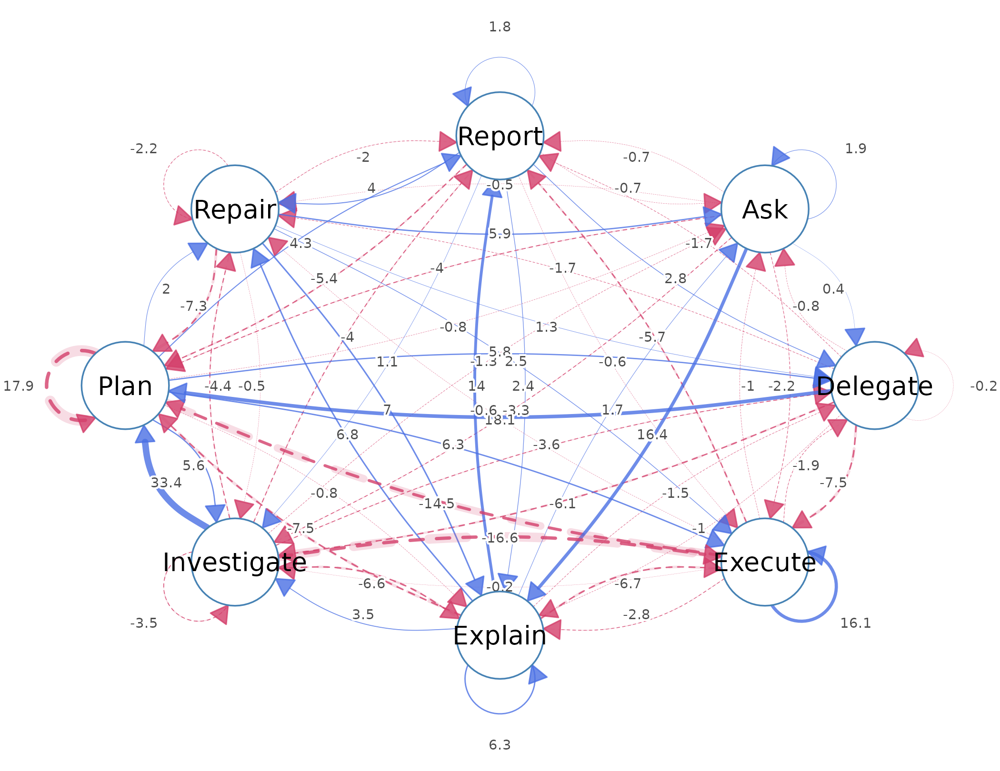
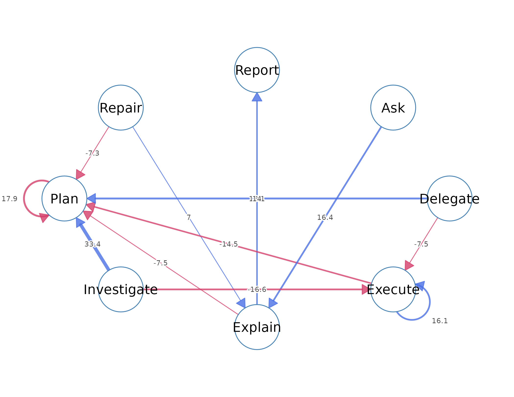
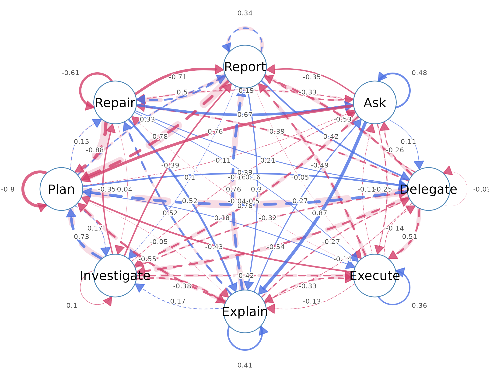
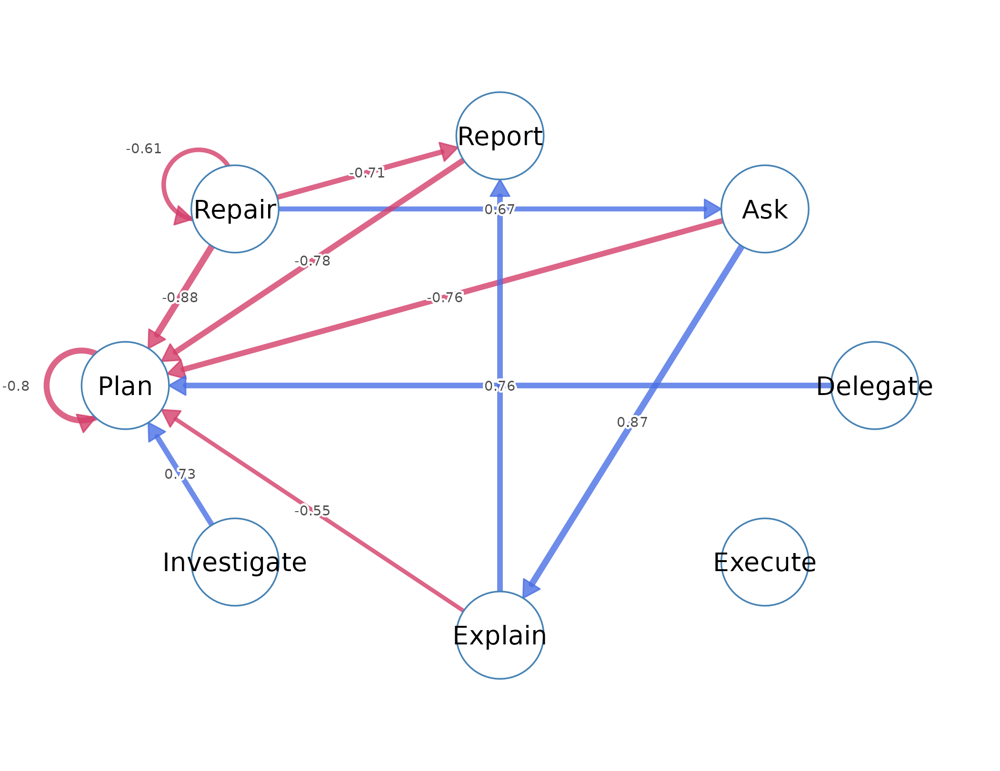
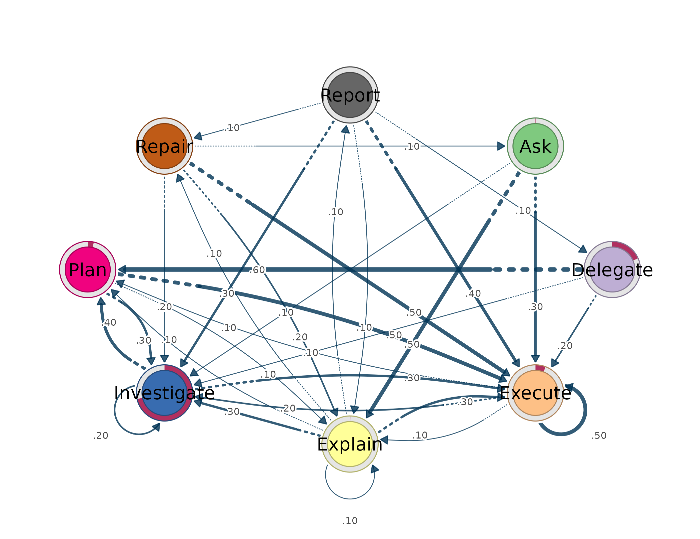

# Lag transition networks

Lag-sequential analysis studies the order in which categorical events
occur. Given a series of events, the method examines pairs that follow
one another and tests whether a given event is followed by another event
more or less often than the order of events alone would predict. The
event types become the states of the process, and the transitions
between them become the object of analysis. A lag transition network is
the representation of these tested transitions: the states are nodes, a
directed edge from one state to another represents the transition
between them, and the weight on the edge measures how far the observed
transition departs from what independence would predict.

The method rests on a comparison between two quantities for every
ordered pair of states. The observed count is the number of times the
first state is immediately followed by the second. The expected count is
the number that would occur if the next state did not depend on the
current one, and it is built from the base rates of the two states
alone. The adjusted residual expresses the difference between the two on
a standardised scale. A positive residual identifies a transition that
occurs more often than expected, which marks a behavioural regularity
above the base rates of its states. A negative residual identifies a
transition that occurs less often than expected, which marks an
avoidance. A residual near zero identifies a transition that occurs
about as often as chance predicts. This tutorial develops these
quantities, fits a model to a real data set, and interprets the network
that results.

## The data and the fitted model

The `ai_long` data set is a long-format event log of coded AI-side
actions in human–AI coding sessions, with one row per event.

``` r

data(ai_long)
head(ai_long)
#>   message_id   project   session_id  timestamp session_date        code cluster
#> 1       3441 Project_7 0086cabebd15 1772661600   2026-03-05    Delegate  Action
#> 2       3441 Project_7 0086cabebd15 1772661600   2026-03-05        Plan  Repair
#> 3       3443 Project_7 0086cabebd15 1772661600   2026-03-05     Execute  Action
#> 4       3443 Project_7 0086cabebd15 1772661600   2026-03-05        Plan  Repair
#> 5       3445 Project_7 0086cabebd15 1772661600   2026-03-05     Execute  Action
#> 6       3447 Project_7 0086cabebd15 1772661600   2026-03-05 Investigate  Action
#>   code_order order_in_session
#> 1          1                5
#> 2          2                6
#> 3          1                8
#> 4          2                9
#> 5          1               12
#> 6          1               14
```

Four columns enter the analysis. The `code` column holds the action, the
event type whose transitions are modelled. The `order_in_session` column
orders events within a session. The `session_id` column identifies one
uninterrupted sequence, and the `project` column groups the sessions.
Transitions are counted within a session only, so the last event of one
session and the first of the next are never treated as a pair; the
`session` argument enforces this boundary.

The [`lsa()`](https://saqr.me/lagdynamics/reference/lsa.md) function
fits the model, taking the four columns as named arguments.

``` r

fit <- lsa(ai_long,
           actor   = "project",
           session = "session_id",
           action  = "code",
           order   = "order_in_session")
fit
#> Lag Sequential Analysis  —  classical  (lag 1, directed)
#>   8 states | 8123 transitions | 8551 events | 428 sequences
#>   states: Ask, Delegate, Execute, Explain, Investigate, Plan, Repair, Report
#>   independence: G² = 2168.1, df = 49, p <2e-16
#> 
#>   Significant transitions (p < 0.05): 40 of 64
#>   strongest over-represented (of 19):
#>     Investigate -> Plan  z =  +33.4  ***
#>     Delegate -> Plan     z =  +18.1  ***
#>     Ask -> Explain       z =  +16.4  ***
#>     Execute -> Execute   z =  +16.1  ***
#>     Explain -> Report    z =  +14.0  ***
#>     ... and 14 more
#> 
#>   Initial states:
#>     Investigate 0.715  ████████████████████████
#>     Delegate    0.185  ██████
#>     Execute     0.058  ██
#>     Plan        0.035  █
#>     Ask         0.005  
#>     Explain     0.002  
#>     Repair      0.000  
#>     Report      0.000
```

The printed model reports the number of states, transitions, and
sequences, the omnibus test of independence, the strongest
over-represented transitions, and the initial-state distribution. The
`ai_long` process has 8 states and 8123 within-session transitions drawn
from 428 sessions, so the model estimates a compact 8-by-8 transition
system from a large number of observed moves; the residuals it reports
are therefore repeated tendencies in the process rather than isolated
episodes.

## Reading the model

The fitted model exposes its contents through accessor functions, each
of which returns a table.

The initial-state distribution records the share of sessions that begin
in each state.

``` r

initial(fit)
#>         state init_prob
#> 1         Ask   0.00467
#> 2    Delegate   0.18458
#> 3     Execute   0.05841
#> 4     Explain   0.00234
#> 5 Investigate   0.71495
#> 6        Plan   0.03505
#> 7      Repair   0.00000
#> 8      Report   0.00000
```

The initial-state distribution places most of its mass on `Investigate`,
whose value of 0.715 means that about 71% of sessions begin with an
investigation action. `Delegate` begins 18% of sessions and `Execute`
6%, while `Repair` and `Report` never begin a session. The process
almost always opens by gathering information.

Node activity records how often each state sends and receives
transitions.

``` r

nodes(fit)
#>         state outgoing incoming
#> 1         Ask       91       97
#> 2    Delegate      280      216
#> 3     Execute     3090     3233
#> 4     Explain      504      523
#> 5 Investigate     2235     2011
#> 6        Plan     1510     1605
#> 7      Repair      251      257
#> 8      Report      162      181
```

`Execute` sends 3090 transitions and receives 3233, more than any other
state, which makes it the most frequently visited state in the process.
`Ask`, `Report`, and `Explain` are visited rarely. The magnitude of
these totals is exactly what the expected-count calculation controls
for, so that a busy state is not credited with meaningful transitions
merely for being busy.

The omnibus test evaluates the whole table against independence and is
the first result to consult.

``` r

tests(fit)
#>   test statistic df p
#> 1 lrx2      2168 49 0
#> 2   x2      2485 49 0
```

The likelihood-ratio statistic is $`G^2 = 2168`$ on 49 degrees of
freedom, with a p-value below machine precision. The order of actions is
therefore not random: the next action depends on the current one. A
non-significant omnibus test would remove any basis for interpreting
individual transitions, so it is checked before them.

The
[`transitions()`](https://saqr.me/lagdynamics/reference/transitions.md)
function returns one row per directed edge. Its `direction` argument
selects over- or under-represented transitions and its `sort` argument
orders them by strength.

``` r

transitions(fit, direction = "over", sort = "strength")
#>           from          to lag count expected   prob prob_col adj_res         p
#> 1  Investigate        Plan   1   977   441.61 0.4371   0.6087   33.41 1.11e-244
#> 2     Delegate        Plan   1   174    55.32 0.6214   0.1084   18.13  1.96e-73
#> 3          Ask     Explain   1    44     5.86 0.4835   0.0841   16.38  2.56e-60
#> 4      Execute     Execute   1  1575  1229.84 0.5097   0.4872   16.12  1.98e-58
#> 5      Explain      Report   1    56    11.23 0.1111   0.3094   13.95  3.12e-44
#> 6       Repair     Explain   1    43    16.16 0.1713   0.0822    7.01  2.36e-12
#> 7      Explain      Repair   1    42    15.95 0.0833   0.1634    6.85  7.59e-12
#> 8         Plan     Execute   1   709   600.99 0.4695   0.2193    6.29  3.10e-10
#> 9      Explain     Explain   1    66    32.45 0.1310   0.1262    6.29  3.24e-10
#> 10      Repair         Ask   1    13     3.00 0.0518   0.1340    5.90  3.54e-09
#> 11        Plan    Delegate   1    73    40.15 0.0483   0.3380    5.82  5.78e-09
#> 12        Plan Investigate   1   458   373.83 0.3033   0.2277    5.56  2.66e-08
#> 13        Plan      Report   1    56    33.65 0.0371   0.3094    4.32  1.56e-05
#> 14      Report      Repair   1    14     5.13 0.0864   0.0545    4.02  5.73e-05
#> 15     Explain Investigate   1   158   124.77 0.3135   0.0786    3.54  3.99e-04
#> 16      Report    Delegate   1    10     4.31 0.0617   0.0463    2.81  4.99e-03
#> 17      Repair     Execute   1   119    99.90 0.4741   0.0368    2.50  1.23e-02
#> 18      Report     Explain   1    18    10.43 0.1111   0.0344    2.45  1.44e-02
#> 19        Plan      Repair   1    60    47.77 0.0397   0.2335    1.99  4.64e-02
#>    yules_q  kappa kappa_z   kappa_p lift sign significant
#> 1    0.734 0.4556   33.41 1.15e-244 2.21 over        TRUE
#> 2    0.761 0.4940   17.86  2.49e-71 3.15 over        TRUE
#> 3    0.873 0.4082   15.99  1.56e-57 7.51 over        TRUE
#> 4    0.358 0.1655   15.30  7.73e-53 1.28 over        TRUE
#> 5    0.765 0.2643   14.07  6.11e-45 4.99 over        TRUE
#> 6    0.522 0.1130    7.20  6.20e-13 2.66 over        TRUE
#> 7    0.516 0.1088    6.93  4.15e-12 2.63 over        TRUE
#> 8    0.178 0.0915    5.21  1.84e-07 1.18 over        TRUE
#> 9    0.405 0.0689    6.37  1.88e-10 2.03 over        TRUE
#> 10   0.670 0.1044    5.93  2.94e-09 4.34 over        TRUE
#> 11   0.394 0.0716    2.59  9.67e-03 1.82 over        TRUE
#> 12   0.173 0.0161    1.18  2.37e-01 1.23 over        TRUE
#> 13   0.333 0.1480    4.16  3.16e-05 1.66 over        TRUE
#> 14   0.501 0.0488    3.77  1.66e-04 2.73 over        TRUE
#> 15   0.174 0.0419    1.62  1.04e-01 1.27 over        TRUE
#> 16   0.425 0.0215    1.55  1.22e-01 2.32 over        TRUE
#> 17   0.159 0.1325    2.75  5.97e-03 1.19 over        TRUE
#> 18   0.297 0.0407    2.16  3.05e-02 1.73 over        TRUE
#> 19   0.148 0.0543    1.83  6.75e-02 1.26 over        TRUE
```

`Investigate -> Plan` is the strongest over-represented transition. It
occurred 977 times, its transition probability is 0.44, and its adjusted
residual is 33.4. The probability means that planning follows
investigation 44% of the time, and the lift of 2.21 means this is 2.2
times more often than independence predicts; investigation is regularly
converted into planning. `Ask -> Explain` carries a lift of 7.51, so
asking is followed by explaining about seven times more often than
chance. `Execute -> Execute` has a probability of 0.51, so execution is
followed by execution about half the time and tends to occur in runs.
`Delegate -> Plan` and `Explain -> Report` describe related
regularities.

``` r

transitions(fit, direction = "under", sort = "strength")
#>           from          to lag count expected    prob prob_col adj_res        p
#> 1         Plan        Plan   1    49   298.36 0.03245  0.03053  -17.86 2.36e-71
#> 2  Investigate     Execute   1   563   889.54 0.25190  0.17414  -16.57 1.07e-61
#> 3      Execute        Plan   1   358   610.54 0.11586  0.22305  -14.50 1.30e-47
#> 4     Delegate     Execute   1    51   111.44 0.18214  0.01577   -7.51 5.92e-14
#> 5      Explain        Plan   1    35    99.58 0.06944  0.02181   -7.46 8.65e-14
#> 6       Repair        Plan   1     4    49.59 0.01594  0.00249   -7.34 2.10e-13
#> 7      Explain     Execute   1   129   200.59 0.25595  0.03990   -6.73 1.73e-11
#> 8  Investigate     Explain   1    79   143.90 0.03535  0.15105   -6.57 5.04e-11
#> 9     Delegate Investigate   1    26    69.32 0.09286  0.01293   -6.10 1.03e-09
#> 10     Execute      Report   1    32    68.85 0.01036  0.17680   -5.71 1.16e-08
#> 11      Report        Plan   1     5    32.01 0.03086  0.00312   -5.38 7.31e-08
#> 12 Investigate      Repair   1    40    70.71 0.01790  0.15564   -4.36 1.30e-05
#> 13 Investigate      Report   1    26    49.80 0.01163  0.14365   -4.01 6.17e-05
#> 14         Ask        Plan   1     3    17.98 0.03297  0.00187   -3.97 7.30e-05
#> 15 Investigate    Delegate   1    36    59.43 0.01611  0.16667   -3.62 2.96e-04
#> 16 Investigate Investigate   1   493   553.32 0.22058  0.24515   -3.47 5.16e-04
#> 17         Ask Investigate   1     9    22.53 0.09890  0.00448   -3.30 9.52e-04
#> 18     Execute     Explain   1   169   198.95 0.05469  0.32314   -2.79 5.29e-03
#> 19         Ask     Execute   1    26    36.22 0.28571  0.00804   -2.20 2.78e-02
#> 20      Repair      Repair   1     2     7.94 0.00797  0.00778   -2.18 2.95e-02
#> 21      Repair      Report   1     1     5.59 0.00398  0.00552   -2.00 4.60e-02
#>    yules_q  kappa kappa_z  kappa_p   lift  sign significant
#> 1   -0.803 -0.840  -18.16 1.04e-73 0.1642 under        TRUE
#> 2   -0.423 -0.362  -16.02 9.06e-58 0.6329 under        TRUE
#> 3   -0.431 -0.420  -14.73 4.13e-49 0.5864 under        TRUE
#> 4   -0.508 -0.546   -7.49 6.85e-14 0.4576 under        TRUE
#> 5   -0.553 -0.647   -7.39 1.42e-13 0.3515 under        TRUE
#> 6   -0.881 -0.918   -7.22 5.10e-13 0.0807 under        TRUE
#> 7   -0.333 -0.354   -6.56 5.42e-11 0.6431 under        TRUE
#> 8   -0.380 -0.444   -6.39 1.67e-10 0.5490 under        TRUE
#> 9   -0.536 -0.675   -7.19 6.49e-13 0.3751 under        TRUE
#> 10  -0.489 -0.536   -5.72 1.08e-08 0.4648 under        TRUE
#> 11  -0.775 -0.854   -5.62 1.96e-08 0.1562 under        TRUE
#> 12  -0.355 -0.426   -4.22 2.41e-05 0.5657 under        TRUE
#> 13  -0.393 -0.470   -3.90 9.82e-05 0.5221 under        TRUE
#> 14  -0.759 -0.840   -4.06 4.82e-05 0.1668 under        TRUE
#> 15  -0.317 -0.550   -5.86 4.72e-09 0.6057 under        TRUE
#> 16  -0.102 -0.215   -7.38 1.58e-13 0.8910 under        TRUE
#> 17  -0.503 -0.664   -4.05 5.03e-05 0.3995 under        TRUE
#> 18  -0.133 -0.154   -2.85 4.44e-03 0.8495 under        TRUE
#> 19  -0.249 -0.311   -2.44 1.47e-02 0.7179 under        TRUE
#> 20  -0.613 -0.741   -2.12 3.37e-02 0.2518 under        TRUE
#> 21  -0.708 -0.816   -1.95 5.08e-02 0.1788 under        TRUE
```

`Plan -> Plan` is the strongest under-represented transition, with an
adjusted residual of -17.9 and a lift of 0.16. Planning is therefore
very rarely repeated immediately: a planning action is followed by
another planning action only about one-sixth as often as expected. The
result does not mean planning is uncommon; it means planning is normally
followed by a different action. `Investigate -> Execute` (residual
-16.6) is also under-represented, so investigation seldom leads straight
to execution. Read together with the over-represented
`Investigate -> Plan`, these avoidances show a separation between
gathering information and acting on it, with a planning step in between.

## The network

The network represents each state as a node and each transition as a
directed edge, with edge width proportional to the weight and an edge
that loops to its own node marking a self-transition. Three networks can
be drawn from the same model, differing in the quantity they place on
the edges. The two lag-sequential networks come first: the residual
network, whose edges are signed adjusted residuals (blue
over-represented, red avoided), and the Yule’s Q network, which shows
the same signed departures on a fixed $`[-1, 1]`$ scale that does not
grow with sample size. The probability network, which is the Transition
Network Analysis view, comes last.

The residual network draws the tested departures from independence. The
full network draws every edge:

``` r

plot_transitions(fit, weights = "residuals", decimals = 1)
```



Because a residual grows with sample size and the data set has many
transitions, most edges are significant and the full network is dense.
The `top` argument keeps the strongest edges by absolute residual:

``` r

plot_transitions(fit, weights = "residuals", top = 12, decimals = 1)
```



The pruned residual network has a directed shape that the edge weights
make explicit. `Investigate -> Plan` is the heaviest edge (residual
33.4), and its reverse `Plan -> Investigate` is also over-represented
(residual 5.6); investigation and planning therefore form a mutual pair.
`Plan -> Execute` then runs forward (residual 6.3), while its reverse
`Execute -> Plan` is red (residual -14.5), so the link from planning to
execution is one-directional. `Execute -> Execute` is a heavy self-loop
(residual 16.1), so the process remains in execution once it arrives.
The red edges `Plan -> Plan` and `Investigate -> Execute` confirm that
planning does not repeat and that investigation does not jump straight
to execution.

The Yule’s Q network shows the same signed departures on a bounded
scale, so its edge values are comparable across datasets and across
groups of different sizes. The full network again draws every edge, and
`top` keeps the strongest:

``` r

plot_transitions(fit, weights = "yules_q", decimals = 2)
```



``` r

plot_transitions(fit, weights = "yules_q", top = 12, decimals = 2)
```



The Yule’s Q network preserves the shape of the residual network, the
same over-represented and avoided edges, but its weights are bounded
association values rather than test statistics, which is the form to use
when the networks of two groups are to be compared.

The probability network draws the same transitions weighted by
$`P(\text{to} \mid \text{from})`$, the share of moves out of a state
that reach each destination. This is the network of Transition Network
Analysis (TNA); a thin ring around each node shows the initial
probability of starting in that state.

``` r

plot_transitions(fit, weights = "prob")
```



The probability network foregrounds the most frequent transitions:
`Delegate -> Plan` (0.62), `Execute -> Execute` (0.51), `Ask -> Explain`
(0.48), `Plan -> Execute` (0.47), and `Investigate -> Plan` (0.44). It
is not equivalent to the lag-sequential networks. A transition
probability lies between 0 and 1, records how often a transition occurs,
and reaches its smallest value at zero, so it cannot represent a
transition that occurs less often than expected. A signed residual or
Yule’s Q can. The under-represented edges of the residual network, such
as `Execute -> Plan`, have no counterpart in the probability network.
The probability network describes where the process goes; the
lag-sequential networks identify which transitions depart from chance,
and in which direction.

## Inference

The adjusted residual is an analytic test, and its conclusions can be
checked against the data by resampling. The bootstrap resamples whole
sequences with replacement, refits the model on each resample, and
records a confidence interval for every edge together with whether the
edge keeps its sign.

``` r

boot <- bootstrap_lsa(fit, R = 1000)
boot
#> <lsa_bootstrap>
#>   engine:        classical
#>   level:         sequence
#>   replicates:    1000
#>   CI level:      95%
#>   stable edges:  41 of 64
```

The bootstrap finds 43 of the 64 possible edges to be stable, meaning
their sign is preserved across the resamples. A stable edge can be
reported with confidence, whereas an unstable edge might not reappear in
a new sample even when its residual is large.

Analytic certainty offers a closed-form alternative to the bootstrap.
The
[`certainty_lsa()`](https://saqr.me/lagdynamics/reference/certainty_lsa.md)
function models each state’s outgoing transitions as
Dirichlet–Multinomial, which yields a posterior distribution, a credible
interval, and a certainty decision for each transition probability
without resampling.

``` r

cert <- certainty_lsa(fit)
cert
#> <lsa_certainty>  (analytic Dirichlet-Multinomial)
#>   engine:        classical
#>   prior:         Dirichlet(0.50)
#>   CI level:      95%  |  inference: stability
#>   certain edges: 26 of 64
```

Analytic certainty classifies 26 of 64 edges as certain, meaning their
transition probabilities are estimated precisely. The bootstrap and the
analytic estimate agree on the overall picture: the frequent transitions
are estimated with confidence, and the rare transitions are not.

## Summary

The analysis of `ai_long` establishes that the order of actions is not
random ($`G^2 = 2168`$, $`p < 0.001`$) and that the process has a
definite shape. Sessions almost always begin in `Investigate` (initial
probability 0.71). `Investigate` and `Plan` form a mutual pair, feed
forward into `Execute` through the one-directional `Plan -> Execute`,
and terminate in `Execute`, which is the busiest state (in-strength
2.30), occurs in runs (`Execute -> Execute`, probability 0.51), and
rarely returns to planning. Planning does not repeat (`Plan -> Plan`,
residual -17.9) and investigation seldom leads straight to execution
(`Investigate -> Execute`, residual -16.6), so a planning step separates
information gathering from acting on it. Of the 64 possible transitions,
40 are significant, 43 are sign-stable under the bootstrap, and 26 are
certain under the Bayesian estimate, so a transition merits reporting
when it is significant, sizeable, and reproducible. The residual network
and the probability network remain complementary throughout: the
probability network describes where the process tends to go, and the
residual network identifies which transitions occur more or less often
than chance.

## References

Bakeman, R., & Gottman, J. M. (1997). *Observing interaction: An
introduction to sequential analysis* (2nd ed.). Cambridge University
Press.

Haberman, S. J. (1973). The analysis of residuals in cross-classified
tables. *Biometrics*, 29(1), 205–220.

Saqr, M., López-Pernas, S., & Tikka, S. (2025). Mapping relational
dynamics with transition network analysis: A primer and tutorial. In
*Advanced Learning Analytics Methods and Tutorials*.
