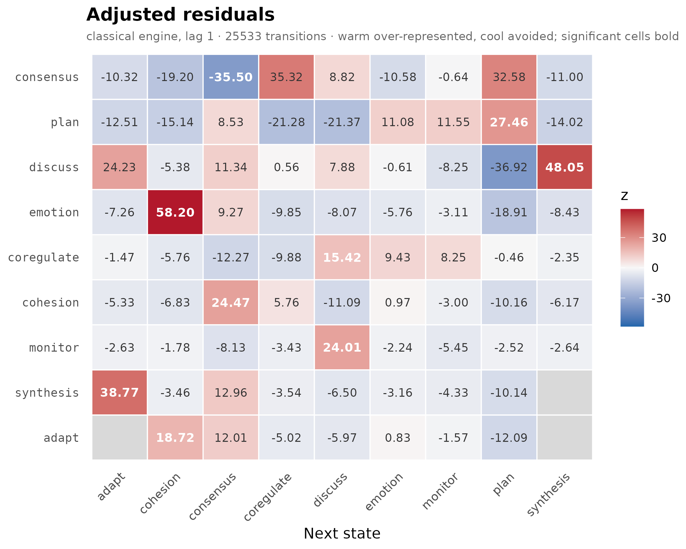
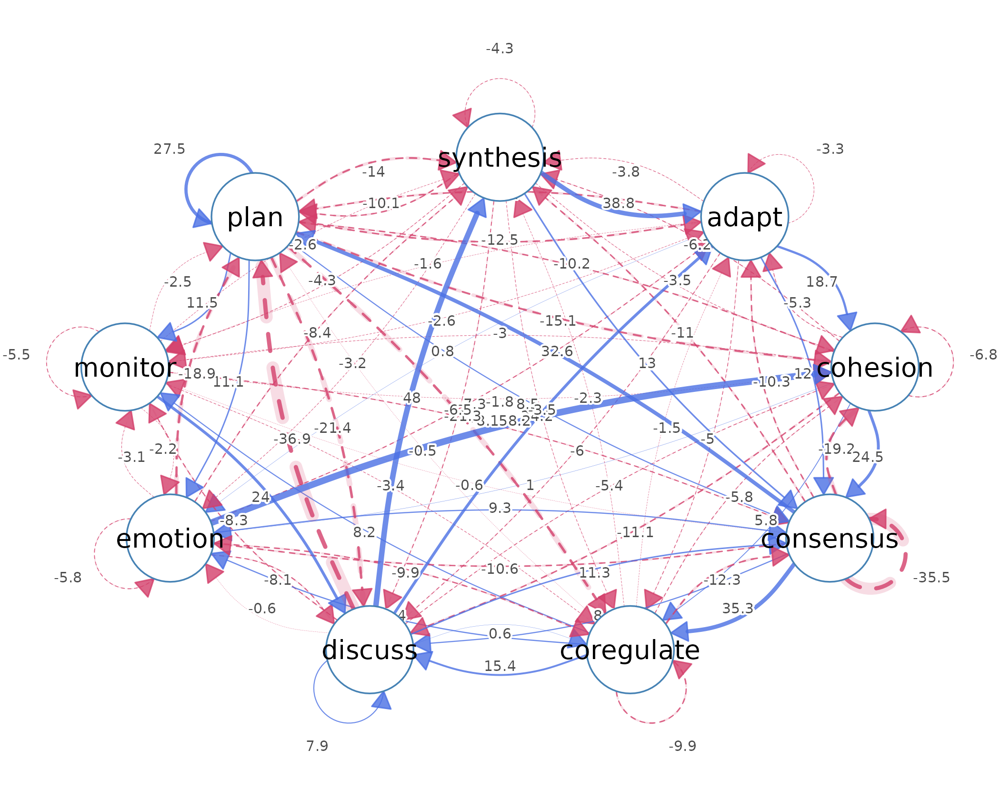
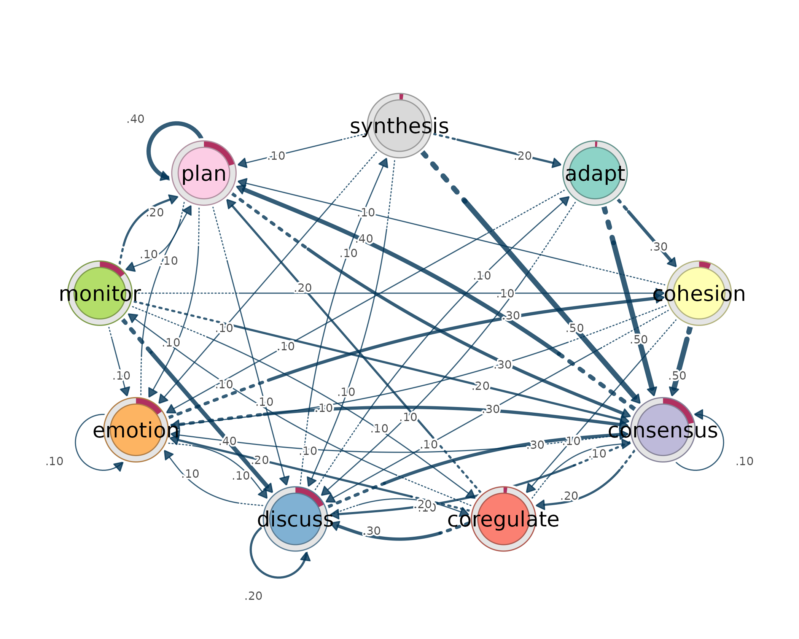
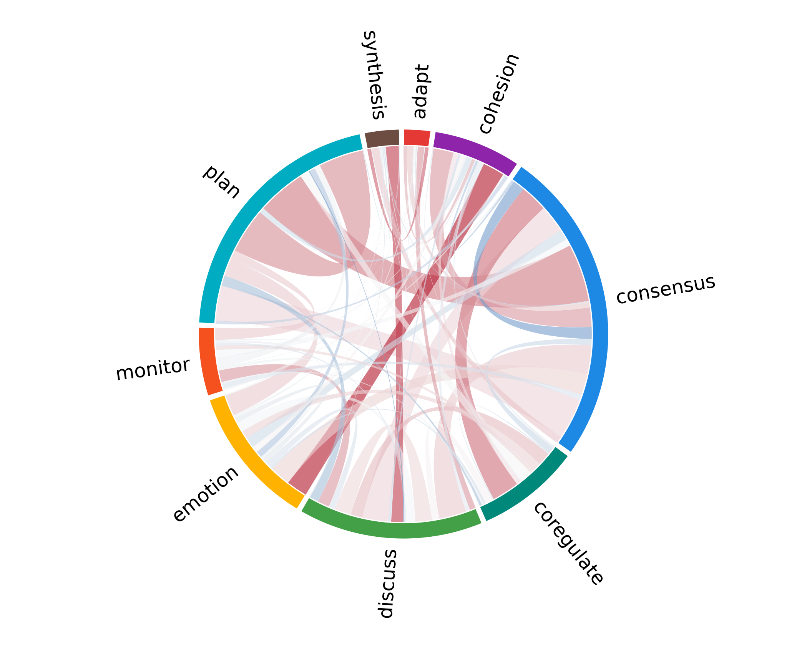
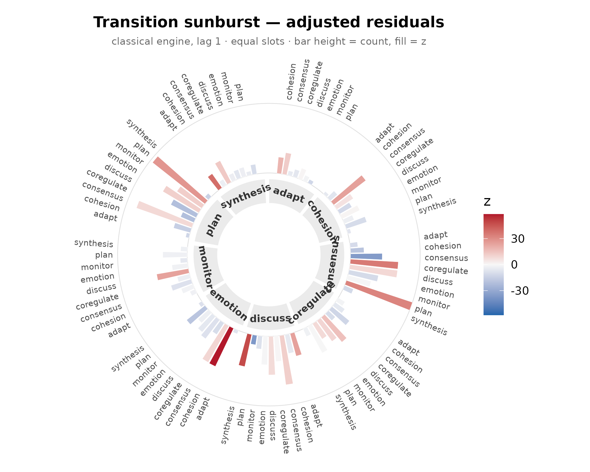
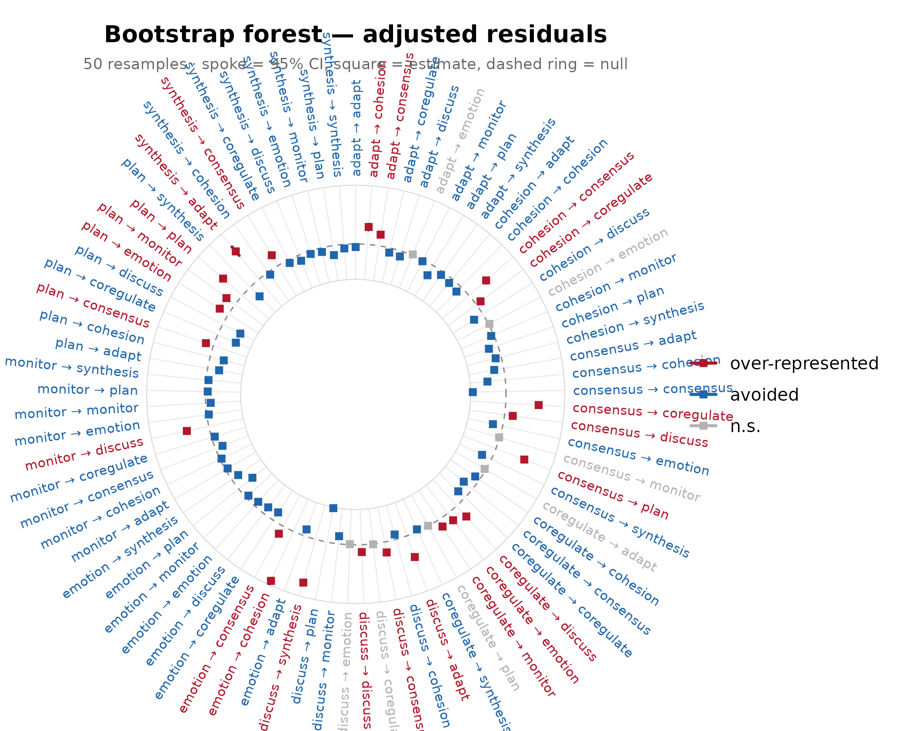
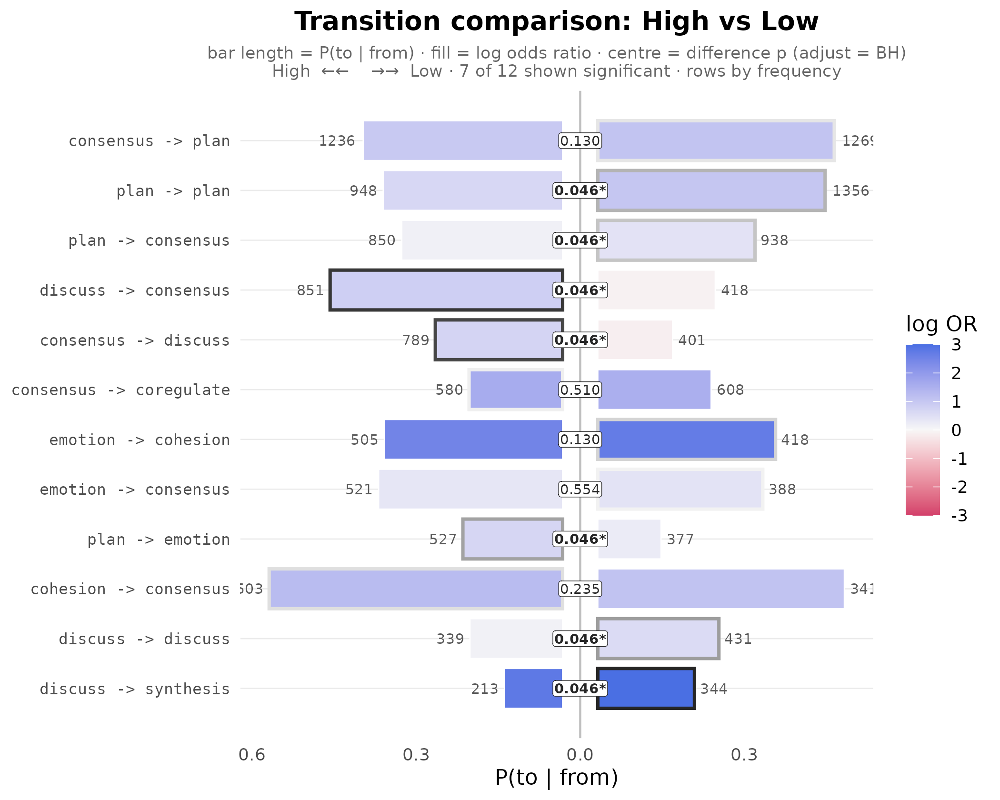
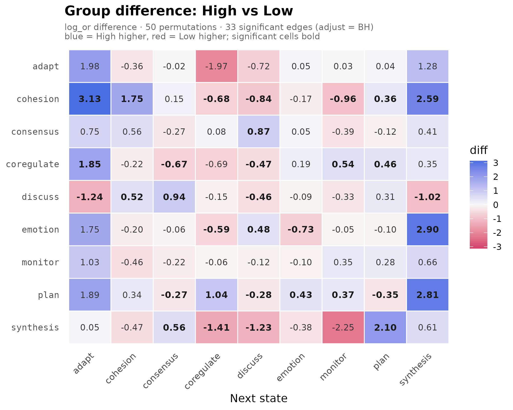

# Get started with lagdynamics

## The Method

Lag-sequential analysis (LSA) studies ordered categorical processes. It
asks whether, given that one state has just occurred, another state
follows more often or less often than chance. The unit of analysis is
the transition from a source state to a target state, written as
`from -> to`.

The reference model is independence. Under independence, the current
state has no sequential memory: the next state is expected only from the
overall marginal distribution of states, not from the state that
preceded it. LSA compares each observed transition count with the count
expected under that no-memory model. The adjusted residual is the
standardized departure from that expectation. A positive residual means
that the transition is over-represented. A negative residual means that
the transition is avoided. Values near zero indicate that the transition
is close to what independence would predict.

The residual is therefore the test statistic for a local sequential
claim. A transition with a large residual is not merely common. It is a
transition whose observed frequency departs from the chance baseline
defined by the row and column margins of the transition table.

## Why lagdynamics

LSA has a long history in behavioral, educational, and interaction
research, but applied studies often stop at description. Observed
transition rates are reported, plotted, and interpreted, while the
inferential question is left implicit: whether the apparent pattern is
larger than expected under chance sequential pairing.

Existing tooling has also tended to be dated, object-centric, or
difficult to combine with modern data workflows. `lagdynamics`
modernizes this practice. It implements lag-sequential analysis as a
tidy, visual, interoperable, and confirmatory workflow. Each result is
returned by a verb as a one-row-per-observation data frame. The fitted
model can be read, plotted, resampled, compared across groups, and
converted to network objects without indexing into internal slots.

The design follows the Dynalytics framework of Saqr, Lopez-Pernas, and
Misiejuk (2026). Dynalytics treats analysis as a scientific contract:
every analytical claim must be matched by evidence appropriate to the
structure, scope, and complexity of the claim. In `lagdynamics`, an edge
is a tested departure from independence. Descriptive claims use
descriptive evidence, edge claims use edge-level uncertainty,
whole-network claims use reproducibility evidence, and group-difference
claims use comparison procedures that preserve the empirical unit of the
sequence.

## Hands-On Tour

The main example is `group_regulation`, a bundled wide-format data set
of 2,000 collaborative-learning sessions. Each row is one sequence, each
column is an ordered time point, and each cell is a coded regulation
action. The smaller `engagement` data set is also bundled and is used
below to show the same input grammar on weekly engagement trajectories.

``` r

dim(group_regulation)
#> [1] 2000   26
head(group_regulation)
#>          T1         T2        T3        T4        T5        T6        T7
#> 1  cohesion  consensus   discuss synthesis     adapt consensus      plan
#> 2      plan    emotion consensus   discuss synthesis     adapt   emotion
#> 3 consensus coregulate   monitor consensus      plan   emotion consensus
#> 4   monitor    emotion      plan   discuss synthesis consensus   discuss
#> 5   discuss    emotion  cohesion      <NA>      <NA>      <NA>      <NA>
#> 6      plan       plan consensus      plan      plan      plan      plan
#>          T8        T9        T10     T11       T12        T13       T14
#> 1 consensus      <NA>       <NA>    <NA>      <NA>       <NA>      <NA>
#> 2      <NA>      <NA>       <NA>    <NA>      <NA>       <NA>      <NA>
#> 3   monitor consensus coregulate emotion  cohesion   cohesion consensus
#> 4  cohesion consensus       plan    plan   emotion       <NA>      <NA>
#> 5      <NA>      <NA>       <NA>    <NA>      <NA>       <NA>      <NA>
#> 6      plan   emotion       plan    plan consensus coregulate     adapt
#>        T15       T16  T17       T18       T19     T20       T21  T22     T23
#> 1     <NA>      <NA> <NA>      <NA>      <NA>    <NA>      <NA> <NA>    <NA>
#> 2     <NA>      <NA> <NA>      <NA>      <NA>    <NA>      <NA> <NA>    <NA>
#> 3     plan   emotion plan      plan consensus monitor consensus plan emotion
#> 4     <NA>      <NA> <NA>      <NA>      <NA>    <NA>      <NA> <NA>    <NA>
#> 5     <NA>      <NA> <NA>      <NA>      <NA>    <NA>      <NA> <NA>    <NA>
#> 6 cohesion consensus plan consensus      <NA>    <NA>      <NA> <NA>    <NA>
#>    T24       T25     T26
#> 1 <NA>      <NA>    <NA>
#> 2 <NA>      <NA>    <NA>
#> 3 plan consensus discuss
#> 4 <NA>      <NA>    <NA>
#> 5 <NA>      <NA>    <NA>
#> 6 <NA>      <NA>    <NA>

dim(engagement)
#> [1] 138  15
head(engagement)
#>      1         2            3            4            5            6           
#> [1,] "Active"  "Disengaged" "Disengaged" "Disengaged" "Active"     "Active"    
#> [2,] "Average" "Average"    "Average"    "Average"    "Average"    "Average"   
#> [3,] "Average" "Active"     "Active"     "Active"     "Active"     "Active"    
#> [4,] "Active"  "Active"     "Active"     "Active"     "Active"     "Average"   
#> [5,] "Active"  "Active"     "Active"     "Average"    "Active"     "Average"   
#> [6,] "Average" "Average"    "Disengaged" "Average"    "Disengaged" "Disengaged"
#>      7         8         9         10           11        12          
#> [1,] "Active"  "Active"  "Average" "Active"     "Average" "Active"    
#> [2,] "Average" "Average" "Average" "Active"     "Average" "Average"   
#> [3,] "Active"  "Active"  "Active"  "Average"    "Active"  "Active"    
#> [4,] "Average" "Active"  "Active"  "Active"     "Average" "Active"    
#> [5,] "Active"  "Active"  "Active"  "Disengaged" "Active"  "Active"    
#> [6,] "Average" "Average" "Average" "Disengaged" "Average" "Disengaged"
#>      13        14        15       
#> [1,] NA        NA        NA       
#> [2,] "Average" "Average" "Average"
#> [3,] "Active"  "Active"  "Active" 
#> [4,] "Average" "Active"  "Average"
#> [5,] "Active"  "Average" "Average"
#> [6,] "Average" "Average" "Average"
```

### Fit

[`lsa()`](https://saqr.me/lagdynamics/reference/lsa.md) fits the model
in one call. It tabulates the transition matrix, derives expected counts
under independence, computes adjusted residuals, and records the recipe
used to estimate the model. The printed object is a compact summary. The
fitted object itself is read through verbs.

``` r

fit <- lsa(group_regulation)
fit
#> Lag Sequential Analysis  —  classical  (lag 1, directed)
#>   9 states | 25533 transitions | 27533 events | 2000 sequences
#>   states: adapt, cohesion, consensus, coregulate, discuss, emotion, monitor, plan, synthesis
#>   independence: G² = 13203.8, df = 64, p <2e-16
#> 
#>   Significant transitions (p < 0.05): 72 of 81
#>   strongest over-represented (of 23):
#>     emotion -> cohesion      z =  +58.2  ***
#>     discuss -> synthesis     z =  +48.0  ***
#>     synthesis -> adapt       z =  +38.8  ***
#>     consensus -> coregulate  z =  +35.3  ***
#>     consensus -> plan        z =  +32.6  ***
#>     ... and 18 more
#> 
#>   Initial states:
#>     consensus  0.214  ████████████████████████
#>     plan       0.204  ███████████████████████
#>     discuss    0.175  ████████████████████
#>     emotion    0.151  █████████████████
#>     monitor    0.144  ████████████████
#>     cohesion   0.060  ███████
#>     synthesis  0.019  ██
#>     coregulate 0.019  ██
#>     adapt      0.011  █
```

### Read a Fit

The public surface is tidy. Every result is produced by a verb, and each
verb returns a data frame with one row per observation.
[`transitions()`](https://saqr.me/lagdynamics/reference/transitions.md)
returns one row per `from -> to` cell. The columns contain observed
counts, expected counts, transition probabilities, adjusted residuals,
p-values, and related association statistics.

``` r

transitions(fit) |> head()   # one row per from -> to transition
#>         from    to lag count expected    prob prob_col adj_res         p
#> 1      adapt adapt   1     0     10.6 0.00000  0.00000   -3.32  8.96e-04
#> 2   cohesion adapt   1     5     35.3 0.00295  0.00942   -5.33  9.89e-08
#> 3  consensus adapt   1    30    131.6 0.00474  0.05650  -10.32  5.64e-25
#> 4 coregulate adapt   1    32     41.0 0.01624  0.06026   -1.47  1.40e-01
#> 5    discuss adapt   1   282     82.2 0.07137  0.53107   24.23 1.03e-129
#> 6    emotion adapt   1     7     59.0 0.00247  0.01318   -7.26  3.98e-13
#>   yules_q  kappa kappa_z   kappa_p  lift  sign significant
#> 1  -1.000 -1.000   -3.41  6.56e-04 0.000 under        TRUE
#> 2  -0.768 -0.865   -5.50  3.76e-08 0.142 under        TRUE
#> 3  -0.698 -0.781  -10.63  2.23e-26 0.228 under        TRUE
#> 4  -0.134 -0.254   -1.75  7.96e-02 0.781 under       FALSE
#> 5   0.736  0.419   23.26 1.07e-119 3.432  over        TRUE
#> 6  -0.811 -0.887   -7.48  7.60e-14 0.119 under        TRUE
```

The companion verbs read the other parts of the same fitted model.
[`nodes()`](https://saqr.me/lagdynamics/reference/nodes.md) reports
incoming and outgoing volume by state.
[`tests()`](https://saqr.me/lagdynamics/reference/tests.md) reports
tablewise independence tests.
[`initial()`](https://saqr.me/lagdynamics/reference/initial.md) reports
the initial-state distribution when the input contains sequences rather
than a precomputed transition matrix.

``` r

nodes(fit)                  # one row per state, with in/out totals
#>        state outgoing incoming
#> 1      adapt      509      531
#> 2   cohesion     1695     1718
#> 3  consensus     6329     6369
#> 4 coregulate     1970     2095
#> 5    discuss     3951     3916
#> 6    emotion     2837     2772
#> 7    monitor     1433     1228
#> 8       plan     6157     6214
#> 9  synthesis      652      690
tests(fit)                  # tablewise independence tests (G^2, chi-square)
#>   test statistic df p
#> 1 lrx2     13204 64 0
#> 2   x2     15435 64 0
initial(fit)                # initial-state distribution
#>        state init_prob
#> 1      adapt    0.0115
#> 2   cohesion    0.0605
#> 3  consensus    0.2140
#> 4 coregulate    0.0190
#> 5    discuss    0.1755
#> 6    emotion    0.1515
#> 7    monitor    0.1440
#> 8       plan    0.2045
#> 9  synthesis    0.0195
```

[`summary()`](https://rdrr.io/r/base/summary.html) returns the same tidy
discipline at the model level: one row per fitted model. For a grouped
model, the same verb returns one row per group.

``` r

summary(fit)                # one-row overview
#> Lag Sequential Analysis
#> =======================
#> Lag Sequential Analysis  —  classical  (lag 1, directed)
#>   9 states | 25533 transitions | 27533 events | 2000 sequences
#>   states: adapt, cohesion, consensus, coregulate, discuss, emotion, monitor, plan, synthesis
#>   independence: G² = 13203.8, df = 64, p <2e-16
#> 
#>   Significant transitions (p < 0.05): 72 of 81
#>   strongest over-represented (of 23):
#>     emotion -> cohesion      z =  +58.2  ***
#>     discuss -> synthesis     z =  +48.0  ***
#>     synthesis -> adapt       z =  +38.8  ***
#>     consensus -> coregulate  z =  +35.3  ***
#>     consensus -> plan        z =  +32.6  ***
#>     ... and 18 more
#> 
#>   Initial states:
#>     consensus  0.214  ████████████████████████
#>     plan       0.204  ███████████████████████
#>     discuss    0.175  ████████████████████
#>     emotion    0.151  █████████████████
#>     monitor    0.144  ████████████████
#>     cohesion   0.060  ███████
#>     synthesis  0.019  ██
#>     coregulate 0.019  ██
#>     adapt      0.011  █
#> 
#> Node activity (share of transitions):
#>     adapt       out 0.020 █           in 0.021 █
#>     cohesion    out 0.066 ███     in 0.067 ███
#>     consensus   out 0.248 ████████████  in 0.249 ████████████
#>     coregulate  out 0.077 ████  in 0.082 ████
#>     discuss     out 0.155 ███████  in 0.153 ███████
#>     emotion     out 0.111 █████  in 0.109 █████
#>     monitor     out 0.056 ███     in 0.048 ██
#>     plan        out 0.241 ████████████  in 0.243 ████████████
#>     synthesis   out 0.026 █           in 0.027 █
#> 
#> Observed counts (obs):
#>            adapt cohesion consensus coregulate discuss emotion monitor plan
#> adapt          0      139       243         11      30      61      17    8
#> cohesion       5       46       844        202     101     196      56  239
#> consensus     30       94       519       1188    1190     460     295 2505
#> coregulate    32       71       265         46     539     339     170  471
#> discuss      282      188      1269        333     770     418      88   46
#> emotion        7      923       909         97     289     218     103  283
#> monitor       16       80       228         83     538     130      26  309
#> plan           6      155      1788        106     418     904     465 2304
#> synthesis    153       22       304         29      41      46       8   49
#>            synthesis
#> adapt              0
#> cohesion           6
#> consensus         48
#> coregulate        37
#> discuss          557
#> emotion            8
#> monitor           23
#> plan              11
#> synthesis          0
#> 
#> Expected counts (exp):
#>            adapt cohesion consensus coregulate discuss emotion monitor plan
#> adapt       10.6     34.2       127       41.8    78.1    55.3    24.5  124
#> cohesion    35.2    114.0       423      139.1   260.0   184.0    81.5  413
#> consensus  131.6    425.9      1579      519.3   970.7   687.1   304.4 1540
#> coregulate  41.0    132.6       491      161.6   302.1   213.9    94.7  479
#> discuss     82.2    265.8       986      324.2   606.0   428.9   190.0  962
#> emotion     59.0    190.9       708      232.8   435.1   308.0   136.4  690
#> monitor     29.8     96.4       357      117.6   219.8   155.6    68.9  349
#> plan       128.0    414.3      1536      505.2   944.3   668.4   296.1 1498
#> synthesis   13.6     43.9       163       53.5   100.0    70.8    31.4  159
#>            synthesis
#> adapt           13.8
#> cohesion        45.8
#> consensus      171.0
#> coregulate      53.2
#> discuss        106.8
#> emotion         76.7
#> monitor         38.7
#> plan           166.4
#> synthesis       17.6
#> 
#> Transitional probabilities (prob):
#>            adapt cohesion consensus coregulate discuss emotion monitor  plan
#> adapt      0.000    0.273     0.477      0.022   0.059   0.120   0.033 0.016
#> cohesion   0.003    0.027     0.498      0.119   0.060   0.116   0.033 0.141
#> consensus  0.005    0.015     0.082      0.188   0.188   0.073   0.047 0.396
#> coregulate 0.016    0.036     0.135      0.023   0.274   0.172   0.086 0.239
#> discuss    0.071    0.048     0.321      0.084   0.195   0.106   0.022 0.012
#> emotion    0.002    0.325     0.320      0.034   0.102   0.077   0.036 0.100
#> monitor    0.011    0.056     0.159      0.058   0.375   0.091   0.018 0.216
#> plan       0.001    0.025     0.290      0.017   0.068   0.147   0.076 0.374
#> synthesis  0.235    0.034     0.466      0.044   0.063   0.071   0.012 0.075
#>            synthesis
#> adapt          0.000
#> cohesion       0.004
#> consensus      0.008
#> coregulate     0.019
#> discuss        0.141
#> emotion        0.003
#> monitor        0.016
#> plan           0.002
#> synthesis      0.000
#> 
#> Adjusted residuals (adj_res):
#>             adapt cohesion consensus coregulate discuss emotion monitor    plan
#> adapt       -3.32    18.72     12.01     -5.019   -5.97   0.826  -1.565 -12.090
#> cohesion    -5.33    -6.83     24.47      5.764  -11.09   0.968  -2.998 -10.165
#> consensus  -10.32   -19.20    -35.50     35.316    8.82 -10.581  -0.636  32.584
#> coregulate  -1.47    -5.76    -12.27     -9.882   15.42   9.433   8.249  -0.461
#> discuss     24.23    -5.38     11.34      0.556    7.88  -0.609  -8.251 -36.920
#> emotion     -7.26    58.20      9.27     -9.852   -8.07  -5.761  -3.113 -18.908
#> monitor     -2.63    -1.78     -8.13     -3.426   24.01  -2.235  -5.454  -2.519
#> plan       -12.51   -15.14      8.53    -21.279  -21.37  11.078  11.547  27.464
#> synthesis   38.77    -3.46     12.96     -3.541   -6.50  -3.161  -4.331 -10.140
#>            synthesis
#> adapt          -3.80
#> cohesion       -6.17
#> consensus     -11.00
#> coregulate     -2.35
#> discuss        48.05
#> emotion        -8.43
#> monitor        -2.64
#> plan          -14.02
#> synthesis      -4.31
```

Focused transition tables are requested through arguments to
[`transitions()`](https://saqr.me/lagdynamics/reference/transitions.md).
The call states the scientific filter directly: significant transitions,
over-represented transitions, avoided transitions, or transitions with a
minimum observed count.

``` r

transitions(fit, significant = TRUE) |> head()    # significant only
#>        from    to lag count expected    prob prob_col adj_res         p yules_q
#> 1     adapt adapt   1     0     10.6 0.00000  0.00000   -3.32  8.96e-04  -1.000
#> 2  cohesion adapt   1     5     35.3 0.00295  0.00942   -5.33  9.89e-08  -0.768
#> 3 consensus adapt   1    30    131.6 0.00474  0.05650  -10.32  5.64e-25  -0.698
#> 4   discuss adapt   1   282     82.2 0.07137  0.53107   24.23 1.03e-129   0.736
#> 5   emotion adapt   1     7     59.0 0.00247  0.01318   -7.26  3.98e-13  -0.811
#> 6   monitor adapt   1    16     29.8 0.01117  0.03013   -2.63  8.54e-03  -0.318
#>    kappa kappa_z   kappa_p  lift  sign significant
#> 1 -1.000   -3.41  6.56e-04 0.000 under        TRUE
#> 2 -0.865   -5.50  3.76e-08 0.142 under        TRUE
#> 3 -0.781  -10.63  2.23e-26 0.228 under        TRUE
#> 4  0.419   23.26 1.07e-119 3.432  over        TRUE
#> 5 -0.887   -7.48  7.60e-14 0.119 under        TRUE
#> 6 -0.475   -2.73  6.35e-03 0.537 under        TRUE
transitions(fit, direction = "over")  |> head(4)  # over-represented
#>        from       to lag count expected   prob prob_col adj_res         p
#> 1   discuss    adapt   1   282     82.2 0.0714   0.5311    24.2 1.03e-129
#> 2 synthesis    adapt   1   153     13.6 0.2347   0.2881    38.8  0.00e+00
#> 3     adapt cohesion   1   139     34.2 0.2731   0.0809    18.7  3.31e-78
#> 4   emotion cohesion   1   923    190.9 0.3253   0.5373    58.2  0.00e+00
#>   yules_q kappa kappa_z   kappa_p  lift sign significant
#> 1   0.736 0.419    23.3 1.07e-119  3.43 over        TRUE
#> 2   0.904 0.256    37.0 2.44e-299 11.28 over        TRUE
#> 3   0.696 0.197    17.5  7.86e-69  4.06 over        TRUE
#> 4   0.860 0.439    55.0  0.00e+00  4.84 over        TRUE
transitions(fit, direction = "under") |> head(4)  # avoided
#>        from    to lag count expected    prob prob_col adj_res        p yules_q
#> 1     adapt adapt   1     0     10.6 0.00000  0.00000   -3.32 8.96e-04  -1.000
#> 2  cohesion adapt   1     5     35.3 0.00295  0.00942   -5.33 9.89e-08  -0.768
#> 3 consensus adapt   1    30    131.6 0.00474  0.05650  -10.32 5.64e-25  -0.698
#> 4   emotion adapt   1     7     59.0 0.00247  0.01318   -7.26 3.98e-13  -0.811
#>    kappa kappa_z  kappa_p  lift  sign significant
#> 1 -1.000   -3.41 6.56e-04 0.000 under        TRUE
#> 2 -0.865   -5.50 3.76e-08 0.142 under        TRUE
#> 3 -0.781  -10.63 2.23e-26 0.228 under        TRUE
#> 4 -0.887   -7.48 7.60e-14 0.119 under        TRUE
transitions(fit, min_count = 500)     |> head(4)  # frequently observed
#>        from        to lag count expected  prob prob_col adj_res         p
#> 1   emotion  cohesion   1   923      191 0.325   0.5373    58.2  0.00e+00
#> 2  cohesion consensus   1   844      423 0.498   0.1325    24.5 3.06e-132
#> 3 consensus consensus   1   519     1579 0.082   0.0815   -35.5 5.32e-276
#> 4   discuss consensus   1  1269      986 0.321   0.1992    11.3  8.71e-30
#>   yules_q   kappa kappa_z   kappa_p  lift  sign significant
#> 1   0.860  0.4393   54.99  0.00e+00 4.835  over        TRUE
#> 2   0.534  0.2816   21.83 1.12e-105 1.996  over        TRUE
#> 3  -0.661 -0.6907  -37.57 7.65e-309 0.329 under        TRUE
#> 4   0.209  0.0671    8.33  8.26e-17 1.288  over        TRUE
```

### Visualise

One plotting verb covers the main views: `plot(fit, type = )`. The
default heatmap displays adjusted residuals, which makes it the direct
visual form of the LSA model. The residual network displays the same
departures as directed edges. A probability-weighted network switches
the representation to a TNA transition network. Chord and sunburst views
summarize transition flow and outgoing distributions. Uncertainty
forests and group barrels are produced by
[`plot()`](https://rdrr.io/r/graphics/plot.default.html) on validation
and comparison results.

``` r

plot(fit)                     # residual heatmap (default)
```



``` r

plot(fit, type = "network")   # residual network
```



``` r

plot(fit, type = "network", weights = "prob")   # TNA transition network
```



``` r

plot(fit, type = "chord")
```



``` r

plot(fit, type = "sunburst")
```



See
[`vignette("plotting", package = "lagdynamics")`](https://saqr.me/lagdynamics/articles/plotting.md)
for the full plotting gallery.

### Get Data In

The canonical input is a sequence object: one or more categorical
sequences with missing cells dropped as missingness rather than modeled
as a state. Wide data frames and matrices use rows as sequences and
columns as ordered positions. This is the shape of both bundled data
sets.

``` r

lsa(engagement)
#> Lag Sequential Analysis  —  classical  (lag 1, directed)
#>   3 states | 1734 transitions | 1870 events | 136 sequences
#>   states: Active, Average, Disengaged
#>   independence: G² = 618.3, df = 4, p <2e-16
#> 
#>   Significant transitions (p < 0.05): 7 of 9
#>   strongest over-represented (of 3):
#>     Active -> Active          z =  +21.7  ***
#>     Disengaged -> Disengaged  z =  +15.4  ***
#>     Average -> Average        z =  +12.5  ***
#> 
#>   Initial states:
#>     Active     0.382  ████████████████████████
#>     Average    0.368  ███████████████████████
#>     Disengaged 0.250  ████████████████
lsa(group_regulation)
#> Lag Sequential Analysis  —  classical  (lag 1, directed)
#>   9 states | 25533 transitions | 27533 events | 2000 sequences
#>   states: adapt, cohesion, consensus, coregulate, discuss, emotion, monitor, plan, synthesis
#>   independence: G² = 13203.8, df = 64, p <2e-16
#> 
#>   Significant transitions (p < 0.05): 72 of 81
#>   strongest over-represented (of 23):
#>     emotion -> cohesion      z =  +58.2  ***
#>     discuss -> synthesis     z =  +48.0  ***
#>     synthesis -> adapt       z =  +38.8  ***
#>     consensus -> coregulate  z =  +35.3  ***
#>     consensus -> plan        z =  +32.6  ***
#>     ... and 18 more
#> 
#>   Initial states:
#>     consensus  0.214  ████████████████████████
#>     plan       0.204  ███████████████████████
#>     discuss    0.175  ████████████████████
#>     emotion    0.151  █████████████████
#>     monitor    0.144  ████████████████
#>     cohesion   0.060  ███████
#>     synthesis  0.019  ██
#>     coregulate 0.019  ██
#>     adapt      0.011  █
```

The canonical sequence representation and the raw transition table can
also be inspected directly. These helpers are useful when the sequencing
contract needs to be made explicit before a model is fitted.

``` r

as.data.frame(lsa_data(group_regulation)) |> head(6)
#>   seq_id index     state
#> 1      1     1  cohesion
#> 2      1     2 consensus
#> 3      1     3   discuss
#> 4      1     4 synthesis
#> 5      1     5     adapt
#> 6      1     6 consensus
as.data.frame(lsa_transitions(group_regulation)) |> head(6)
#>         from    to lag count row_total col_total n_transitions
#> 1      adapt adapt   1     0       509       531         25533
#> 2   cohesion adapt   1     5      1695       531         25533
#> 3  consensus adapt   1    30      6329       531         25533
#> 4 coregulate adapt   1    32      1970       531         25533
#> 5    discuss adapt   1   282      3951       531         25533
#> 6    emotion adapt   1     7      2837       531         25533
```

Raw event logs are handled with the same `actor` / `action` / `time`
grammar. The bundled `group_regulation_long` log is exactly that: one
row per timestamped event. The call groups events by actor, orders them
by time, constructs sequences, and then fits the LSA model.

``` r

head(group_regulation_long)
#>   Actor Achiever Group Course                Time    Action
#> 1     1     High     1      A 2025-01-01 08:27:07  cohesion
#> 2     1     High     1      A 2025-01-01 08:35:20 consensus
#> 3     1     High     1      A 2025-01-01 08:42:18   discuss
#> 4     1     High     1      A 2025-01-01 08:50:00 synthesis
#> 5     1     High     1      A 2025-01-01 08:52:25     adapt
#> 6     1     High     1      A 2025-01-01 08:57:31 consensus

fit_log <- lsa(group_regulation_long, actor = "Actor",
               action = "Action", time = "Time")
fit_log
#> Lag Sequential Analysis  —  classical  (lag 1, directed)
#>   9 states | 25533 transitions | 27533 events | 2000 sequences
#>   states: adapt, cohesion, consensus, coregulate, discuss, emotion, monitor, plan, synthesis
#>   independence: G² = 13203.8, df = 64, p <2e-16
#> 
#>   Significant transitions (p < 0.05): 72 of 81
#>   strongest over-represented (of 23):
#>     emotion -> cohesion      z =  +58.2  ***
#>     discuss -> synthesis     z =  +48.0  ***
#>     synthesis -> adapt       z =  +38.8  ***
#>     consensus -> coregulate  z =  +35.3  ***
#>     consensus -> plan        z =  +32.6  ***
#>     ... and 18 more
#> 
#>   Initial states:
#>     consensus  0.214  ████████████████████████
#>     plan       0.204  ███████████████████████
#>     discuss    0.175  ████████████████████
#>     emotion    0.151  █████████████████
#>     monitor    0.144  ████████████████
#>     cohesion   0.060  ███████
#>     synthesis  0.019  ██
#>     coregulate 0.019  ██
#>     adapt      0.011  █
```

[`lsa()`](https://saqr.me/lagdynamics/reference/lsa.md) reads long event
logs and common sequence objects, and exposes the fitted transition and
initial probabilities for downstream network tooling.

### Lags

The lag controls the temporal distance between the source and target
states. Positive lags count successors, negative lags count
predecessors, and lag zero pairs each event with itself.
[`lag_profile()`](https://saqr.me/lagdynamics/reference/lag_profile.md)
tracks one transition across several lags.
[`lsa_lags()`](https://saqr.me/lagdynamics/reference/lsa_lags.md) fits a
full multi-lag profile and returns a tidy long table through
[`as.data.frame()`](https://rdrr.io/r/base/as.data.frame.html).

``` r

lag_profile(group_regulation, "plan", "consensus", lags = 1:3)
#>   lag from        to count  prob adj_res        p significant
#> 1   1 plan consensus  1788 0.290    8.53 1.51e-17        TRUE
#> 2   2 plan consensus  1316 0.232   -3.62 2.96e-04        TRUE
#> 3   3 plan consensus  1261 0.243   -1.14 2.56e-01       FALSE
as.data.frame(lsa_lags(group_regulation, lags = 1:2)) |> head(3)
#>        from    to lag count expected    prob prob_col adj_res        p yules_q
#> 1     adapt adapt   1     0     10.6 0.00000  0.00000   -3.32 8.96e-04  -1.000
#> 2  cohesion adapt   1     5     35.3 0.00295  0.00942   -5.33 9.89e-08  -0.768
#> 3 consensus adapt   1    30    131.6 0.00474  0.05650  -10.32 5.64e-25  -0.698
#>    kappa kappa_z  kappa_p  lift  sign significant
#> 1 -1.000   -3.41 6.56e-04 0.000 under        TRUE
#> 2 -0.865   -5.50 3.76e-08 0.142 under        TRUE
#> 3 -0.781  -10.63 2.23e-26 0.228 under        TRUE
```

### Groups

A grouped model estimates one LSA fit per group under one shared label
set. For raw long logs, `group` names a grouping column that is constant
within each recovered sequence. The same reading verbs then return a
leading `group` column.

``` r

gfit <- lsa(group_regulation_long, actor = "Actor", action = "Action",
            time = "Time", group = "Achiever")
gfit
#> <lsa_group>
#>   engine:    classical
#>   states:    9 (adapt, cohesion, consensus, coregulate, discuss, emotion, monitor, plan, synthesis)
#>   groups:    2
#>     - High:        1000 sequences
#>     - Low:         1000 sequences
transitions(gfit, significant = TRUE) |> head(4)
#>   group       from    to lag count expected    prob prob_col adj_res        p
#> 1  High  consensus adapt   1    14     38.1 0.00413   0.0979   -4.59 4.45e-06
#> 2  High coregulate adapt   1    20     10.0 0.02237   0.1399    3.27 1.06e-03
#> 3  High    discuss adapt   1    48     22.5 0.02396   0.3357    5.88 4.00e-09
#> 4  High    emotion adapt   1     5     17.4 0.00323   0.0350   -3.19 1.40e-03
#>   yules_q   kappa kappa_z  kappa_p  lift  sign significant
#> 1  -0.544 -0.6606   -4.98 6.36e-07 0.367 under        TRUE
#> 2   0.371  0.0636    2.90 3.68e-03 1.990  over        TRUE
#> 3   0.466  0.1803    5.21 1.86e-07 2.132  over        TRUE
#> 4  -0.589 -0.7375   -3.46 5.48e-04 0.287 under        TRUE
nodes(gfit) |> head(4)
#>   group      state outgoing incoming
#> 1  High      adapt      141      143
#> 2  High   cohesion      938      936
#> 3  High  consensus     3392     3439
#> 4  High coregulate      894      954
summary(gfit)
#>   group    engine lag n_states n_sequences n_events n_transitions n_significant
#> 1  High classical   1        9        1000    13721         12721            66
#> 2   Low classical   1        9        1000    13812         12812            67
#>   alpha lrx2 lrx2_df lrx2_p   x2 x2_df x2_p
#> 1  0.05 6147      64      0 6807    64    0
#> 2  0.05 7715      64      0 9197    64    0
```

### Validate and Confirm

The adjusted residual tests whether an edge departs from independence in
the fitted table. Stronger claims require further evidence.
`lagdynamics` therefore includes a confirmatory battery that follows the
Dynalytics contract.

[`certainty_lsa()`](https://saqr.me/lagdynamics/reference/certainty_lsa.md)
gives analytic Bayesian uncertainty for transition probabilities. It
uses a Dirichlet-Multinomial posterior for each source state’s outgoing
transitions and returns credible intervals without resampling.

``` r

cert <- certainty_lsa(fit)
cert
#> <lsa_certainty>  (analytic Dirichlet-Multinomial)
#>   engine:        classical
#>   prior:         Dirichlet(0.50)
#>   CI level:      95%  |  inference: stability
#>   certain edges: 51 of 78
as.data.frame(cert) |> head(3)
#>        from    to observed prob_observed prob_mean prob_se prob_ci_low
#> 1     adapt adapt        0       0.00000  0.000974 0.00138    9.58e-07
#> 2  cohesion adapt        5       0.00295  0.003236 0.00138    1.12e-03
#> 3 consensus adapt       30       0.00474  0.004816 0.00087    3.26e-03
#>   prob_ci_high p_value stable adj_res_observed adj_res_stable
#> 1      0.00489   1.000  FALSE            -3.32          FALSE
#> 2      0.00644   0.569  FALSE            -5.33          FALSE
#> 3      0.00666   0.168  FALSE           -10.32          FALSE
```

[`bootstrap_lsa()`](https://saqr.me/lagdynamics/reference/bootstrap_lsa.md)
is the resampling counterpart. It resamples whole sequences, refits the
model, and summarizes edge-level variability. A forest plot displays the
interval evidence for the selected edge metric.

``` r

boot <- bootstrap_lsa(fit, R = 50)
as.data.frame(boot) |> head(3)
#>        from    to observed count_mean count_se count_ci_low count_ci_high
#> 1     adapt adapt        0       0.00     0.00         0.00           0.0
#> 2  cohesion adapt        5       4.52     2.09         1.23           8.0
#> 3 consensus adapt       30      31.00     5.41        21.23          40.8
#>   adj_res_observed adj_res_mean adj_res_se adj_res_ci_low adj_res_ci_high
#> 1            -3.32        -3.35      0.160          -3.67           -3.06
#> 2            -5.33        -5.43      0.397          -5.98           -4.51
#> 3           -10.32       -10.27      0.540         -11.26           -9.29
#>   adj_res_p_boot adj_res_stable prob_observed prob_mean prob_ci_low
#> 1              0           TRUE       0.00000   0.00000     0.00000
#> 2              0           TRUE       0.00295   0.00268     0.00074
#> 3              0           TRUE       0.00474   0.00491     0.00330
#>   prob_ci_high yules_q_observed yules_q_mean yules_q_ci_low yules_q_ci_high
#> 1      0.00000           -1.000       -1.000         -1.000          -1.000
#> 2      0.00479           -0.768       -0.793         -0.937          -0.628
#> 3      0.00626           -0.698       -0.692         -0.783          -0.618
```

``` r

plot(boot)
```



[`reliability_lsa()`](https://saqr.me/lagdynamics/reference/reliability_lsa.md)
estimates whole-network reproducibility by repeated split-half
refitting.
[`stability_lsa()`](https://saqr.me/lagdynamics/reference/stability_lsa.md)
drops cases and records whether edges remain significant.
[`permute_lsa()`](https://saqr.me/lagdynamics/reference/permute_lsa.md)
constructs an empirical null by shuffling events within sequences and
recomputing the residuals.

``` r

rel <- reliability_lsa(fit, R = 20)
rel
#> <lsa_reliability>
#>   engine:        classical
#>   replicates:    20
#>   weights:       prob
#>   method:        pearson
#>   n sequences:   2000
#>   split-half r:  0.993  (sd = 0.002)
#>   95% CI:        [0.989, 0.996]
as.data.frame(rel) |> head(3)
#>   replicate correlation
#> 1         1       0.991
#> 2         2       0.993
#> 3         3       0.989

stab <- stability_lsa(fit, R = 30)
stab
#> <lsa_stability>
#>   engine:        classical
#>   replicates:    30
#>   proportion:    80%
#>   min stable:    95%
#>   stable edges:  67 of 81 (>= 95% across replicates)
as.data.frame(stab) |> head(3)
#>        from    to observed_sig stability stable
#> 1     adapt adapt         TRUE         1   TRUE
#> 2  cohesion adapt         TRUE         1   TRUE
#> 3 consensus adapt         TRUE         1   TRUE

pm <- permute_lsa(fit, R = 50)
pm
#> <lsa_permutation>
#>   engine:        classical
#>   replicates:    50
#>   within seq:    TRUE
#>   significant edges (p_perm < 0.050): 69 of 81
as.data.frame(pm) |> head(3)
#>        from    to observed_count observed_adj_res p_perm significant
#> 1     adapt adapt              0            -3.32 0.0196        TRUE
#> 2  cohesion adapt              5            -5.33 0.0196        TRUE
#> 3 consensus adapt             30           -10.32 0.0196        TRUE
```

Group comparison is confirmatory rather than visual.
[`compare_lsa()`](https://saqr.me/lagdynamics/reference/compare_lsa.md)
permutes group labels at the sequence level and tests whether transition
structures differ.
[`bayes_compare_lsa()`](https://saqr.me/lagdynamics/reference/bayes_compare_lsa.md)
is the analytic Bayesian comparison: it reports the plausible range of
group differences in transition probabilities.

``` r

gfit <- lsa(group_regulation_long, actor = "Actor", action = "Action",
            time = "Time", group = "Achiever")

cmp <- compare_lsa(gfit, R = 50, adjust = "BH")
cmp
#> <lsa_comparison>
#>   groups:   High vs Low
#>   measure:  log_or difference (High - Low)
#>   R:        50 label permutations
#>   edges:    33 significant of 78 tested (adjust = BH)
#>   omnibus:  statistic = 79.48, p = 0.01961
as.data.frame(cmp) |> head(4)
#>         from    to log_or_a log_or_b  diff p_perm  p_adj significant
#> 1      adapt adapt   -1.183    -3.17 1.984     NA     NA       FALSE
#> 2   cohesion adapt   -0.794    -3.92 3.127 0.0196 0.0463        TRUE
#> 3  consensus adapt   -1.219    -1.97 0.748 0.0392 0.0765       FALSE
#> 4 coregulate adapt    0.778    -1.08 1.855 0.0196 0.0463        TRUE

bcmp <- bayes_compare_lsa(gfit, draws = 1000, adjust = "BH", seed = 1)
bcmp
#> <lsa_bayes>  (Bayesian Dirichlet-Multinomial comparison)
#>   groups:    High vs Low
#>   prior:     Dirichlet(0.50)  |  draws: 1000  |  CI: 95%
#>   edges:     39 credibly different of 81 compared
as.data.frame(bcmp) |> head(4)
#>         from    to  prob_a   prob_b     diff    ci_low ci_high    pd
#> 1      adapt adapt 0.00344 0.001342  0.00209 -0.005313 0.01663 0.650
#> 2   cohesion adapt 0.00584 0.000657  0.00518  0.001209 0.01097 0.989
#> 3  consensus adapt 0.00427 0.005609 -0.00134 -0.004714 0.00214 0.777
#> 4 coregulate adapt 0.02282 0.011569  0.01125  0.000315 0.02310 0.977
#>   effect_size p_value  p_adj significant
#> 1        0.39   0.700 0.8239       FALSE
#> 2        2.06   0.022 0.0435       FALSE
#> 3       -0.75   0.446 0.6123       FALSE
#> 4        1.91   0.046 0.0867       FALSE
```

``` r

plot(cmp)
```



``` r

plot(cmp, style = "heatmap")
```



### Engines

The classical LSA engine is the default, but the package also includes
two-cell, bidirectional, parallel-dominance, and nonparallel-dominance
engines. The registry is open, so custom engines can be registered with
[`register_lsa_engine()`](https://saqr.me/lagdynamics/reference/register_lsa_engine.md)
and removed with
[`unregister_lsa_engine()`](https://saqr.me/lagdynamics/reference/unregister_lsa_engine.md).
Convenience wrappers call the built-in engines directly.

``` r

list_lsa_engines()
#>                    name
#> 1         bidirectional
#> 2             classical
#> 3 nonparallel_dominance
#> 4    parallel_dominance
#> 5              two_cell
#>                                                            description requires
#> 1 Sackett's bidirectional / matched-pair test on the symmetrized table         
#> 2                    Bakeman & Quera classical lag sequential analysis         
#> 3       Sackett's non-parallel-dominance (observed-SE + binomial) test         
#> 4                      Sackett's parallel-dominance (expected-SE) test         
#> 5                  2x2 cell test (odds ratio, log-OR Wald z, Yule's Q)
lsa_two_cell(group_regulation)
#> Lag Sequential Analysis  —  two_cell  (lag 1, directed)
#>   9 states | 25533 transitions | 27533 events | 2000 sequences
#>   states: adapt, cohesion, consensus, coregulate, discuss, emotion, monitor, plan, synthesis
#> 
#>   Significant transitions (p < 0.05): 72 of 81
#>   strongest over-represented (of 23):
#>     emotion -> cohesion      z =  +48.0  ***
#>     discuss -> synthesis     z =  +33.3  ***
#>     consensus -> coregulate  z =  +32.9  ***
#>     consensus -> plan        z =  +31.9  ***
#>     synthesis -> adapt       z =  +28.2  ***
#>     ... and 18 more
#> 
#>   Initial states:
#>     consensus  0.214  ████████████████████████
#>     plan       0.204  ███████████████████████
#>     discuss    0.175  ████████████████████
#>     emotion    0.151  █████████████████
#>     monitor    0.144  ████████████████
#>     cohesion   0.060  ███████
#>     synthesis  0.019  ██
#>     coregulate 0.019  ██
#>     adapt      0.011  █
lsa_bidirectional(group_regulation)
#> Lag Sequential Analysis  —  bidirectional  (lag 1, undirected)
#>   9 states | 25533 transitions | 27533 events | 2000 sequences
#>   states: adapt, cohesion, consensus, coregulate, discuss, emotion, monitor, plan, synthesis
#> 
#>   Significant transitions (p < 0.05): 71 of 81
#>   strongest over-represented (of 28):
#>     emotion -> cohesion   z =  +42.2  ***
#>     cohesion -> emotion   z =  +42.2  ***
#>     plan -> plan          z =  +38.8  ***
#>     synthesis -> discuss  z =  +30.0  ***
#>     discuss -> synthesis  z =  +30.0  ***
#>     ... and 23 more
#> 
#>   Initial states:
#>     consensus  0.214  ████████████████████████
#>     plan       0.204  ███████████████████████
#>     discuss    0.175  ████████████████████
#>     emotion    0.151  █████████████████
#>     monitor    0.144  ████████████████
#>     cohesion   0.060  ███████
#>     synthesis  0.019  ██
#>     coregulate 0.019  ██
#>     adapt      0.011  █
```

### Structural Zeros

Some transitions are impossible by design. `loops = FALSE` is the common
constraint when self-transitions are not part of the model. A full 0/1
matrix can be supplied through `structural_zeros` for arbitrary
forbidden patterns. Structural-zero cells are not treated as expected
transitions; they are non-estimable cells in the model.

``` r

fz <- lsa(group_regulation, loops = FALSE)   # forbid self-transitions
transitions(fz) |> subset(from == to)
#>          from         to lag count expected   prob prob_col adj_res  p yules_q
#> 1       adapt      adapt   1     0        0 0.0000   0.0000      NA NA  -1.000
#> 11   cohesion   cohesion   1    46        0 0.0271   0.0268      NA NA  -0.460
#> 21  consensus  consensus   1   519        0 0.0820   0.0815      NA NA  -0.661
#> 31 coregulate coregulate   1    46        0 0.0234   0.0220      NA NA  -0.599
#> 41    discuss    discuss   1   770        0 0.1949   0.1966      NA NA   0.173
#> 51    emotion    emotion   1   218        0 0.0768   0.0786      NA NA  -0.207
#> 61    monitor    monitor   1    26        0 0.0181   0.0212      NA NA  -0.479
#> 71       plan       plan   1  2304        0 0.3742   0.3708      NA NA   0.406
#> 81  synthesis  synthesis   1     0        0 0.0000   0.0000      NA NA  -1.000
#>      kappa kappa_z   kappa_p lift     sign significant
#> 1  -1.0000   -3.41  6.56e-04   NA expected       FALSE
#> 11 -0.6255   -7.43  1.10e-13   NA     over       FALSE
#> 21 -0.6907  -37.57 7.65e-309   NA     over       FALSE
#> 31 -0.7216  -10.06  8.72e-24   NA     over       FALSE
#> 41  0.0301    5.00  5.66e-07   NA     over       FALSE
#> 51 -0.3652   -7.62  2.55e-14   NA     over       FALSE
#> 61 -0.6885   -6.66  2.79e-11   NA     over       FALSE
#> 71  0.1413   23.45 1.32e-121   NA     over       FALSE
#> 81 -1.0000   -4.51  6.40e-06   NA expected       FALSE
```

### Network Views

An LSA fit is also a directed weighted network. The fitted quantities
are exposed directly for downstream network tooling.
[`transition_probabilities()`](https://saqr.me/lagdynamics/reference/transition_probabilities.md)
returns the row-stochastic transition matrix P(to\|from), and
[`initial()`](https://saqr.me/lagdynamics/reference/initial.md) returns
the initial-state probabilities. The choice of weight in
[`plot_transitions()`](https://saqr.me/lagdynamics/reference/plot_transitions.md)
carries the model meaning: `prob` is a transition network, `count` is
observed transition volume, `adj_res` is the residual LSA network, and
`lift` is observed over expected association strength.

``` r

transition_probabilities(fit)
#>               adapt cohesion consensus coregulate discuss emotion monitor
#> adapt      0.000000   0.2731     0.477     0.0216  0.0589  0.1198  0.0334
#> cohesion   0.002950   0.0271     0.498     0.1192  0.0596  0.1156  0.0330
#> consensus  0.004740   0.0149     0.082     0.1877  0.1880  0.0727  0.0466
#> coregulate 0.016244   0.0360     0.135     0.0234  0.2736  0.1721  0.0863
#> discuss    0.071374   0.0476     0.321     0.0843  0.1949  0.1058  0.0223
#> emotion    0.002467   0.3253     0.320     0.0342  0.1019  0.0768  0.0363
#> monitor    0.011165   0.0558     0.159     0.0579  0.3754  0.0907  0.0181
#> plan       0.000975   0.0252     0.290     0.0172  0.0679  0.1468  0.0755
#> synthesis  0.234663   0.0337     0.466     0.0445  0.0629  0.0706  0.0123
#>              plan synthesis
#> adapt      0.0157   0.00000
#> cohesion   0.1410   0.00354
#> consensus  0.3958   0.00758
#> coregulate 0.2391   0.01878
#> discuss    0.0116   0.14098
#> emotion    0.0998   0.00282
#> monitor    0.2156   0.01605
#> plan       0.3742   0.00179
#> synthesis  0.0752   0.00000
```

## Related methods

`lagdynamics` sits beside several established approaches to process
data. Process mining discovers and checks event-log workflows. Social
network analysis models relations among actors. Sequence analysis models
whole trajectories and distances between them. Transition network
analysis models conditional movement from one state to the next.

LSA is closest to transition network analysis, but it answers a
different question. A TNA edge is a transition tendency, usually a
conditional probability. An LSA edge is a tested departure from
independence. The same empirical process can therefore produce both
models, but the scientific claims are different. TNA asks where the
process tends to go next. LSA asks which transitions are more or less
frequent than expected under a no-memory baseline.

`lagdynamics` contributes the lag-sequential and confirmatory approach
to this space, and exposes its fitted transition and initial
probabilities so results can be passed to general network representation
and visualization tools. It keeps the methodological contract explicit:
each edge is tested against independence, each uncertainty claim is
matched to uncertainty evidence, each whole-network claim is matched to
reliability or stability evidence, and each group claim is matched to a
comparison procedure.

In short, the package turns a familiar descriptive practice into a
complete inferential workflow:

``` r

fit <- lsa(group_regulation)                  # fit
transitions(fit)                              # tidy edge table
transitions(fit, significant = TRUE)          # tested departures
nodes(fit); tests(fit); initial(fit)          # other tidy results
summary(fit)                                  # one-row overview
plot(fit)                                     # residual heatmap
lag_profile(group_regulation, "plan", "consensus")  # multi-lag profile
certainty_lsa(fit); bootstrap_lsa(fit)        # edge uncertainty
reliability_lsa(fit); stability_lsa(fit)      # network evidence
permute_lsa(fit)                              # empirical null
```

See
[`vignette("workflow", package = "lagdynamics")`](https://saqr.me/lagdynamics/articles/workflow.md)
for a fuller claim-to-evidence workflow and
[`?lsa`](https://saqr.me/lagdynamics/reference/lsa.md) for the complete
input grammar.
