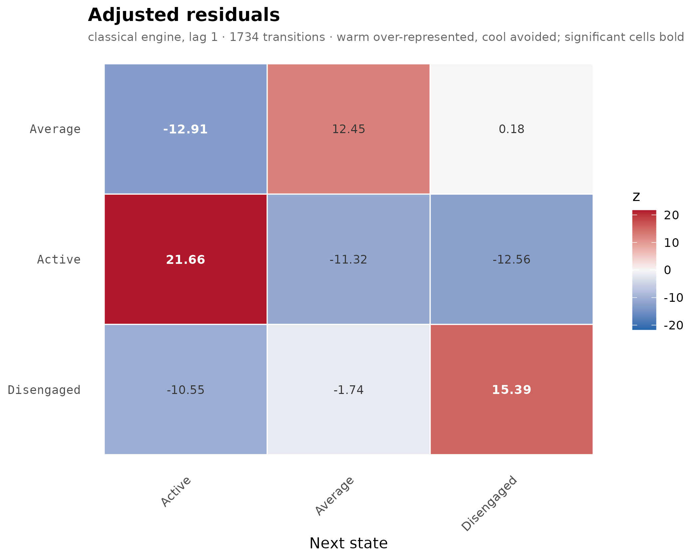
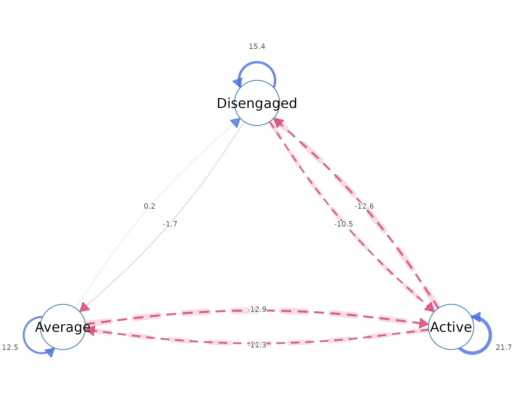
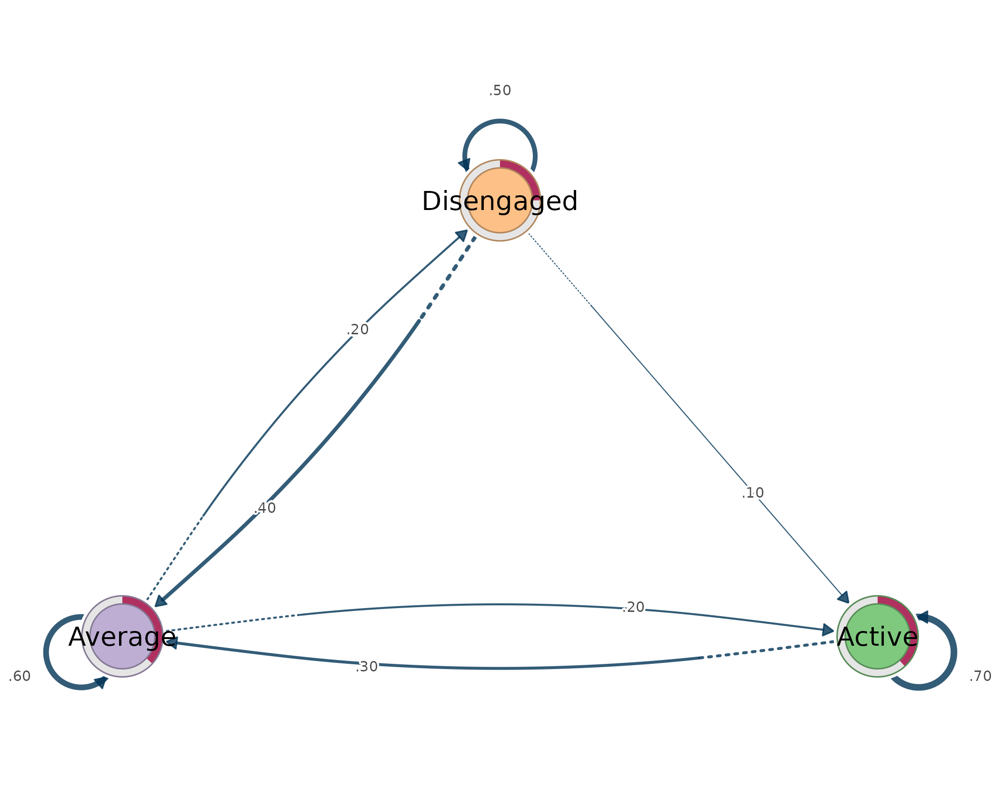
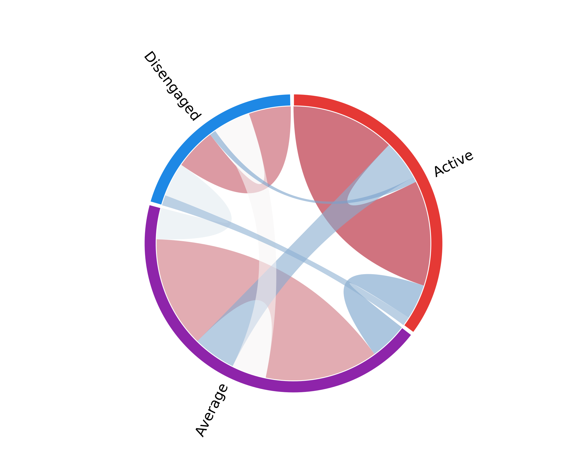
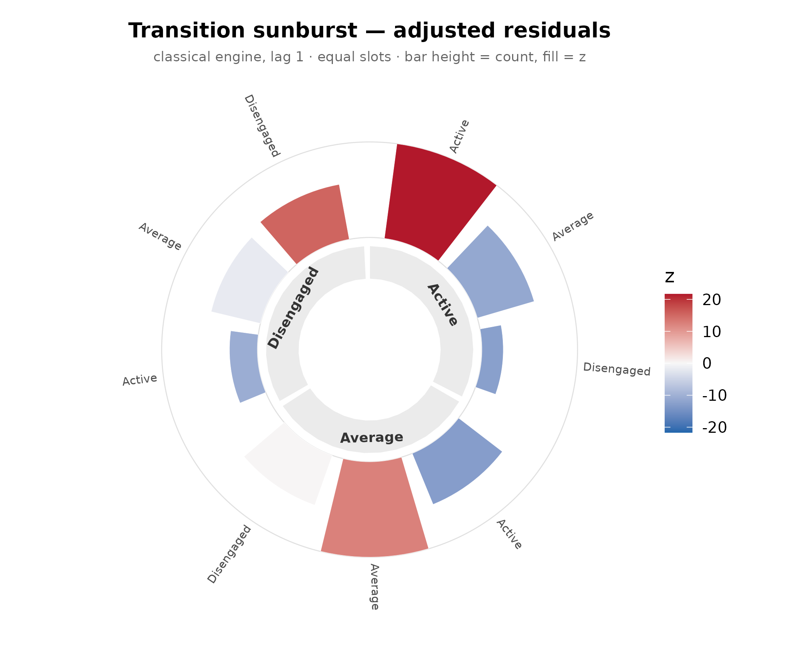
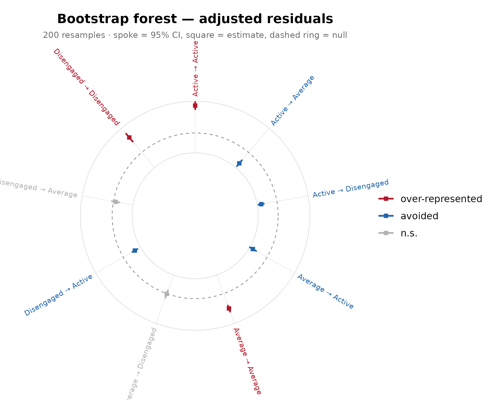
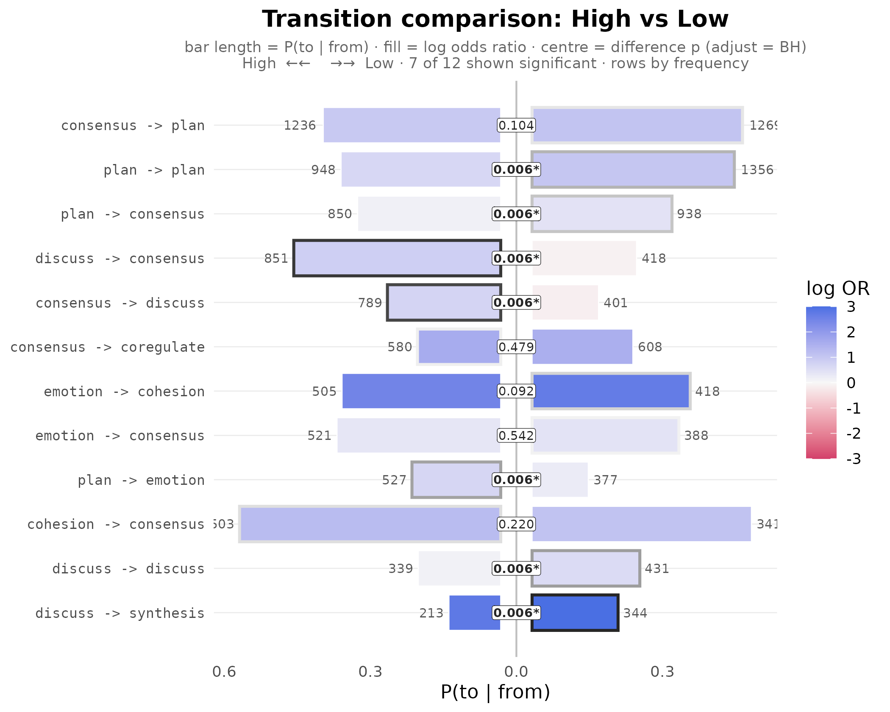
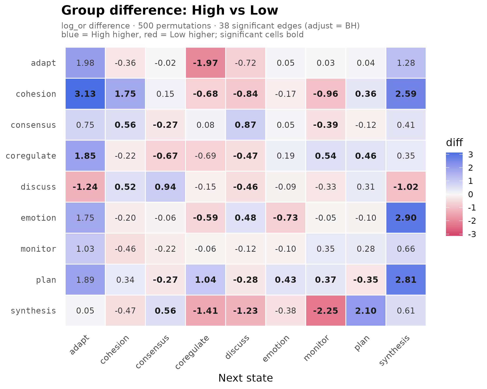

# A complete workflow: from sequences to a group comparison

Lag-sequential analysis (LSA) asks whether, given a state at one moment,
another state follows it more or less often than chance. The method has
a long history in the behavioural sciences, but applied work has often
stopped at description – reading off observed transition rates – without
the inferential machinery needed to establish that a pattern reflects
the process rather than the particular sample.

`lagdynamics` implements LSA as a member of the Dynalytics framework
(Saqr, Lopez-Pernas, and Misiejuk, 2026), whose central tenet is a
*scientific contract*: every analytical claim must be matched by
evidence appropriate to its structure, scope, and complexity, and
estimation, validation, and interpretation are treated as one
inferential system rather than separate steps. Accordingly, in
`lagdynamics` each edge is a *tested departure from independence* – the
adjusted residual is a test statistic, not a descriptive weight.

The package is built around a small set of design commitments:

- **Tidy.** Every result is produced by a verb
  ([`transitions()`](https://mohsaqr.github.io/lagdynamics/reference/transitions.md),
  [`nodes()`](https://mohsaqr.github.io/lagdynamics/reference/nodes.md),
  [`tests()`](https://mohsaqr.github.io/lagdynamics/reference/tests.md),
  [`initial()`](https://mohsaqr.github.io/lagdynamics/reference/initial.md),
  …) that returns a one-row-per-observation data frame; the user never
  indexes into an object.
- **Interoperable.**
  [`lsa()`](https://mohsaqr.github.io/lagdynamics/reference/lsa.md)
  reads long event logs and common sequence objects with an `actor` /
  `action` / `time` grammar, and exposes the fitted transition and
  initial probabilities for downstream network tooling.
- **Rigorous, following Dynalytics.** The confirmatory testing battery
  is built in: analytic certainty and the bootstrap for edge-level
  uncertainty, split-half reliability for the whole network,
  case-dropping for stability, and permutation under exchangeability for
  group comparison.
- **Expanded.** Beyond the classical engine the package offers several
  model variants, multi-lag analysis, structural-zero constraints, and
  an analytic Bayesian certainty estimator.
- **Visual.** A single
  [`plot()`](https://rdrr.io/r/graphics/plot.default.html) verb renders
  the model as a residual heatmap, a residual network, a
  probability-weighted TNA transition network, a chord diagram, or a
  polar sunburst, alongside dedicated plots for uncertainty and for
  group differences.
- **Group-aware.** A grouping column yields one model per group, and
  [`compare_lsa()`](https://mohsaqr.github.io/lagdynamics/reference/compare_lsa.md)
  tests whether the groups differ by permutation.

The remainder of this vignette walks one analysis end to end on real
bundled data, treating each step as one tier of the claim-to-evidence
map: descriptive views support claims about which transitions exist;
certainty intervals and bootstraps support claims about particular
edges; split-half reliability supports claims about the reproducibility
of the whole network; and permutation tests support claims that two
groups differ.

## The data: engagement trajectories

`engagement` is 138 students observed over 15 weekly time points; each
cell is that week’s engagement state - `Active`, `Average`, or
`Disengaged`. It is a wide matrix: **one sequence per row**. This
section anchors the scope of every later claim: the units are students,
the events are weekly engagement states, and the possible states are
known before the model is fitted. In Dynalytics terms, this is the
descriptive foundation on which the evidential contract rests. Before
asking whether an edge is surprising or a group differs, we first make
clear what process the model is allowed to represent.

``` r

dim(engagement)
#> [1] 138  15
head(engagement)
#>      1         2            3            4            5            6           
#> [1,] "Active"  "Disengaged" "Disengaged" "Disengaged" "Active"     "Active"    
#> [2,] "Average" "Average"    "Average"    "Average"    "Average"    "Average"   
#> [3,] "Average" "Active"     "Active"     "Active"     "Active"     "Active"    
#> [4,] "Active"  "Active"     "Active"     "Active"     "Active"     "Average"   
#> [5,] "Active"  "Active"     "Active"     "Average"    "Active"     "Average"   
#> [6,] "Average" "Average"    "Disengaged" "Average"    "Disengaged" "Disengaged"
#>      7         8         9         10           11        12          
#> [1,] "Active"  "Active"  "Average" "Active"     "Average" "Active"    
#> [2,] "Average" "Average" "Average" "Active"     "Average" "Average"   
#> [3,] "Active"  "Active"  "Active"  "Average"    "Active"  "Active"    
#> [4,] "Average" "Active"  "Active"  "Active"     "Average" "Active"    
#> [5,] "Active"  "Active"  "Active"  "Disengaged" "Active"  "Active"    
#> [6,] "Average" "Average" "Average" "Disengaged" "Average" "Disengaged"
#>      13        14        15       
#> [1,] NA        NA        NA       
#> [2,] "Average" "Average" "Average"
#> [3,] "Active"  "Active"  "Active" 
#> [4,] "Average" "Active"  "Average"
#> [5,] "Active"  "Average" "Average"
#> [6,] "Average" "Average" "Average"
```

## Fit

[`lsa()`](https://mohsaqr.github.io/lagdynamics/reference/lsa.md)
estimates the model in a single call. It tabulates every state-to-state
transition, derives the frequencies expected under the independence
(no-memory) model, and computes an **adjusted residual** for each cell:
a standardised measure of how far the observed frequency departs from
its expectation. The fitted object is therefore a *residual network* –
each edge is a tested deviation from independence rather than a raw
rate. This is the named-model discipline of Dynalytics: the same
sequences could be re-expressed as a probability-weighted transition
(TNA) network, but that is a distinct model answering a distinct
question – the typical next state rather than the surprising one.

``` r

fit <- lsa(engagement)
fit
#> Lag Sequential Analysis  —  classical  (lag 1, directed)
#>   3 states | 1734 transitions | 1870 events | 136 sequences
#>   states: Active, Average, Disengaged
#>   independence: G² = 618.3, df = 4, p <2e-16
#> 
#>   Significant transitions (p < 0.05): 7 of 9
#>   strongest over-represented (of 3):
#>     Active -> Active          z =  +21.7  ***
#>     Disengaged -> Disengaged  z =  +15.4  ***
#>     Average -> Average        z =  +12.5  ***
#> 
#>   Initial states:
#>     Active     0.382  ████████████████████████
#>     Average    0.368  ███████████████████████
#>     Disengaged 0.250  ████████████████
```

## Read the fit

Every result is produced by a verb that returns a tidy data frame; the
object is never indexed directly.
[`transitions()`](https://mohsaqr.github.io/lagdynamics/reference/transitions.md)
is the primary accessor, and its arguments select the transitions of
interest. This step supports the most modest claim in the workflow –
which departures from chance are present in the fitted model. The
evidence is descriptive and edge-level, appropriate for reading the
model but not yet for claims about stability, replication, or group
differences.

``` r

transitions(fit, significant = TRUE)   # transitions beyond chance
#>         from         to lag count expected  prob prob_col adj_res         p
#> 1     Active     Active   1   459      247 0.698   0.7051    21.7 4.60e-104
#> 2    Average     Active   1   153      282 0.204   0.2350   -12.9  4.16e-38
#> 3 Disengaged     Active   1    39      122 0.120   0.0599   -10.5  5.11e-26
#> 4     Active    Average   1   176      290 0.267   0.2307   -11.3  1.06e-29
#> 5    Average    Average   1   458      330 0.610   0.6003    12.5  1.35e-35
#> 6     Active Disengaged   1    23      121 0.035   0.0719   -12.6  3.64e-36
#> 7 Disengaged Disengaged   1   157       60 0.483   0.4906    15.4  1.90e-53
#>   yules_q  kappa kappa_z  kappa_p  lift  sign significant
#> 1   0.828  0.444   19.19 4.68e-82 1.858  over        TRUE
#> 2  -0.601 -0.499  -14.70 6.81e-49 0.543 under        TRUE
#> 3  -0.698 -0.707  -11.46 2.03e-30 0.320 under        TRUE
#> 4  -0.534 -0.424  -12.48 9.39e-36 0.608 under        TRUE
#> 5   0.553  0.227    9.83 7.97e-23 1.386  over        TRUE
#> 6  -0.826 -0.827  -13.41 5.14e-41 0.189 under        TRUE
#> 7   0.754  0.314   13.56 7.34e-42 2.618  over        TRUE
```

A positive residual means the transition happens **more** than chance
(over-represented); a negative one means it is **avoided**. The other
results follow the same one-verb pattern. The companion tables provide
the base rates, node volumes, starting states, and tablewise tests that
keep interpretation grounded in the observed process. They help prevent
an edge from being read in isolation, which is part of the Dynalytics
idea that estimation and interpretation must stay connected.

``` r

nodes(fit)      # per-state incoming / outgoing volume
#>        state outgoing incoming
#> 1     Active      658      651
#> 2    Average      751      763
#> 3 Disengaged      325      320
tests(fit)      # tablewise independence tests
#>   test statistic df         p
#> 1 lrx2       618  4 1.69e-132
#> 2   x2       629  4 7.41e-135
initial(fit)    # where sequences start
#>        state init_prob
#> 1     Active     0.382
#> 2    Average     0.368
#> 3 Disengaged     0.250
```

## Plot - the full gallery

Every view is produced by `plot(fit, type = )`, and each answers a
different descriptive question. Visualisation is the first evidence
tier: it can support claims about pattern, concentration, and direction,
but it is not confirmatory evidence about uncertainty or group
differences.

### Residual heatmap

This is the default view. Rows are the current state, columns the next,
and colour is the adjusted residual, so the heatmap displays the
departure-from-chance model directly. Strong colours mark transitions
whose observed counts sit far from the independence expectation, which
makes the view well matched to descriptive claims about where the
process departs from chance.

``` r

plot(fit)                                   # type = "heatmap"
```



### Residual network

The same residuals as a directed graph. The convention matches the wider
Transition Network Analysis (TNA) style: **blue = more than chance**
(solid edges), **red = less** (dashed, with a soft halo). It shows
*which* transitions are surprising. The graph keeps the residual scale
but makes direction and connectedness easier to read. It is still the
RESIDUAL model: blue and red edges are not simply popular or unpopular
transitions, but tested deviations from what independence would predict.

``` r

plot(fit, type = "network")
```



### Transition network (a TNA model)

Weighting the edges by probability instead yields the familiar
transition network, drawn in the Transition Network Analysis (TNA) style
by
[`cograph::splot()`](https://sonsoles.me/cograph/reference/splot.html):
coloured nodes, a per-node initial-probability ring, and weighted
directed edges. The named model changes even though the underlying
sequences do not. A transition (TNA) network is a first-order Markov
model whose edge weights are conditional probabilities; it is the
appropriate display when the claim concerns the typical next state,
whereas the residual network is appropriate when the claim concerns a
tested departure from chance.

``` r

plot(fit, type = "network", weights = "prob")
```



### Chord and sunburst

Two further views connect local edges to the overall movement of the
process: a chord diagram of the transition flow, and a polar sunburst of
each state’s outgoing distribution. Both are descriptive - for example,
they make clear when one state distributes its outgoing transitions
broadly while another concentrates them in a single destination. They do
not replace the uncertainty checks that follow; they make the fitted
structure easier to inspect before stronger claims are made.

``` r

plot(fit, type = "chord")
```



``` r

plot(fit, type = "sunburst")
```



## Verify and validate

To validate the trustworthiness of an estimated edge, its uncertainty
must be quantified. This is where the Dynalytics contract becomes
explicit: a claim about a specific edge requires edge-level evidence,
because a single observed value is weaker support than a measure of how
much that value could vary. `lagdynamics` provides two complementary
procedures, both returning a tidy object.

[`certainty_lsa()`](https://mohsaqr.github.io/lagdynamics/reference/certainty_lsa.md)
is the analytic procedure. It places a Dirichlet-Multinomial posterior
on each state’s outgoing transitions, which gives an exact credible
interval for every transition probability in closed form, without
resampling. The interval states directly how precisely the data pin down
each edge, and so provides the evidence appropriate to a claim about a
specific transition.

``` r

certainty_lsa(fit)
#> <lsa_certainty>  (analytic Dirichlet-Multinomial)
#>   engine:        classical
#>   prior:         Dirichlet(0.50)
#>   CI level:      95%  |  inference: stability
#>   certain edges: 7 of 9
as.data.frame(certainty_lsa(fit)) |> head(4)
#>         from      to observed prob_observed prob_mean prob_se prob_ci_low
#> 1     Active  Active      459         0.698     0.697  0.0179      0.6611
#> 2    Average  Active      153         0.204     0.204  0.0147      0.1760
#> 3 Disengaged  Active       39         0.120     0.121  0.0180      0.0879
#> 4     Active Average      176         0.267     0.268  0.0172      0.2345
#>   prob_ci_high  p_value stable adj_res_observed adj_res_stable
#> 1        0.731 5.56e-20   TRUE             21.7           TRUE
#> 2        0.233 6.06e-04   TRUE            -12.9           TRUE
#> 3        0.158 9.45e-02  FALSE            -10.5          FALSE
#> 4        0.302 1.21e-04   TRUE            -11.3           TRUE
```

[`bootstrap_lsa()`](https://mohsaqr.github.io/lagdynamics/reference/bootstrap_lsa.md)
is the resampling counterpart. It resamples whole sequences with
replacement, re-estimates the model on each resample, and summarises how
much each edge varies. The two procedures agree when the population is
homogeneous; the bootstrap is preferred when it is a mixture, because
resampling whole sequences preserves the within-sequence dependence that
the analytic model treats as independent. The forest plot below shows
each edge’s interval. Both procedures supply the edge-level evidence a
claim about a single transition requires: a narrow, stable interval
indicates the transition is not an artefact of the particular sample.

``` r

as.data.frame(bootstrap_lsa(fit, R = 200)) |> head(4)
#>         from      to observed count_mean count_se count_ci_low count_ci_high
#> 1     Active  Active      459      466.9    53.63          369           566
#> 2    Average  Active      153      152.7    15.24          127           183
#> 3 Disengaged  Active       39       38.6     6.37           26            51
#> 4     Active Average      176      176.2    16.06          148           210
#>   adj_res_observed adj_res_mean adj_res_se adj_res_ci_low adj_res_ci_high
#> 1             21.7         21.7       1.58           18.1           24.28
#> 2            -12.9        -13.1       1.49          -15.8           -9.98
#> 3            -10.5        -10.5       1.27          -12.8           -8.09
#> 4            -11.3        -11.4       1.54          -14.3           -8.16
#>   adj_res_p_boot adj_res_stable prob_observed prob_mean prob_ci_low
#> 1              0           TRUE         0.698     0.700      0.6388
#> 2              0           TRUE         0.204     0.205      0.1674
#> 3              0           TRUE         0.120     0.122      0.0856
#> 4              0           TRUE         0.267     0.266      0.2184
#>   prob_ci_high yules_q_observed yules_q_mean yules_q_ci_low yules_q_ci_high
#> 1        0.751            0.828        0.827          0.754           0.879
#> 2        0.249           -0.601       -0.605         -0.695          -0.487
#> 3        0.159           -0.698       -0.696         -0.800          -0.581
#> 4        0.323           -0.534       -0.537         -0.633          -0.406
```

``` r

plot(bootstrap_lsa(fit, R = 200))           # circular forest of edge CIs
```



[`reliability_lsa()`](https://mohsaqr.github.io/lagdynamics/reference/reliability_lsa.md)
raises the claim from a single edge to the whole network. It repeatedly
splits the sequences into two halves, estimates a model on each half,
and correlates the two edge-weight vectors. A high average correlation
indicates that the network is reproducible within the sample; a low one
indicates that the structure is sample-dependent and should be
interpreted with caution. This evidence matches a claim about the
network as a whole rather than about any single edge.

``` r

reliability_lsa(fit, R = 30)
#> <lsa_reliability>
#>   engine:        classical
#>   replicates:    30
#>   weights:       prob
#>   method:        pearson
#>   n sequences:   136
#>   split-half r:  0.969  (sd = 0.023)
#>   95% CI:        [0.924, 0.996]
```

## Starting from a raw event log

`engagement` arrived as ready-made sequences. Real data is often a
**long event log** instead - one row per event.
[`lsa()`](https://mohsaqr.github.io/lagdynamics/reference/lsa.md)
sequences it on the fly with an `actor` / `action` / `time` grammar.
This step shows that the same inferential chain can begin from raw
process traces rather than from an already assembled sequence matrix.
The data format changes, but the contract does not: define the actors,
events, and ordering rule before estimating a model from them.

The bundled `group_regulation_long` is exactly that: 2,000 students,
each a stream of timestamped regulation actions, with a recorded
achievement group. The grouping variable will matter later, but it is
first treated as metadata attached to recovered sequences. Keeping
sequencing and grouping explicit helps preserve the units that later
resampling and permutation procedures require.

``` r

head(group_regulation_long)
#>   Actor Achiever Group Course                Time    Action
#> 1     1     High     1      A 2025-01-01 08:27:07  cohesion
#> 2     1     High     1      A 2025-01-01 08:35:20 consensus
#> 3     1     High     1      A 2025-01-01 08:42:18   discuss
#> 4     1     High     1      A 2025-01-01 08:50:00 synthesis
#> 5     1     High     1      A 2025-01-01 08:52:25     adapt
#> 6     1     High     1      A 2025-01-01 08:57:31 consensus
```

A single call converts the log into a fitted model:
[`lsa()`](https://mohsaqr.github.io/lagdynamics/reference/lsa.md) groups
events by actor, orders them by time, splits sessions on long gaps, and
fits. Those operations are not clerical details; they define the
empirical process to which the residual test is applied. Once the log
has been converted to ordered transitions, the fitted edges again
represent departures from independence in that recovered sequence
process.

``` r

fit_log <- lsa(group_regulation_long, actor = "Actor",
               action = "Action", time = "Time")
fit_log
#> Lag Sequential Analysis  —  classical  (lag 1, directed)
#>   9 states | 25533 transitions | 27533 events | 2000 sequences
#>   states: adapt, cohesion, consensus, coregulate, discuss, emotion, monitor, plan, synthesis
#>   independence: G² = 13203.8, df = 64, p <2e-16
#> 
#>   Significant transitions (p < 0.05): 72 of 81
#>   strongest over-represented (of 23):
#>     emotion -> cohesion      z =  +58.2  ***
#>     discuss -> synthesis     z =  +48.0  ***
#>     synthesis -> adapt       z =  +38.8  ***
#>     consensus -> coregulate  z =  +35.3  ***
#>     consensus -> plan        z =  +32.6  ***
#>     ... and 18 more
#> 
#>   Initial states:
#>     consensus  0.214  ████████████████████████
#>     plan       0.204  ███████████████████████
#>     discuss    0.175  ████████████████████
#>     emotion    0.151  █████████████████
#>     monitor    0.144  ████████████████
#>     cohesion   0.060  ███████
#>     synthesis  0.019  ██
#>     coregulate 0.019  ██
#>     adapt      0.011  █
```

The fitted model separates the estimation step from the rendering and
analysis layers. The same empirical object can be read as a residual
lag-sequential model when testing departures from chance, or its fitted
transition and initial probabilities can be passed into
transition-network tooling when the question is about
probability-weighted flow.

``` r

transition_probabilities(fit_log)           # P(to | from) transition matrix
#>               adapt cohesion consensus coregulate discuss emotion monitor
#> adapt      0.000000   0.2731     0.477     0.0216  0.0589  0.1198  0.0334
#> cohesion   0.002950   0.0271     0.498     0.1192  0.0596  0.1156  0.0330
#> consensus  0.004740   0.0149     0.082     0.1877  0.1880  0.0727  0.0466
#> coregulate 0.016244   0.0360     0.135     0.0234  0.2736  0.1721  0.0863
#> discuss    0.071374   0.0476     0.321     0.0843  0.1949  0.1058  0.0223
#> emotion    0.002467   0.3253     0.320     0.0342  0.1019  0.0768  0.0363
#> monitor    0.011165   0.0558     0.159     0.0579  0.3754  0.0907  0.0181
#> plan       0.000975   0.0252     0.290     0.0172  0.0679  0.1468  0.0755
#> synthesis  0.234663   0.0337     0.466     0.0445  0.0629  0.0706  0.0123
#>              plan synthesis
#> adapt      0.0157   0.00000
#> cohesion   0.1410   0.00354
#> consensus  0.3958   0.00758
#> coregulate 0.2391   0.01878
#> discuss    0.0116   0.14098
#> emotion    0.0998   0.00282
#> monitor    0.2156   0.01605
#> plan       0.3742   0.00179
#> synthesis  0.0752   0.00000
initial(fit_log)                            # initial-state probabilities
#>        state init_prob
#> 1      adapt    0.0115
#> 2   cohesion    0.0605
#> 3  consensus    0.2140
#> 4 coregulate    0.0190
#> 5    discuss    0.1755
#> 6    emotion    0.1515
#> 7    monitor    0.1440
#> 8       plan    0.2045
#> 9  synthesis    0.0195
```

## Group

To compare achievement groups, name the grouping **column** in the same
call - `group = "Achiever"`.
[`lsa()`](https://mohsaqr.github.io/lagdynamics/reference/lsa.md)
derives one label per recovered sequence (the column must be fixed
within each actor), so there is no manual splitting or relabelling.
Grouped fitting estimates one lag-sequential model per group under the
same data grammar, which makes the models comparable. At this point the
claim is still descriptive: each group has its own fitted residual
structure.

``` r

gfit <- lsa(group_regulation_long, actor = "Actor", action = "Action",
            time = "Time", group = "Achiever")
gfit
#> <lsa_group>
#>   engine:    classical
#>   states:    9 (adapt, cohesion, consensus, coregulate, discuss, emotion, monitor, plan, synthesis)
#>   groups:    2
#>     - High:        1000 sequences
#>     - Low:         1000 sequences
```

Every verb now returns grouped, tidy results with a leading `group`
column. This makes it easy to inspect apparent differences without
turning visual contrast into inference. Side-by-side networks almost
always differ somewhere, so the next step asks whether those differences
are larger than expected under a valid null.

``` r

transitions(gfit, significant = TRUE) |> head(4)
#>   group       from    to lag count expected    prob prob_col adj_res        p
#> 1  High  consensus adapt   1    14     38.1 0.00413   0.0979   -4.59 4.45e-06
#> 2  High coregulate adapt   1    20     10.0 0.02237   0.1399    3.27 1.06e-03
#> 3  High    discuss adapt   1    48     22.5 0.02396   0.3357    5.88 4.00e-09
#> 4  High    emotion adapt   1     5     17.4 0.00323   0.0350   -3.19 1.40e-03
#>   yules_q   kappa kappa_z  kappa_p  lift  sign significant
#> 1  -0.544 -0.6606   -4.98 6.36e-07 0.367 under        TRUE
#> 2   0.371  0.0636    2.90 3.68e-03 1.990  over        TRUE
#> 3   0.466  0.1803    5.21 1.86e-07 2.132  over        TRUE
#> 4  -0.589 -0.7375   -3.46 5.48e-04 0.287 under        TRUE
```

## Compare the groups

[`compare_lsa()`](https://mohsaqr.github.io/lagdynamics/reference/compare_lsa.md)
tests whether the two groups have a different transition structure. It
permutes the group labels and compares an N-invariant effect size (the
log-odds ratio), returning a per-edge table together with a single
omnibus test of whether the groups differ at all. This is the evidence
tier appropriate to a comparative claim. Under the null hypothesis of no
group difference, group labels are exchangeable, so shuffling them
builds a reference distribution for any chosen difference function. The
observed edge differences and the omnibus statistic are then judged
against that permutation distribution rather than against the visual
fact that two separately estimated networks are not identical.

``` r

cmp <- compare_lsa(gfit, R = 500, adjust = "BH")
cmp
#> <lsa_comparison>
#>   groups:   High vs Low
#>   measure:  log_or difference (High - Low)
#>   R:        500 label permutations
#>   edges:    38 significant of 78 tested (adjust = BH)
#>   omnibus:  statistic = 79.48, p = 0.001996
```

The back-to-back **barrel** displays the result: each group’s bar runs
to one side, the higher group’s bar is bordered (darker for a larger
difference), and the centre chip carries the difference p-value. The
plot is a compact rendering of the permutation result, not a substitute
for it: the bars show direction and magnitude, while the centre chip
records whether the observed difference is large relative to the
differences produced by label shuffling under exchangeability.

``` r

plot(cmp)
```



The same comparison as a full-grid difference heatmap. Use it when the
claim is easier to assess as a matrix of source-by-target contrasts than
as paired bars. The underlying evidence remains the same permutation
comparison; only the visual summary changes.

``` r

plot(cmp, style = "heatmap")
```



## In short

The compact recipe below is the same workflow expressed as a checklist:
estimate the named model, read and visualise its descriptive structure,
validate edge-level uncertainty, move to logs when needed, preserve
group labels at the sequence level, and use permutation for group
comparisons. Each step escalates the evidence only when the claim being
made also escalates.

``` r

fit <- lsa(engagement)                          # 1. fit ready sequences
transitions(fit, significant = TRUE)            # 2. read (one verb per result)
plot(fit)                                       # 3. plot: heatmap / network /
plot(fit, type = "network", weights = "prob")   #    chord / sunburst, TNA network
certainty_lsa(fit); bootstrap_lsa(fit)          # 4. validate (analytic + resampling)

log  <- group_regulation_long                   # 5. or start from a raw log
fit  <- lsa(log, actor =, action =, time =)     #    actor/action/time grammar, one call
gfit <- lsa(log, actor =, action =, time =, group = "Achiever")  # 6. group by a column
compare_lsa(gfit)                               # 7. compare + plot(cmp)
```

Taken together, the workflow is a complete inferential chain.
Descriptive claims receive descriptive support, edge claims receive
edge-level uncertainty, whole-network claims receive reproducibility
evidence, and group-difference claims receive permutation evidence under
exchangeability. That is the Dynalytics scientific contract in practice:
every interpretation is tied to the evidence tier that can actually
support it.
