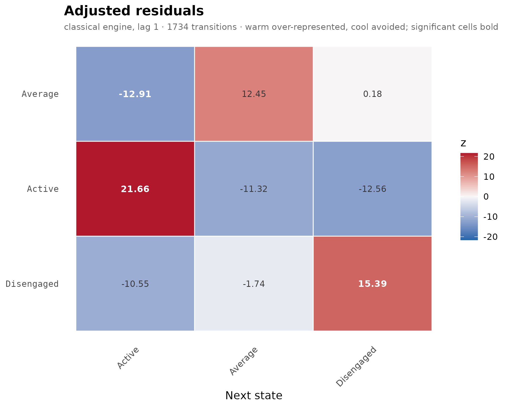
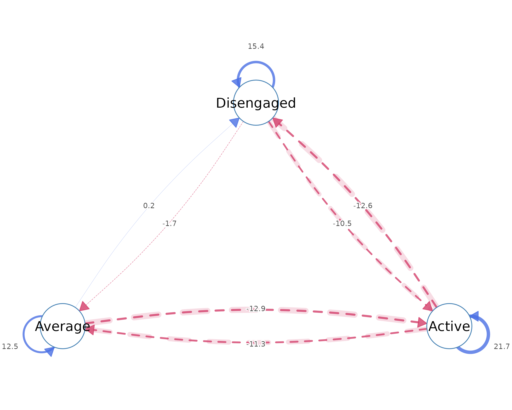
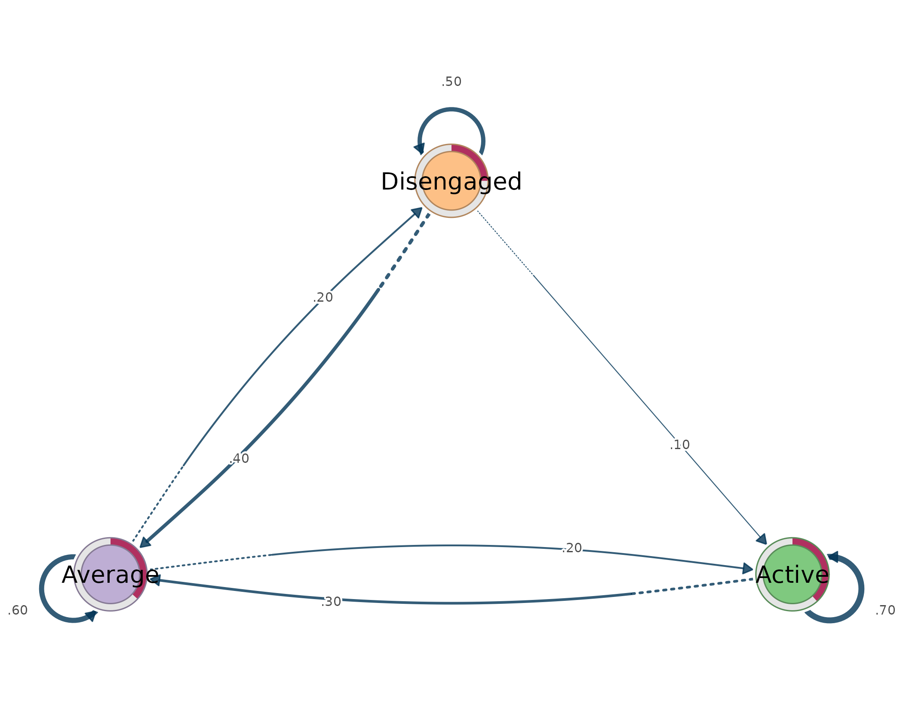
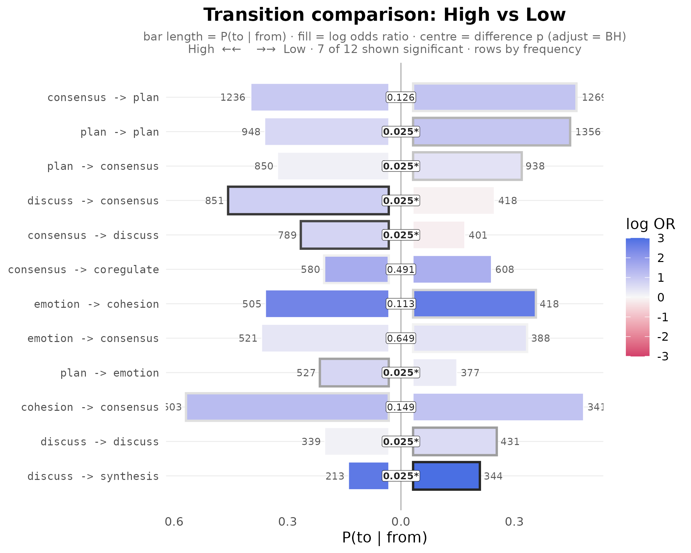

# A complete workflow: from sequences to a group comparison

This vignette shows a complete applied workflow: define the sequence
data, fit an LSA model, read the fitted transitions, visualise the main
structure, add uncertainty evidence, start from a raw event log, and
compare groups.

It assumes the method overview in
[`vignette("intro", package = "lagdynamics")`](https://pak.dynasite.org/lagdynamics/articles/intro.md).
It uses only a small plotting subset; the full gallery is in
[`vignette("plotting", package = "lagdynamics")`](https://pak.dynasite.org/lagdynamics/articles/plotting.md).
The full confirmatory battery is in
[`vignette("confirmatory", package = "lagdynamics")`](https://pak.dynasite.org/lagdynamics/articles/confirmatory.md).

## Define the sequence data

`engagement` contains 138 students observed over 15 weekly time points.
Each row is one student sequence. Each cell is a weekly engagement
state: `Active`, `Average`, or `Disengaged`.

``` r

head(engagement)
#>         1          2          3          4          5          6       7
#> 1  Active Disengaged Disengaged Disengaged     Active     Active  Active
#> 2 Average    Average    Average    Average    Average    Average Average
#> 3 Average     Active     Active     Active     Active     Active  Active
#> 4  Active     Active     Active     Active     Active    Average Average
#> 5  Active     Active     Active    Average     Active    Average  Active
#> 6 Average    Average Disengaged    Average Disengaged Disengaged Average
#>         8       9         10      11         12      13      14      15
#> 1  Active Average     Active Average     Active    <NA>    <NA>    <NA>
#> 2 Average Average     Active Average    Average Average Average Average
#> 3  Active  Active    Average  Active     Active  Active  Active  Active
#> 4  Active  Active     Active Average     Active Average  Active Average
#> 5  Active  Active Disengaged  Active     Active  Active Average Average
#> 6 Average Average Disengaged Average Disengaged Average Average Average
```

This first step fixes the scope of the claim: the empirical units are
students, the events are weekly states, and the ordering is column
order.

## Fit the model

[`lsa()`](https://pak.dynasite.org/lagdynamics/reference/lsa.md)
estimates the transition table, the counts expected under independence,
and the adjusted residual for each transition. The adjusted residual is
the local test statistic: positive values mark over-represented
transitions and negative values mark avoided transitions.

``` r

fit <- lsa(engagement)
fit
#> Lag Sequential Analysis  -  classical  (lag 1, directed)
#>   3 states | 1734 transitions | 1870 events | 136 sequences
#>   states: Active, Average, Disengaged
#>   independence: G² = 618.3, df = 4, p <2e-16
#> 
#>   Significant transitions (p < 0.05): 7 of 9
#>   strongest over-represented (of 3):
#>     Active -> Active          z =  +21.7  ***
#>     Disengaged -> Disengaged  z =  +15.4  ***
#>     Average -> Average        z =  +12.5  ***
#> 
#>   Initial states:
#>     Active     0.382  ████████████████████████
#>     Average    0.368  ███████████████████████
#>     Disengaged 0.250  ████████████████
```

## Read the fitted transitions

The fitted object is read through verbs.
[`transitions()`](https://pak.dynasite.org/lagdynamics/reference/transitions.md)
returns one row per `from -> to` edge.

``` r

transitions(fit)
#>         from         to lag count expected  prob prob_col adj_res         p
#> 1     Active     Active   1   459      247 0.698   0.7051  21.663 4.60e-104
#> 2    Average     Active   1   153      282 0.204   0.2350 -12.906  4.16e-38
#> 3 Disengaged     Active   1    39      122 0.120   0.0599 -10.549  5.11e-26
#> 4     Active    Average   1   176      290 0.267   0.2307 -11.319  1.06e-29
#> 5    Average    Average   1   458      330 0.610   0.6003  12.453  1.35e-35
#> 6 Disengaged    Average   1   129      143 0.397   0.1691  -1.736  8.25e-02
#> 7     Active Disengaged   1    23      121 0.035   0.0719 -12.557  3.64e-36
#> 8    Average Disengaged   1   140      139 0.186   0.4375   0.176  8.60e-01
#> 9 Disengaged Disengaged   1   157       60 0.483   0.4906  15.390  1.90e-53
#>   yules_q   kappa kappa_z  kappa_p  lift  sign significant
#> 1   0.828  0.4438   19.19 4.68e-82 1.858  over        TRUE
#> 2  -0.601 -0.4994  -14.70 6.81e-49 0.543 under        TRUE
#> 3  -0.698 -0.7069  -11.46 2.03e-30 0.320 under        TRUE
#> 4  -0.534 -0.4242  -12.48 9.39e-36 0.608 under        TRUE
#> 5   0.553  0.2275    9.83 7.97e-23 1.386  over        TRUE
#> 6  -0.108 -0.1618   -2.96 3.03e-03 0.902 under       FALSE
#> 7  -0.826 -0.8272  -13.41 5.14e-41 0.189 under        TRUE
#> 8   0.011 -0.0903   -1.66 9.79e-02 1.010  over       FALSE
#> 9   0.754  0.3136   13.56 7.34e-42 2.618  over        TRUE
```

For interpretation, it is usually clearer to begin with transitions that
depart from chance.

``` r

transitions(fit, significant = TRUE)
#>         from         to lag count expected  prob prob_col adj_res         p
#> 1     Active     Active   1   459      247 0.698   0.7051    21.7 4.60e-104
#> 2    Average     Active   1   153      282 0.204   0.2350   -12.9  4.16e-38
#> 3 Disengaged     Active   1    39      122 0.120   0.0599   -10.5  5.11e-26
#> 4     Active    Average   1   176      290 0.267   0.2307   -11.3  1.06e-29
#> 5    Average    Average   1   458      330 0.610   0.6003    12.5  1.35e-35
#> 6     Active Disengaged   1    23      121 0.035   0.0719   -12.6  3.64e-36
#> 7 Disengaged Disengaged   1   157       60 0.483   0.4906    15.4  1.90e-53
#>   yules_q  kappa kappa_z  kappa_p  lift  sign significant
#> 1   0.828  0.444   19.19 4.68e-82 1.858  over        TRUE
#> 2  -0.601 -0.499  -14.70 6.81e-49 0.543 under        TRUE
#> 3  -0.698 -0.707  -11.46 2.03e-30 0.320 under        TRUE
#> 4  -0.534 -0.424  -12.48 9.39e-36 0.608 under        TRUE
#> 5   0.553  0.227    9.83 7.97e-23 1.386  over        TRUE
#> 6  -0.826 -0.827  -13.41 5.14e-41 0.189 under        TRUE
#> 7   0.754  0.314   13.56 7.34e-42 2.618  over        TRUE
```

The companion tables keep the transition interpretation grounded in node
volume, starting states, and tablewise tests.

``` r

nodes(fit)
#>        state outgoing incoming
#> 1     Active      658      651
#> 2    Average      751      763
#> 3 Disengaged      325      320
tests(fit)
#>   test statistic df         p
#> 1 lrx2       618  4 1.69e-132
#> 2   x2       629  4 7.41e-135
initial(fit)
#>        state init_prob
#> 1     Active     0.382
#> 2    Average     0.368
#> 3 Disengaged     0.250
```

## Visualise the fitted model

The default plot is the residual heatmap. It displays the LSA model
directly: rows are source states, columns are target states, and colour
is the adjusted residual.

``` r

plot(fit)
```



The residual network shows the same departure-from-chance model as
directed edges.

``` r

plot(fit, type = "network")
```



A TNA-style transition network is a different view of the same process:
edge weights are conditional transition probabilities rather than
residuals.

``` r

plot(fit, type = "network", weights = "tna")
```



Use the plotting vignette for chord diagrams, sunbursts, comparison
heatmaps, and uncertainty plots.

## Add uncertainty evidence

An edge claim needs more than a fitted residual.
[`certainty_lsa()`](https://pak.dynasite.org/lagdynamics/reference/certainty_lsa.md)
gives analytic credible intervals for transition probabilities.

``` r

cert <- certainty_lsa(fit)
cert
#> <lsa_certainty>  (analytic Dirichlet-Multinomial)
#>   engine:        classical
#>   prior:         Dirichlet(0.50)
#>   CI level:      95%  |  inference: stability
#>   certain edges: 7 of 9
as.data.frame(cert) |> head(4)
#>         from      to observed prob_observed prob_mean prob_se prob_ci_low
#> 1     Active  Active      459         0.698     0.697  0.0179      0.6611
#> 2    Average  Active      153         0.204     0.204  0.0147      0.1760
#> 3 Disengaged  Active       39         0.120     0.121  0.0180      0.0879
#> 4     Active Average      176         0.267     0.268  0.0172      0.2345
#>   prob_ci_high  p_value stable adj_res_observed adj_res_stable
#> 1        0.731 5.56e-20   TRUE             21.7           TRUE
#> 2        0.233 6.06e-04   TRUE            -12.9           TRUE
#> 3        0.158 9.45e-02  FALSE            -10.5          FALSE
#> 4        0.302 1.21e-04   TRUE            -11.3           TRUE
```

[`bootstrap_lsa()`](https://pak.dynasite.org/lagdynamics/reference/bootstrap_lsa.md)
resamples sequences, refits the model, and reports edge-level
variability. It is useful when the population may be a mixture of
different sequence types.

``` r

boot <- bootstrap_lsa(fit, R = 100)
boot
#> <lsa_bootstrap>
#>   engine:        classical
#>   level:         sequence
#>   replicates:    100
#>   CI level:      95%
#>   stable edges:  7 of 9
as.data.frame(boot) |> head(4)
#>         from      to observed count_mean count_se count_ci_low count_ci_high
#> 1     Active  Active      459      465.2    51.55          378           560
#> 2    Average  Active      153      153.9    16.30          126           187
#> 3 Disengaged  Active       39       39.1     6.37           27            52
#> 4     Active Average      176      178.4    17.68          148           217
#>   adj_res_observed adj_res_mean adj_res_se adj_res_ci_low adj_res_ci_high
#> 1             21.7         21.5       1.46           18.2           23.92
#> 2            -12.9        -13.0       1.41          -15.6          -10.60
#> 3            -10.5        -10.4       1.26          -12.5           -8.16
#> 4            -11.3        -11.3       1.53          -14.1           -8.63
#>   adj_res_p_boot adj_res_stable prob_observed prob_mean prob_ci_low
#> 1              0           TRUE         0.698     0.697       0.633
#> 2              0           TRUE         0.204     0.206       0.162
#> 3              0           TRUE         0.120     0.124       0.089
#> 4              0           TRUE         0.267     0.269       0.223
#>   prob_ci_high yules_q_observed yules_q_mean yules_q_ci_low yules_q_ci_high
#> 1        0.746            0.828        0.824          0.743           0.871
#> 2        0.256           -0.601       -0.603         -0.690          -0.508
#> 3        0.166           -0.698       -0.690         -0.798          -0.575
#> 4        0.324           -0.534       -0.530         -0.633          -0.418
```

[`reliability_lsa()`](https://pak.dynasite.org/lagdynamics/reference/reliability_lsa.md)
moves from edge evidence to whole-network evidence by repeated
split-half refitting.

``` r

reliability_lsa(fit, R = 30)
#> <lsa_reliability>
#>   engine:        classical
#>   replicates:    30
#>   weights:       prob
#>   method:        pearson
#>   n sequences:   136
#>   split-half r:  0.969  (sd = 0.021)
#>   95% CI:        [0.925, 0.993]
```

## Start from a raw event log

Real process data often arrives as a long event log. The bundled
`group_regulation_long` data has one timestamped regulation action per
row, plus an achievement-group label.

``` r

head(group_regulation_long)
#>   Actor Achiever Group Course                Time    Action
#> 1     1     High     1      A 2025-01-01 08:27:07  cohesion
#> 2     1     High     1      A 2025-01-01 08:35:20 consensus
#> 3     1     High     1      A 2025-01-01 08:42:18   discuss
#> 4     1     High     1      A 2025-01-01 08:50:00 synthesis
#> 5     1     High     1      A 2025-01-01 08:52:25     adapt
#> 6     1     High     1      A 2025-01-01 08:57:31 consensus
```

[`lsa()`](https://pak.dynasite.org/lagdynamics/reference/lsa.md) can
recover sequences and fit the model in one call. `actor` identifies the
sequence, `action` identifies the event state, and `time` orders events.
If there is no actor column, `action` alone is valid and the log is
treated as one long sequence.

``` r

fit_log <- lsa(group_regulation_long, actor = "Actor",
               action = "Action", time = "Time")
fit_log
#> Lag Sequential Analysis  -  classical  (lag 1, directed)
#>   9 states | 25533 transitions | 27533 events | 2000 sequences
#>   states: adapt, cohesion, consensus, coregulate, discuss, emotion, monitor, plan, synthesis
#>   independence: G² = 13203.8, df = 64, p <2e-16
#> 
#>   Significant transitions (p < 0.05): 72 of 81
#>   strongest over-represented (of 23):
#>     emotion -> cohesion      z =  +58.2  ***
#>     discuss -> synthesis     z =  +48.0  ***
#>     synthesis -> adapt       z =  +38.8  ***
#>     consensus -> coregulate  z =  +35.3  ***
#>     consensus -> plan        z =  +32.6  ***
#>     ... and 18 more
#> 
#>   Initial states:
#>     consensus  0.214  ████████████████████████
#>     plan       0.204  ███████████████████████
#>     discuss    0.175  ████████████████████
#>     emotion    0.151  █████████████████
#>     monitor    0.144  ████████████████
#>     cohesion   0.060  ███████
#>     synthesis  0.019  ██
#>     coregulate 0.019  ██
#>     adapt      0.011  █
```

The fitted probabilities are exposed for downstream transition-network
workflows.

``` r

transition_probabilities(fit_log)
#>               adapt cohesion consensus coregulate discuss emotion monitor
#> adapt      0.000000   0.2731     0.477     0.0216  0.0589  0.1198  0.0334
#> cohesion   0.002950   0.0271     0.498     0.1192  0.0596  0.1156  0.0330
#> consensus  0.004740   0.0149     0.082     0.1877  0.1880  0.0727  0.0466
#> coregulate 0.016244   0.0360     0.135     0.0234  0.2736  0.1721  0.0863
#> discuss    0.071374   0.0476     0.321     0.0843  0.1949  0.1058  0.0223
#> emotion    0.002467   0.3253     0.320     0.0342  0.1019  0.0768  0.0363
#> monitor    0.011165   0.0558     0.159     0.0579  0.3754  0.0907  0.0181
#> plan       0.000975   0.0252     0.290     0.0172  0.0679  0.1468  0.0755
#> synthesis  0.234663   0.0337     0.466     0.0445  0.0629  0.0706  0.0123
#>              plan synthesis
#> adapt      0.0157   0.00000
#> cohesion   0.1410   0.00354
#> consensus  0.3958   0.00758
#> coregulate 0.2391   0.01878
#> discuss    0.0116   0.14098
#> emotion    0.0998   0.00282
#> monitor    0.2156   0.01605
#> plan       0.3742   0.00179
#> synthesis  0.0752   0.00000
initial(fit_log)
#>        state init_prob
#> 1      adapt    0.0115
#> 2   cohesion    0.0605
#> 3  consensus    0.2140
#> 4 coregulate    0.0190
#> 5    discuss    0.1755
#> 6    emotion    0.1515
#> 7    monitor    0.1440
#> 8       plan    0.2045
#> 9  synthesis    0.0195
```

## Fit groups

For group-specific models, name the grouping column.
[`lsa()`](https://pak.dynasite.org/lagdynamics/reference/lsa.md)
estimates one model per group under the same state labels.

``` r

gfit <- lsa(group_regulation_long, actor = "Actor", action = "Action",
            time = "Time", group = "Achiever")
gfit
#> <lsa_group>
#>   engine:    classical
#>   states:    9 (adapt, cohesion, consensus, coregulate, discuss, emotion, monitor, plan, synthesis)
#>   groups:    2
#>     - High:        1000 sequences
#>     - Low:         1000 sequences
```

The reading verbs now return a leading `group` column.

``` r

transitions(gfit, significant = TRUE) |> head(6)
#>   group       from    to lag count expected    prob prob_col adj_res         p
#> 1  High  consensus adapt   1    14    38.13 0.00413   0.0979   -4.59  4.45e-06
#> 2  High coregulate adapt   1    20    10.05 0.02237   0.1399    3.27  1.06e-03
#> 3  High    discuss adapt   1    48    22.52 0.02396   0.3357    5.88  4.00e-09
#> 4  High    emotion adapt   1     5    17.42 0.00323   0.0350   -3.19  1.40e-03
#> 5  High       plan adapt   1     4    32.51 0.00138   0.0280   -5.72  1.06e-08
#> 6  High  synthesis adapt   1    40     3.13 0.14388   0.2797   21.21 7.61e-100
#>   yules_q   kappa kappa_z  kappa_p   lift  sign significant
#> 1  -0.544 -0.6606   -4.98 6.36e-07  0.367 under        TRUE
#> 2   0.371  0.0636    2.90 3.68e-03  1.990  over        TRUE
#> 3   0.466  0.1803    5.21 1.86e-07  2.132  over        TRUE
#> 4  -0.589 -0.7375   -3.46 5.48e-04  0.287 under        TRUE
#> 5  -0.824 -0.8859   -5.99 2.04e-09  0.123 under        TRUE
#> 6   0.905  0.2406   19.62 1.08e-85 12.800  over        TRUE
nodes(gfit) |> head(6)
#>   group      state outgoing incoming
#> 1  High      adapt      141      143
#> 2  High   cohesion      938      936
#> 3  High  consensus     3392     3439
#> 4  High coregulate      894      954
#> 5  High    discuss     2003     1986
#> 6  High    emotion     1550     1517
```

## Compare groups

[`compare_lsa()`](https://pak.dynasite.org/lagdynamics/reference/compare_lsa.md)
tests whether groups differ by permuting group labels at the sequence
level. The result includes edge-level differences and an omnibus
comparison.

``` r

cmp <- compare_lsa(gfit, R = 100, adjust = "BH")
cmp
#> <lsa_comparison>
#>   groups:   High vs Low
#>   measure:  log_or difference (High - Low)
#>   R:        100 label permutations
#>   edges:    35 significant of 78 tested (adjust = BH)
#>   omnibus:  statistic = 79.48, p = 0.009901
as.data.frame(cmp) |> head(6)
#>         from    to log_or_a log_or_b   diff p_perm  p_adj significant
#> 1      adapt adapt   -1.183    -3.17  1.984     NA     NA       FALSE
#> 2   cohesion adapt   -0.794    -3.92  3.127 0.0099 0.0249        TRUE
#> 3  consensus adapt   -1.219    -1.97  0.748 0.0594 0.1030       FALSE
#> 4 coregulate adapt    0.778    -1.08  1.855 0.0099 0.0249        TRUE
#> 5    discuss adapt    1.010     2.25 -1.241 0.0099 0.0249        TRUE
#> 6    emotion adapt   -1.352    -3.10  1.751 0.0891 0.1390       FALSE
```

The default comparison plot is a back-to-back barrel display. It shows
direction, magnitude, and the permutation p-value for each edge.

``` r

plot(cmp)
```



## In short

The complete analysis is a claim-to-evidence chain:

``` r

fit <- lsa(engagement)
transitions(fit, significant = TRUE)
plot(fit)
plot(fit, type = "network", weights = "tna")

certainty_lsa(fit)
bootstrap_lsa(fit)
reliability_lsa(fit)

log_fit <- lsa(log_data, actor = "Actor", action = "Action", time = "Time")
group_fit <- lsa(log_data, actor = "Actor", action = "Action",
                 time = "Time", group = "Group")
compare_lsa(group_fit)
```

Descriptive claims use the fitted transition tables and plots. Edge
claims add uncertainty. Whole-network claims add reliability or
stability. Group-difference claims use permutation comparison.

------------------------------------------------------------------------

Part of the [Dynalytics framework](https://saqr.me/).
